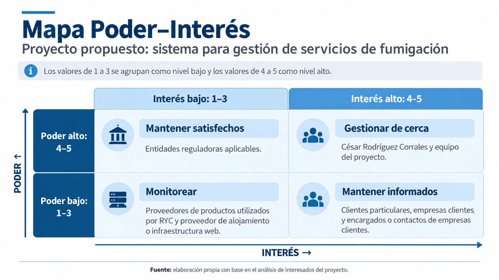

# Sistema de Gestión para RYC Control de Plagas

> Taller del proyecto · Definición e interesados

**Universidad Técnica Nacional**  
Sede Regional San Carlos

| Información | Detalle |
| --- | --- |
| Curso | Administración de Proyectos Informáticos |
| Proyecto | Sistema de Gestión para RYC Control de Plagas |
| Profesor | Deiver Cubero Molina |

**Integrantes**

- Brian Rodríguez Pérez
- Jeremy Rodríguez Esquivel

---

## Contenido

- [Semana 1 · Definición del proyecto](#semana-1--definición-del-proyecto)
  - [Problema](#problema)
  - [Proyecto propuesto](#proyecto-propuesto)
  - [Valor esperado](#valor-esperado)
  - [Objetivo general](#objetivo-general)
  - [Objetivos específicos](#objetivos-específicos)
- [Semana 2 · Taller: interesados de nuestro proyecto](#semana-2--taller-interesados-de-nuestro-proyecto)
  - [Contexto y restricciones del proyecto](#contexto-y-restricciones-del-proyecto)
  - [Registro de interesados](#registro-de-interesados)
  - [Justificación de valoraciones relevantes](#justificación-de-valoraciones-relevantes)
  - [Mapa Poder–Interés](#mapa-poderinterés)
  - [Tres interesados críticos y su involucramiento](#tres-interesados-críticos-y-su-involucramiento)
  - [Preguntas de análisis de interesados](#preguntas-de-análisis-de-interesados)
  - [Enfoque de gestión del proyecto](#enfoque-de-gestión-del-proyecto)

---

## Semana 1 · Definición del proyecto

### Problema

RYC Control de Plagas lleva el seguimiento de sus clientes, visitas, tipos de plagas, productos químicos utilizados y próximas fumigaciones de forma poco centralizada. Esto puede dificultar saber cuándo corresponde volver a visitar a un cliente, qué tratamiento se utilizó anteriormente, qué tipo de plaga presenta cada lugar y cuál es la frecuencia de atención necesaria.

Además, los clientes no cuentan con un medio digital propio donde puedan consultar la información de los servicios recibidos, conocer sus próximas visitas o solicitar una nueva visita, lo que genera una mayor dependencia de la comunicación directa con la empresa.

### Proyecto propuesto

Desarrollar un sistema web de gestión para RYC Control de Plagas que permita administrar clientes, empresas, visitas realizadas, tipos de plagas, productos utilizados, tratamientos y próximas fumigaciones.

El sistema contará además con un portal para clientes, donde cada cliente podrá acceder mediante su propia cuenta para consultar su historial de servicios, tratamientos realizados, recomendaciones, próximas visitas programadas y solicitar gratuitamente una nueva visita. Las solicitudes podrán ser revisadas y programadas posteriormente por RYC Control de Plagas

### Valor esperado

Mejorar la organización y el control de los servicios realizados por RYC Control de Plagas, facilitando el seguimiento de clientes, tratamientos y próximas visitas.

Además, se busca mejorar la experiencia del cliente mediante un espacio donde pueda consultar de manera sencilla la información relacionada con sus servicios y solicitar nuevas visitas sin depender únicamente de llamadas o mensajes.

### Objetivo general

Desarrollar un sistema web que permita a RYC Control de Plagas gestionar y dar seguimiento a sus clientes, visitas y tratamientos, incorporando un portal de autoservicio para mejorar la comunicación y el acceso de los clientes a la información de sus servicios.

### Objetivos específicos

- Registrar y administrar la información de clientes particulares y empresas.
- Registrar las visitas y servicios realizados a cada cliente.
- Llevar un control de los tipos de plagas identificadas en cada servicio.
- Registrar los productos y tratamientos utilizados durante cada fumigación.
- Programar próximas visitas de acuerdo con las necesidades y frecuencia de atención de cada cliente.
- Mantener un historial de visitas y tratamientos realizados a cada cliente.
- Facilitar la organización de los servicios mediante un calendario de visitas programadas.
- Permitir que cada cliente disponga de una cuenta personal para acceder al sistema.
- Permitir que los clientes consulten su historial de servicios, plagas tratadas, tratamientos realizados, recomendaciones y próximas visitas programadas.
- Permitir que los clientes soliciten gratuitamente una nueva visita desde su cuenta.
- Facilitar a RYC Control de Plagas la revisión y programación de las solicitudes de visita realizadas por los clientes.

---

## Semana 2 · Taller: interesados de nuestro proyecto

### Contexto y restricciones del proyecto

RYC Control de Plagas es una empresa pequeña administrada principalmente por César Rodríguez Corrales, quien además realiza la mayor parte de los servicios y concentra gran parte del conocimiento operativo del negocio. Debido a esto, su disponibilidad será importante para obtener información, aclarar procesos y validar las funcionalidades desarrolladas.

El proyecto será desarrollado por Brian Rodríguez Pérez y Jeremy Rodríguez Esquivel dentro del periodo establecido para el curso, por lo que el tiempo disponible representa una restricción importante. Además, el proyecto cuenta con recursos económicos limitados, por lo que se buscará utilizar herramientas y tecnologías de bajo costo o gratuitas cuando sea posible.

A nivel tecnológico, el sistema será desarrollado como una aplicación web y dependerá de acceso a Internet, dispositivos compatibles y un servicio de alojamiento. También será necesario considerar que parte de la información histórica de clientes y servicios puede encontrarse distribuida en distintos medios, por lo que deberá determinarse qué información podrá incorporarse al sistema.

Debido al tamaño del equipo, al tiempo disponible y a la dependencia de la información proporcionada por César Rodríguez Corrales, será necesario priorizar las funcionalidades que aporten mayor valor al proyecto.

### Registro de interesados

| Interesado | Necesidad | Poder | Interés | Actitud inicial | Estrategia | Responsable |
| --- | --- | :---: | :---: | --- | --- | --- |
| César Rodríguez Corrales, propietario y operador de RYC | Centralizar la información de clientes, visitas, tratamientos y próximas fumigaciones. | 5 | 5 | Favorable | Gestionar de cerca: consultar necesidades y validar avances. | Ambos |
| Brian Rodríguez Pérez y Jeremy Rodríguez Esquivel, equipo del proyecto | Contar con requisitos claros y retroalimentación para organizar y desarrollar el sistema. | 4 | 5 | Favorable | Gestionar de cerca: coordinar tareas, resolver dudas y revisar avances. | Ambos |
| Clientes particulares | Consultar su historial, próximas visitas y solicitar nuevas visitas desde su cuenta. | 2 | 4 | Favorable | Mantener informados y recoger comentarios sobre el portal. | Jeremy |
| Empresas clientes, como organizaciones que contratan los servicios | Consultar el historial de servicios y dar seguimiento a los tratamientos recibidos. | 3 | 5 | Favorable | Mantener informadas y consultar sus necesidades durante las validaciones del portal. | Brian |
| Encargados o contactos de empresas clientes | Coordinar las visitas y consultar la información necesaria para recibir los servicios. | 3 | 5 | Favorable | Mantener informados y consultar el proceso de coordinación de visitas. | Jeremy |
| Proveedores de productos utilizados por RYC | Que los productos suministrados se identifiquen correctamente en los registros de tratamientos. | 2 | 2 | Neutral | Monitorear y consultar información de los productos cuando sea necesario para su registro. | Brian |
| Proveedor de alojamiento o infraestructura web | Contar con requisitos técnicos claros para prestar el servicio de alojamiento. | 2 | 2 | Neutral | Monitorear las condiciones y disponibilidad del servicio. | Brian |
| Entidades reguladoras aplicables | Que el proyecto considere las disposiciones que le correspondan. | 5 | 2 | Neutral | Mantener satisfechas mediante la identificación y atención de los requisitos aplicables. | Ambos |

### Justificación de valoraciones relevantes

- **Equipo del proyecto — poder 4 e interés 5:** toma decisiones técnicas y organiza el desarrollo, aunque las decisiones sobre las necesidades del negocio deben validarse con César.

- **Empresas clientes — poder 3 e interés 5:** sus necesidades influyen en el portal y el resultado les afecta directamente, pero no se ha identificado autoridad para aprobar cambios en el proyecto.

- **Encargados de empresas clientes — poder 3 e interés 5:** pueden facilitar o dificultar la coordinación y aportar información relevante, aunque no necesariamente deciden por la empresa que representan.

- **Proveedores de productos utilizados por RYC — poder 2 e interés 2:** pueden aportar información para identificar correctamente los productos registrados en los tratamientos, pero no tienen autoridad sobre las decisiones del sistema. Su participación sería puntual, por lo que inicialmente se les asigna poder e interés bajos.

- **Entidades reguladoras — poder 5 e interés 2:** se propone un poder alto porque los requisitos que resulten aplicables podrían condicionar decisiones del proyecto. Su interés se considera bajo por no participar en el trabajo cotidiano. Las entidades y disposiciones concretas deberán identificarse.

### Mapa Poder–Interés

### Tres interesados críticos y su involucramiento

| Interesado crítico | Cómo se involucrará | Momento o frecuencia propuesta | Responsable |
| --- | --- | --- | --- |
| César Rodríguez Corrales | Mediante consultas directas para identificar necesidades y demostraciones para validar funcionalidades y resolver dudas. | Al inicio y al finalizar cada ciclo de trabajo, según su disponibilidad. | Ambos |
| Empresas clientes | Mediante consultas y pruebas del portal con representantes, para revisar la información de servicios, próximas visitas y solicitudes. | Durante la definición del portal y cuando exista una versión que puedan probar. | Brian |
| Equipo del proyecto | Mediante reuniones breves y mensajes para distribuir tareas, revisar avances y tomar decisiones entre ambos integrantes. | Coordinación semanal y comunicación cuando surjan dudas o bloqueos. | Ambos |

### Preguntas de análisis de interesados

#### ¿A quién debemos involucrar primero?

A César Rodríguez Corrales, debido a que es el propietario y la persona que posee mayor conocimiento sobre el funcionamiento de RYC Control de Plagas.

#### ¿Quién puede bloquear una decisión?

César Rodríguez Corrales puede modificar o detener decisiones relacionadas con las necesidades reales del negocio. También podrían existir requisitos regulatorios que obliguen a modificar alguna decisión del proyecto.

#### ¿Quién necesita información frecuente?

César Rodríguez Corrales y los integrantes del equipo del proyecto, ya que participan directamente en la definición, desarrollo y validación de las funcionalidades.

#### ¿Qué interesado estamos subestimando?

Los encargados o contactos de empresas clientes, debido a que pueden aportar información importante sobre la forma en que coordinan las visitas y reciben los servicios de RYC.

#### ¿Qué conflicto de expectativas puede aparecer?

Puede existir un conflicto entre la cantidad de funcionalidades que se desean desarrollar y el tiempo disponible para completar el proyecto. También pueden existir diferencias entre las necesidades internas de RYC y las funcionalidades que los clientes esperan encontrar en el portal.

### Enfoque de gestión del proyecto

Se propone un enfoque adaptativo, porque los detalles de los procesos y las funcionalidades deberán precisarse mediante consultas con César y retroalimentación de los usuarios.

La empresa concentra gran parte de sus decisiones y conocimiento operativo en su propietario, por lo que será necesario coordinar las validaciones según su disponibilidad. Además, el equipo está formado por dos estudiantes, dispone de recursos limitados y debe trabajar dentro del periodo del curso.

Por estas condiciones, se desarrollará el sistema en ciclos cortos, revisando los avances y ajustando los detalles de las funcionalidades con la retroalimentación recibida. Se priorizará el orden de implementación de los objetivos aprobados en la clase 1.
