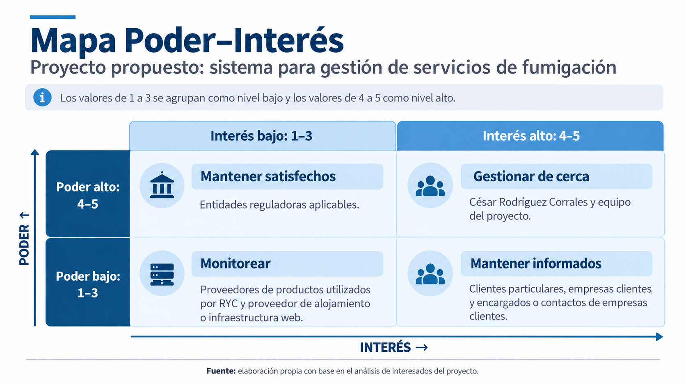

# Sistema de Gestión para RYC Control de Plagas

**Universidad Técnica Nacional**\
Sede Regional San Carlos

| Información | Detalle                                       |
| ----------- | --------------------------------------------- |
| Curso       | Administración de Proyectos Informáticos      |
| Proyecto    | Sistema de Gestión para RYC Control de Plagas |
| Profesor    | Deiver Cubero Molina                          |

**Integrantes**

- Brian Rodríguez Pérez
- Jeremy Rodríguez Esquivel

---

## Contenido

- [Sistema de Gestión para RYC Control de Plagas](#sistema-de-gestión-para-ryc-control-de-plagas)
  - [Contenido](#contenido)
  - [Semana 1 · Definición del proyecto](#semana-1--definición-del-proyecto)
    - [Problema](#problema)
    - [Proyecto propuesto](#proyecto-propuesto)
    - [Valor esperado](#valor-esperado)
    - [Objetivo general](#objetivo-general)
    - [Objetivos específicos](#objetivos-específicos)
  - [Semana 2 · Taller: interesados de nuestro proyecto](#semana-2--taller-interesados-de-nuestro-proyecto)
    - [Contexto y restricciones del proyecto](#contexto-y-restricciones-del-proyecto)
    - [Registro de interesados](#registro-de-interesados)
    - [Justificación de valoraciones relevantes](#justificación-de-valoraciones-relevantes)
    - [Mapa Poder–Interés](#mapa-poderinterés)
    - [Tres interesados críticos y su involucramiento](#tres-interesados-críticos-y-su-involucramiento)
    - [Preguntas de análisis de interesados](#preguntas-de-análisis-de-interesados)
      - [¿A quién debemos involucrar primero?](#a-quién-debemos-involucrar-primero)
      - [¿Quién puede bloquear una decisión?](#quién-puede-bloquear-una-decisión)
      - [¿Quién necesita información frecuente?](#quién-necesita-información-frecuente)
      - [¿Qué interesado estamos subestimando?](#qué-interesado-estamos-subestimando)
      - [¿Qué conflicto de expectativas puede aparecer?](#qué-conflicto-de-expectativas-puede-aparecer)
    - [Enfoque de gestión del proyecto](#enfoque-de-gestión-del-proyecto)
  - [Semana 3 Planeamiento del proyecto](#semana-3-planeamiento-del-proyecto)
    - [Alcance y organización de la información](#alcance-y-organización-de-la-información)
      - [Cuenta, cliente y asociación](#cuenta-cliente-y-asociación)
      - [Atención sin cuenta: recorrido principal](#atención-sin-cuenta-recorrido-principal)
      - [Atención con cuenta: recorrido opcional](#atención-con-cuenta-recorrido-opcional)
    - [Landing Page y contacto por WhatsApp](#landing-page-y-contacto-por-whatsapp)
      - [Contenido y recorrido](#contenido-y-recorrido)
      - [Formulario breve para preparar el mensaje](#formulario-breve-para-preparar-el-mensaje)
    - [Necesidades de los usuarios y resultados esperados](#necesidades-de-los-usuarios-y-resultados-esperados)
      - [Necesidades de las personas interesadas y los clientes](#necesidades-de-las-personas-interesadas-y-los-clientes)
      - [Necesidades de César](#necesidades-de-césar)
      - [Necesidades de RYC como empresa](#necesidades-de-ryc-como-empresa)
    - [Registro e inicio de sesión](#registro-e-inicio-de-sesión)
      - [Campos del registro](#campos-del-registro)
      - [Opciones del login](#opciones-del-login)
      - [Validación de formularios y seguridad de las cuentas](#validación-de-formularios-y-seguridad-de-las-cuentas)
        - [Mensajes al completar los formularios](#mensajes-al-completar-los-formularios)
        - [Páginas y funciones de acceso](#páginas-y-funciones-de-acceso)
        - [Medidas para proteger las cuentas](#medidas-para-proteger-las-cuentas)
    - [Diseño y comportamiento en dispositivos](#diseño-y-comportamiento-en-dispositivos)
      - [Dirección visual](#dirección-visual)
      - [Colores](#colores)
      - [Tipografía](#tipografía)
      - [Login](#login)
      - [Presentación de la administración y el portal](#presentación-de-la-administración-y-el-portal)
    - [Experiencia de uso de César](#experiencia-de-uso-de-césar)
      - [Registro por etapas y reutilización](#registro-por-etapas-y-reutilización)
      - [Guardado de formularios](#guardado-de-formularios)
      - [Acciones y estado](#acciones-y-estado)
    - [Empresas, sedes y cuentas](#empresas-sedes-y-cuentas)
      - [Permisos de consulta y solicitud](#permisos-de-consulta-y-solicitud)
      - [Ejemplo de acceso por sede](#ejemplo-de-acceso-por-sede)
      - [Justificación](#justificación)
    - [Asociación mediante ID](#asociación-mediante-id)
    - [Consultoría y aceptación del servicio](#consultoría-y-aceptación-del-servicio)
      - [Formulario de consultoría](#formulario-de-consultoría)
      - [Estados de la consultoría](#estados-de-la-consultoría)
      - [Cómo se registra la aceptación del trabajo](#cómo-se-registra-la-aceptación-del-trabajo)
      - [Orden y situación financiera](#orden-y-situación-financiera)
      - [Datos del reporte de pago](#datos-del-reporte-de-pago)
      - [Comunicación y seguimiento de los pagos](#comunicación-y-seguimiento-de-los-pagos)
      - [Archivos, permisos y alcance comercial](#archivos-permisos-y-alcance-comercial)
    - [Clientes, ubicaciones y servicios](#clientes-ubicaciones-y-servicios)
      - [Cliente particular](#cliente-particular)
      - [Empresa](#empresa)
      - [Servicio realizado](#servicio-realizado)
    - [Plagas, productos y tratamientos](#plagas-productos-y-tratamientos)
      - [Catálogo de plagas](#catálogo-de-plagas)
      - [Catálogo de productos](#catálogo-de-productos)
      - [Registro del tratamiento](#registro-del-tratamiento)
      - [Publicación del historial](#publicación-del-historial)
    - [Visitas y calendario](#visitas-y-calendario)
      - [Datos de una visita](#datos-de-una-visita)
      - [Reglas](#reglas)
      - [Presentación](#presentación)
    - [Información histórica](#información-histórica)
    - [Tecnología, alojamiento y entrega](#tecnología-alojamiento-y-entrega)
      - [Tecnologías](#tecnologías)
      - [Alojamiento de la demostración y del piloto](#alojamiento-de-la-demostración-y-del-piloto)
      - [Respaldo y entrega](#respaldo-y-entrega)
    - [Páginas del sistema y su contenido](#páginas-del-sistema-y-su-contenido)
      - [Convenciones de presentación](#convenciones-de-presentación)
      - [Mensajes de validación de campos](#mensajes-de-validación-de-campos)
      - [Navegación](#navegación)
      - [Cómo se organiza cada página](#cómo-se-organiza-cada-página)
      - [Landing Page y acceso a la aplicación web](#landing-page-y-acceso-a-la-aplicación-web)
        - [Landing Page de RYC](#landing-page-de-ryc)
          - [Formulario de contacto por WhatsApp](#formulario-de-contacto-por-whatsapp)
        - [Inicio de sesión](#inicio-de-sesión)
        - [Crear cuenta](#crear-cuenta)
        - [Recuperar acceso](#recuperar-acceso)
        - [Cambiar contraseña por recuperación](#cambiar-contraseña-por-recuperación)
      - [Portal del cliente](#portal-del-cliente)
        - [Panel del cliente](#panel-del-cliente)
          - [Verificación del correo en el portal](#verificación-del-correo-en-el-portal)
          - [Solicitudes y seguimiento del cliente](#solicitudes-y-seguimiento-del-cliente)
          - [Formulario de consultoría del portal](#formulario-de-consultoría-del-portal)
          - [Formulario de nueva visita](#formulario-de-nueva-visita)
          - [Propuesta del trabajo y decisión del cliente](#propuesta-del-trabajo-y-decisión-del-cliente)
          - [Próximas visitas y solicitud de cambios](#próximas-visitas-y-solicitud-de-cambios)
          - [Historial de servicios del cliente](#historial-de-servicios-del-cliente)
        - [Pagos y documentos](#pagos-y-documentos)
          - [Pagos y reportes del cliente](#pagos-y-reportes-del-cliente)
          - [Datos de facturación de la orden](#datos-de-facturación-de-la-orden)
          - [Documentos y descargas del cliente](#documentos-y-descargas-del-cliente)
      - [Administración de César](#administración-de-césar)
        - [Panel de administración de César](#panel-de-administración-de-césar)
          - [Registro rápido de un contacto](#registro-rápido-de-un-contacto)
          - [Consultorías y propuesta del trabajo](#consultorías-y-propuesta-del-trabajo)
          - [Nuevas visitas y cambios por revisar](#nuevas-visitas-y-cambios-por-revisar)
          - [Programación y estado de una visita](#programación-y-estado-de-una-visita)
          - [Servicio y tratamiento realizado](#servicio-y-tratamiento-realizado)
          - [Pagos y documentos dentro de la ficha de atención](#pagos-y-documentos-dentro-de-la-ficha-de-atención)
        - [Clientes](#clientes)
          - [Formulario de cliente particular o empresa](#formulario-de-cliente-particular-o-empresa)
          - [Ficha del cliente y cuentas autorizadas](#ficha-del-cliente-y-cuentas-autorizadas)
          - [Ubicaciones del cliente](#ubicaciones-del-cliente)
          - [Registro de servicios anteriores](#registro-de-servicios-anteriores)
        - [Calendario](#calendario)
        - [Catálogos](#catálogos)
        - [Cobros y documentos](#cobros-y-documentos)
          - [Revisión de pagos recibidos](#revisión-de-pagos-recibidos)
          - [Recibos no fiscales](#recibos-no-fiscales)
          - [Documentos fiscales de la atención](#documentos-fiscales-de-la-atención)
          - [Entrega de documentos de la atención](#entrega-de-documentos-de-la-atención)
      - [Cuenta compartida por portal y administración](#cuenta-compartida-por-portal-y-administración)
        - [Mi cuenta](#mi-cuenta)
    - [Comprobaciones del sistema](#comprobaciones-del-sistema)
  - [Semana 4 · Interacción e integración entre procesos](#semana-4--interacción-e-integración-entre-procesos)
    - [Product Backlog priorizado](#product-backlog-priorizado)
    - [Criterios utilizados para priorizar](#criterios-utilizados-para-priorizar)
    - [Sprints y Sprint Backlogs](#sprints-y-sprint-backlogs)
      - [Sprint 1: base técnica, acceso y presentación](#sprint-1-base-técnica-acceso-y-presentación)
      - [Sprint 2: clientes, solicitudes y programación](#sprint-2-clientes-solicitudes-y-programación)
      - [Sprint 3: cobros y registro de atenciones](#sprint-3-cobros-y-registro-de-atenciones)
      - [Sprint 4: propuestas, historial y operación](#sprint-4-propuestas-historial-y-operación)
      - [Sprint 5: validación, respaldo y cierre](#sprint-5-validación-respaldo-y-cierre)
    - [Backlog técnico de implementación](#backlog-técnico-de-implementación)
      - [Simbología de las historias y las tareas](#simbología-de-las-historias-y-las-tareas)
      - [H01: Conocer RYC y contactar desde la Landing Page](#h01-conocer-ryc-y-contactar-desde-la-landing-page)
      - [H02: Iniciar sesión en la aplicación web](#h02-iniciar-sesión-en-la-aplicación-web)
      - [H03: Crear una cuenta de cliente](#h03-crear-una-cuenta-de-cliente)
      - [H04: Recuperar el acceso desde Olvidé mi contraseña](#h04-recuperar-el-acceso-desde-olvidé-mi-contraseña)
      - [H05: Consultar mi resumen y gestionar mis atenciones](#h05-consultar-mi-resumen-y-gestionar-mis-atenciones)
      - [H06: Consultar mis pagos y documentos](#h06-consultar-mis-pagos-y-documentos)
      - [H07: Consultar pendientes y gestionar las atenciones](#h07-consultar-pendientes-y-gestionar-las-atenciones)
      - [H08: Consultar y administrar Mi cuenta](#h08-consultar-y-administrar-mi-cuenta)
      - [H09: Gestionar clientes, ubicaciones y cuentas autorizadas](#h09-gestionar-clientes-ubicaciones-y-cuentas-autorizadas)
      - [H10: Programar visitas y administrar la disponibilidad](#h10-programar-visitas-y-administrar-la-disponibilidad)
      - [H11: Administrar los catálogos de plagas y productos](#h11-administrar-los-catálogos-de-plagas-y-productos)
      - [H12: Verificar cobros y gestionar documentos y entregas](#h12-verificar-cobros-y-gestionar-documentos-y-entregas)
      - [Componentes y tareas comunes](#componentes-y-tareas-comunes)
        - [Preparación inicial de la aplicación web](#preparación-inicial-de-la-aplicación-web)
        - [Componentes utilizados en las páginas](#componentes-utilizados-en-las-páginas)
        - [Pruebas de la aplicación web](#pruebas-de-la-aplicación-web)
        - [Entorno de entrega y respaldos](#entorno-de-entrega-y-respaldos)
        - [Guía, aceptación y cierre](#guía-aceptación-y-cierre)
      - [Estimación y asignación de las tareas](#estimación-y-asignación-de-las-tareas)
    - [Equipo profesional y capacidad](#equipo-profesional-y-capacidad)
      - [Puestos, experiencia y dedicación](#puestos-experiencia-y-dedicación)
      - [Disponibilidad y carga por sprint](#disponibilidad-y-carga-por-sprint)
      - [Secuencia, capacidad y sensibilidad del plazo](#secuencia-capacidad-y-sensibilidad-del-plazo)
    - [Presupuesto del proyecto simulado](#presupuesto-del-proyecto-simulado)
      - [Tarifas profesionales y costo del equipo](#tarifas-profesionales-y-costo-del-equipo)
      - [Infraestructura y operación prevista](#infraestructura-y-operación-prevista)
      - [Presupuesto total y distribución](#presupuesto-total-y-distribución)
    - [Criterios de terminación y aceptación](#criterios-de-terminación-y-aceptación)
  - [Historias de usuario desarrolladas — Especificación formal según plantilla](#historias-de-usuario-desarrolladas--especificación-formal-según-plantilla)
    - [Introducción y metodología de desarrollo](#introducción-y-metodología-de-desarrollo)
    - [Historia H01: Conocer RYC y contactar desde la Landing Page](#historia-h01-conocer-ryc-y-contactar-desde-la-landing-page)
    - [Historia H02: Iniciar sesión en la aplicación web](#historia-h02-iniciar-sesión-en-la-aplicación-web)
    - [Historia H03: Crear una cuenta de cliente](#historia-h03-crear-una-cuenta-de-cliente)
    - [Historia H04: Recuperar el acceso desde Olvidé mi contraseña](#historia-h04-recuperar-el-acceso-desde-olvidé-mi-contraseña)
    - [Historia H05: Consultar mi resumen y gestionar mis atenciones](#historia-h05-consultar-mi-resumen-y-gestionar-mis-atenciones)
    - [Historia H06: Consultar mis pagos y documentos](#historia-h06-consultar-mis-pagos-y-documentos)
    - [Historia H07: Consultar pendientes y gestionar las atenciones](#historia-h07-consultar-pendientes-y-gestionar-las-atenciones)
    - [Historia H08: Consultar y administrar Mi cuenta](#historia-h08-consultar-y-administrar-mi-cuenta)
    - [Historia H09: Gestionar clientes, ubicaciones y cuentas autorizadas](#historia-h09-gestionar-clientes-ubicaciones-y-cuentas-autorizadas)
    - [Historia H10: Programar visitas y administrar la disponibilidad](#historia-h10-programar-visitas-y-administrar-la-disponibilidad)
    - [Historia H11: Administrar los catálogos de plagas y productos](#historia-h11-administrar-los-catálogos-de-plagas-y-productos)
    - [Historia H12: Verificar cobros y gestionar documentos y entregas](#historia-h12-verificar-cobros-y-gestionar-documentos-y-entregas)
    - [Resumen de estimaciones y prioridades del Product Backlog](#resumen-de-estimaciones-y-prioridades-del-product-backlog)
    - [Consideraciones sobre la Definition of Done y entrega progresiva](#consideraciones-sobre-la-definition-of-done-y-entrega-progresiva)
    - [Conclusión](#conclusión)

---

## Semana 1 · Definición del proyecto

> **Fecha lectiva de referencia:** miércoles 16 de septiembre de 2026, correspondiente a la Semana 1.
>
> **Resumen:** Identificación del problema, propuesta del sistema web, valor esperado y definición de objetivos generales y específicos.

### Problema

RYC conserva clientes, visitas, plagas, productos y próximas fumigaciones en medios dispersos. Cuesta consultar tratamientos, frecuencias y fechas de regreso. Los clientes dependen de llamadas o mensajes para conocer sus servicios y solicitar atención.

### Proyecto propuesto

Planificar y simular la construcción de una aplicación web con una página pública de presentación (Landing Page), Administración de César y un Portal del cliente
opcional. Las funciones siguientes describen el producto que construiría el equipo profesional del escenario.

La página pública presentará información real de RYC y facilitará el contacto por WhatsApp sin cuenta. César gestionará clientes, empresas, ubicaciones,
solicitudes, agenda, servicios, tratamientos, pagos y documentos desde celular y computadora.

La consultoría inicial será gratuita en el cantón de San Carlos; fuera se cotizará y cobrará completamente antes de la visita. El trabajo requiere 50% antes de iniciar
y 50% al finalizar, verificados por César.

Facturas y documentos se emitirán externamente y se entregarán sin exigir cuenta. Quien se registre podrá consultar el historial autorizado, solicitar atención o
informar pagos; César asociará registros existentes mediante el ID, con acceso por empresa o sede.

### Valor esperado

Centralizar el seguimiento de clientes, tratamientos y próximas visitas, y facilitar la consulta y solicitud de atención desde el portal opcional.

### Objetivo general

Planificar y simular el desarrollo del sistema web de RYC para gestionar clientes, visitas y tratamientos, con portal opcional, definiendo tareas, equipo, presupuesto y aceptación para completarlo en diez semanas y cinco sprints.

### Objetivos específicos

Capacidades previstas del producto:

- Presentar servicios, operador, zonas y condiciones reales; facilitar WhatsApp directo o con mensaje preparado, sin registro.
- Gestionar particulares, empresas y ubicaciones con o sin cuenta; reunir contactos de César y solicitudes del portal.
- Aplicar consultoría gratuita en San Carlos y cotización con pago previo fuera; trabajo con 50% de anticipo y saldo al finalizar.
- Verificar SINPE, efectivo y transferencias sin duplicar dinero; consultar confirmados por periodo y moneda.
- Conservar servicios, plagas, productos, cantidades, tratamientos y recomendaciones reales, con historial por cliente/lugar, agenda y seguimiento según frecuencia acordada.
- Facilitar las tareas de César en celular y computadora, reutilizando datos.
- Adjuntar documentos fiscales externos y registrar su entrega y la de recomendaciones sin exigir cuenta.
- Ofrecer portal opcional para solicitudes, reportes de pago y consulta de historial, pagos, documentos y próximas visitas.
- Asociar historial por ID sin duplicarlo; autorizar toda una empresa o solo la sede asignada.

## Semana 2 · Taller: interesados de nuestro proyecto

> **Fecha lectiva de referencia:** miércoles 23 de septiembre de 2026, correspondiente a la Semana 2.
>
> **Resumen:** Identificación y clasificación de interesados, matriz Poder–Interés, estrategias de involucramiento y restricciones del proyecto.

### Contexto y restricciones del proyecto

César concentra la operación y el conocimiento de RYC; su disponibilidad condiciona consultas y validación. La información histórica está dispersa: él decide qué incorporar.

Brian y Jeremy preparan el expediente; el equipo profesional hipotético representa la ejecución en diez semanas y cinco sprints. La aplicación necesita Internet, dispositivos compatibles y alojamiento. Priorizar ordena la construcción manteniendo el alcance.

### Registro de interesados

| Interesado                                                            | Necesidad                                                  | Poder | Interés | Actitud inicial     | Estrategia                                              | Responsable documental |
| --------------------------------------------------------------------- | ---------------------------------------------------------- | ----- | ------- | ------------------- | ------------------------------------------------------- | ---------------------- |
| César Rodríguez Corrales, propietario y operador                      | Centralizar clientes, visitas, tratamientos y seguimiento. | 5     | 5       | Favorable           | Consultar necesidades y validar avances de cerca.       | Brian y Jeremy         |
| Brian Rodríguez Pérez y Jeremy Rodríguez Esquivel, autores académicos | Requisitos y retroalimentación para el plan.               | 4     | 5       | Favorable           | Coordinar expediente, dudas y decisiones.               | Brian y Jeremy         |
| Ocho profesionales hipotéticos                                        | Requisitos, dependencias y disponibilidad suficientes.     | 4     | 5       | Favorable, supuesto | Representar asignaciones, capacidad, costos y revisión. | Brian y Jeremy         |
| Clientes particulares                                                 | Historial, próximas visitas y solicitudes.                 | 2     | 4       | Favorable           | Informar y recoger comentarios del portal.              | Jeremy                 |
| Empresas clientes                                                     | Seguimiento de servicios y tratamientos.                   | 3     | 5       | Favorable           | Informar, consultar y validar necesidades del portal.   | Brian                  |
| Encargados de empresas                                                | Coordinar visitas e información para recibirlas.           | 3     | 5       | Favorable           | Informar y consultar la coordinación.                   | Jeremy                 |
| Proveedores de productos                                              | Identificación correcta de productos.                      | 2     | 2       | Neutral             | Monitorear y consultar datos puntuales.                 | Brian                  |
| Proveedor de alojamiento                                              | Requisitos técnicos claros.                                | 2     | 2       | Neutral             | Monitorear condiciones y disponibilidad.                | Brian                  |
| Entidades reguladoras aplicables                                      | Atender disposiciones pertinentes.                         | 5     | 2       | Neutral             | Identificar requisitos y mantener satisfechas.          | Brian y Jeremy         |

### Justificación de valoraciones relevantes

- **Autores y profesionales: poder 4, interés 5.** Planifican y ejecutarían, respectivamente; César valida el negocio.
- **Empresas y encargados: poder 3, interés 5.** Aportan requisitos y coordinación, sin autoridad identificada para aprobar cambios ni representar siempre a la empresa.
- **Proveedores: poder 2, interés 2.** Información puntual, sin autoridad sobre el sistema.
- **Reguladores: poder 5, interés 2.** Pueden condicionar decisiones sin participar diariamente. Falta identificar entidades y disposiciones concretas.

### Mapa Poder–Interés

### Tres interesados críticos y su involucramiento

| Interesado         | Participación y momento                                                                                                                     | Responsable documental |
| ------------------ | ------------------------------------------------------------------------------------------------------------------------------------------- | ---------------------- |
| César              | Consultas de necesidades y revisión de requisitos, recorridos y aceptación al inicio y cierre de ciclos, según disponibilidad.              | Brian y Jeremy         |
| Empresas           | Consultas y revisión de servicios, visitas y solicitudes durante la definición del portal. Las pruebas de software pertenecen al escenario. | Brian                  |
| Autores académicos | Reuniones y mensajes para repartir documentación, revisar avances y decidir; coordinación semanal y ante dudas o bloqueos.                  | Brian y Jeremy         |

### Preguntas de análisis de interesados

#### ¿A quién debemos involucrar primero?

A César, propietario y principal conocedor de la operación.

#### ¿Quién puede bloquear una decisión?

César puede modificar o detener decisiones del negocio; los requisitos regulatorios aplicables también pueden exigir cambios.

#### ¿Quién necesita información frecuente?

César, Brian y Jeremy para definir y validar el plan. La comunicación profesional se representa en los cinco sprints.

#### ¿Qué interesado estamos subestimando?

Los encargados de empresas: conocen cómo coordinan visitas y reciben servicios.

#### ¿Qué conflicto de expectativas puede aparecer?

La cantidad de funciones frente al plazo disponible, o diferencias entre la gestión interna de RYC y lo que esperan los clientes del portal.

### Enfoque de gestión del proyecto

Enfoque adaptativo: precisar requisitos con César y usuarios, según disponibilidad, y simular cinco ciclos con backlog y revisión de decisiones. Brian y Jeremy documentan cómo la retroalimentación afecta la ejecución profesional prevista, conservando los objetivos.

## Semana 3 Planeamiento del proyecto

> **Fecha lectiva de referencia:** miércoles 30 de septiembre de 2026, correspondiente a la Semana 3.
>
> **Resumen:** Definición del alcance, requisitos funcionales, procesos del negocio, seguridad, diseño de interfaces, tecnologías y estructura del sistema.

### Alcance y organización de la información

**César Rodríguez Corrales**, dueño y operador de RYC, organiza y realiza servicios para particulares y empresas. **Cliente** es quien solicita o recibe atención.

La aplicación se utiliza desde el navegador en celular o computadora:

| Área                    | Quién entra                                | Función                                                               |
| ----------------------- | ------------------------------------------ | --------------------------------------------------------------------- |
| Landing Page            | Cualquier persona, sin cuenta.             | Conocer RYC y contactar por WhatsApp.                                 |
| Acceso y Mi cuenta      | Cliente y César, con credenciales propias. | Ingresar, recuperar acceso y editar perfil.                           |
| Portal del cliente      | Cliente autenticado.                       | Consultar registros autorizados, solicitar atención e informar pagos. |
| Administración de César | César, con permiso administrativo.         | Gestionar todos los registros del negocio.                            |

Un login compartido dirige a cada área según permisos. César y el cliente autorizado consultan el mismo servicio publicado. **WhatsApp es el canal comercial principal; la cuenta es opcional**, incluso para pagos y documentos. El formulario público prepara un mensaje; solo el envío del portal o el registro del contacto recibido por César guarda una solicitud.

#### Cuenta, cliente y asociación

| Elemento   | Significado                                                                                                   |
| ---------- | ------------------------------------------------------------------------------------------------------------- |
| Cuenta     | Correo, contraseña, perfil e ID personal.                                                                     |
| Cliente    | Ficha de particular o empresa, contactos, ubicaciones e historial; existe sin cuenta.                         |
| Asociación | Autorización comprobada por César para consultar un cliente y sus lugares permitidos, sin duplicar historial. |

Registrarse no asocia historial. Aplicar [permisos](#permisos-de-consulta-y-solicitud) y [comprobación por ID](#asociación-mediante-id).

#### Atención sin cuenta: recorrido principal

1. La persona conoce RYC y envía el contacto por WhatsApp.
2. César busca coincidencias, registra el contacto y comprueba cliente/lugar.
3. César comprueba el lugar: consultoría gratuita en San Carlos o [cotización aceptada y 100% confirmado fuera](#consultoría-y-aceptación-del-servicio). Después de atender presenta el trabajo; aceptar su propuesta crea la orden.
4. Comparte instrucciones de pago, verifica dinero y aplica el [requisito para iniciar](#visitas-y-calendario).
5. Registra tratamiento y recomendaciones reales, cobra saldo y adjunta documentos externos.
6. Entrega documentos/recomendaciones y registra la entrega.
7. Si después se crea cuenta, comprueba su ID y asocia el mismo historial.

#### Atención con cuenta: recorrido opcional

El portal guarda una solicitud y ofrece **Consultar por WhatsApp** con su referencia. Cambiar de canal conserva la solicitud y reutiliza la orden del cobro correspondiente, sin duplicar decisiones ni pagos.

El cliente acepta propuestas e informa pagos; César registra respuestas externas y confirma dinero una vez. Rigen las mismas condiciones comerciales. Consultar servicios publicados o documentos autorizados en el portal no sustituye su entrega.

### Landing Page y contacto por WhatsApp

#### Contenido y recorrido

**Público.** Acción principal: **Contactar por WhatsApp**; secundaria: **Ver mi historial**.

| Sección, en orden   | Contenido                                                                                      |
| ------------------- | ---------------------------------------------------------------------------------------------- |
| Encabezado          | RYC; Servicios, Cómo trabajamos, Zonas, Contacto; WhatsApp y portal.                           |
| Presentación        | Servicio, zona y foto real autorizada del operador si existe; WhatsApp y Preparar mi consulta. |
| Quién atiende       | Nombre, función y datos autorizados de César.                                                  |
| Servicios           | Servicios/plagas confirmados; consulta sin confirmar precio ni disponibilidad.                 |
| Cómo trabajamos     | Contacto, consultoría, propuesta, anticipo, tratamiento, saldo y documentos.                   |
| Zonas y condiciones | San Carlos gratuito, cobro fuera, condiciones y total antes de aceptar.                        |
| Historial opcional  | Servicios, tratamientos, recomendaciones, pagos y documentos; Crear cuenta/Ver mi historial.   |
| Contacto y cierre   | WhatsApp autorizado y formulario breve.                                                        |

#### Formulario breve para preparar el mensaje

En las tablas de campos, **\*** significa obligatorio; los demás son opcionales salvo condición indicada. Los límites de texto se expresan en **caracteres**. Teléfono, correo y territorio utilizan las [reglas comunes](#campos-del-registro).

| Campo, en orden         | Regla                                                          |
| ----------------------- | -------------------------------------------------------------- |
| Nombre de contacto \*   | 2–100; nombre completo, sin separar apellidos.                 |
| Teléfono de contacto \* | Teléfono común; puede responder desde el número con que envíe. |
| Cantón o lugar \*       | 2–150; César comprueba dirección y cantón después.             |
| Descripción \*          | 10–2000.                                                       |
| Fecha preferida         | Hoy o futura; no reserva.                                      |

Una columna. **Continuar en WhatsApp** prepara saludo y campos codificados al número real de RYC, conservando tildes/saltos; **Contactar sin formulario**, solo saludo. El usuario envía en WhatsApp o su versión web. Texto: **Prepararemos tu mensaje en WhatsApp. Revísalo y pulsa Enviar allí. Esto no reserva una visita.**

Abrir, copiar o regresar no registra solicitud, recepción ni reserva. Datos solo en la página abierta, sin guardarlos en base de datos, direcciones de la aplicación, analítica o diagnóstico. Ante fallo de WhatsApp/portapapeles, ofrecer número y texto para copia manual.

Sin correo, contraseña, identificación fiscal, pagos o archivos; César completa el contacto recibido. Sin chat web ni lectura automática de WhatsApp.

### Necesidades de los usuarios y resultados esperados

#### Necesidades de las personas interesadas y los clientes

Consultar [H01 — Landing Page](#h01-conocer-ryc-y-contactar-desde-la-landing-page), [H02 — Login](#h02-iniciar-sesión-en-la-aplicación-web), [H03 — Registro](#h03-crear-una-cuenta-de-cliente), [H04 — Recuperación](#h04-recuperar-el-acceso-desde-olvidé-mi-contraseña), [H05 — Panel del cliente](#h05-consultar-mi-resumen-y-gestionar-mis-atenciones), [H06 — Pagos/documentos](#h06-consultar-mis-pagos-y-documentos) y [H08 — Mi cuenta](#h08-consultar-y-administrar-mi-cuenta), compartida con César.

#### Necesidades de César

Consultar [H07 — Panel administrativo](#h07-consultar-pendientes-y-gestionar-las-atenciones), [H09 — Clientes](#h09-gestionar-clientes-ubicaciones-y-cuentas-autorizadas), [H10 — Calendario](#h10-programar-visitas-y-administrar-la-disponibilidad), [H11 — Catálogos](#h11-administrar-los-catálogos-de-plagas-y-productos) y [H12 — Cobros/documentos](#h12-verificar-cobros-y-gestionar-documentos-y-entregas).

#### Necesidades de RYC como empresa

En Sprint 5 se aceptaría aplicación validada, guía, archivos privados persistentes y recuperación comprobada, mediante las [tareas comunes](#componentes-y-tareas-comunes).

### Registro e inicio de sesión

Registro público de clientes; acceso administrativo de César asignado inicialmente. La cuenta sin verificar puede ingresar y editar perfil; solicitar atención exige correo verificado y teléfono. Correo automático para acceso; WhatsApp para comunicación comercial.

#### Campos del registro

Reglas comunes aplicables a todos los formularios; la tabla local determina obligatoriedad y valor inicial:

| Dato            | Regla común                                                                                                                                                                      |
| --------------- | -------------------------------------------------------------------------------------------------------------------------------------------------------------------------------- |
| Correo          | Formato válido, máximo 254. En cuentas: único, recortando espacios exteriores y normalizando para detectar duplicados.                                                           |
| Teléfono        | Ocho dígitos nacionales costarricenses; acepta +506 y separadores, máximo 20 caracteres introducidos. Retirar prefijo/separadores para validar; guardar con +506 para contactos. |
| Territorio      | Selectores de provincia, cantón y distrito dependientes del mismo catálogo. Cambiar provincia limpia cantón/distrito; cambiar cantón limpia distrito.                            |
| Fecha preferida | Selector de fecha: hoy o futura; expresa preferencia, sin reservar agenda.                                                                                                       |
| Monto           | Positivo, hasta dos decimales y moneda de la orden, salvo excepción explícita.                                                                                                   |

Registro, en este orden:

| Campo                 | Regla                                                            |
| --------------------- | ---------------------------------------------------------------- |
| Nombre completo \*    | 2–100; espacios, tildes, apóstrofos y guiones permitidos.        |
| Correo electrónico \* | Correo común; único.                                             |
| Teléfono              | Teléfono común; opcional al registrarse.                         |
| Contraseña \*         | 8–128; espacios y Unicode permitidos; admite pegar desde gestor. |
| Confirmación \*       | Coincidencia exacta con contraseña.                              |

#### Opciones del login

[Inicio de sesión](#inicio-de-sesión) permite entrar o recuperar acceso. **60 minutos** de inactividad finalizan la sesión; **Cerrar sesión** la invalida. Recuperación: enlace de un uso, **30 minutos**, con los dos pasos de [H04 — Recuperar acceso](#h04-recuperar-el-acceso-desde-olvidé-mi-contraseña).

#### Validación de formularios y seguridad de las cuentas

Aplicar las reglas y mensajes siguientes.

##### Mensajes al completar los formularios

Usar los [mensajes comunes](#mensajes-de-validación-de-campos) con los límites de cada campo.

##### Páginas y funciones de acceso

Login, registro y las dos páginas de recuperación están en [Acceso](#landing-page-y-acceso-a-la-aplicación-web); la [verificación](#verificación-del-correo-en-el-portal), dentro del Panel del cliente.

##### Medidas para proteger las cuentas

- Máximo **cinco fallos/minuto por correo y dirección IP** (dirección de red del intento); error definido en login.
- **Argon2id en Laravel 13** protege contraseñas: nunca legibles ni en registros de error/diagnóstico.
- El registro público no otorga administración. Para consultar historial y próximas visitas, exigir correo verificado y asociación activa según [permisos](#empresas-sedes-y-cuentas).

### Diseño y comportamiento en dispositivos

#### Dirección visual

Priorizar las tareas de César en ambos dispositivos. Historial en línea de tiempo. Usar logo real de RYC; mientras falte, **RYC Control de Plagas**.

#### Colores

| Uso                                           | Color          |
| --------------------------------------------- | -------------- |
| Acciones principales y encabezados destacados | Verde #166534  |
| Fondo de página                               | #F4F7F5        |
| Superficies de formularios y paneles          | Blanco #FFFFFF |
| Texto principal                               | #1F2937        |
| Bordes                                        | #CBD5E1        |
| Errores                                       | #B91C1C        |

#### Tipografía

Manrope 600 para encabezados; Source Sans 3, 400 para texto/formularios/tablas y 600 para etiquetas. Fuentes locales, alternativa sans-serif del sistema. Base 16 px/altura 1.5; etiquetas 14 px; título 28 px, 24 px en celular.

#### Login

Contenedor de ancho disponible, máximo **420 px**, centrado horizontal/vertical si cabe; alto según contenido y desplazamiento si excede la pantalla. Exterior 16 px en celular, 24 px mayor; interior 24 px, 32 px desde 640 px; radio 12 px; separación encabezado/formulario 24 px. Campos, botones, etiquetas y errores siguen las [convenciones](#convenciones-de-presentación).

#### Presentación de la administración y el portal

Contenido máximo **1280 px**. Navegación: lateral **240 px**, encabezado **64 px**, comportamiento en [Navegación](#navegación). Registro: una columna, máximo **520 px**, estilo login. Formularios, listados y accesibilidad: [convenciones comunes](#convenciones-de-presentación). Agrupar tareas por contacto, lugar, condiciones, programación, trabajo y documentos, con datos precargados y siguiente acción visible.

### Experiencia de uso de César

Celular y computadora ofrecen las mismas funciones y conservan cliente, ubicación y atención.

#### Registro por etapas y reutilización

La [ficha](#panel-de-administración-de-césar) reúne contacto, lugar, condiciones, pago, servicio, entrega y seguimiento, con datos disponibles precargados. Coincidencias de nombre/teléfono no fusionan clientes. El catálogo evita reescribir productos; cantidades, tratamiento y recomendaciones se comprueban por atención.

#### Guardado de formularios

Confirmar la acción guarda tras validar. Fallos o sesión vencida conservan el texto mientras la página siga abierta. Cancelar/salir con cambios exige confirmación. Guardar requiere conexión y sesión válida; aplicar [contexto común](#cómo-se-organiza-cada-página).

#### Acciones y estado

La ficha muestra registrado, pendiente y siguiente acción. Programar enlaza solicitud/visita; confirmar dinero recalcula saldo; publicar finaliza servicio/visita. César confirma decisiones, dinero, horario y tratamiento. Celular prioriza dato/acción siguiente; computadora admite dos columnas y tablas.

### Empresas, sedes y cuentas

**Empresa**: ficha administrativa. **Sede**: ubicación empresarial con historial propio. Existen sin cuenta; la asociación determina qué puede consultar cada cuenta.

#### Permisos de consulta y solicitud

El historial incluye visitas, plagas, productos, tratamientos, recomendaciones, pagos, recibos, facturas y próximas visitas.

| Cuenta               | Alcance                                                                                                                     |
| -------------------- | --------------------------------------------------------------------------------------------------------------------------- |
| Principal de empresa | Historial y atención de todas sus sedes.                                                                                    |
| De sede              | Historial y atención solo de la sede asignada.                                                                              |
| Particular           | Sus ubicaciones y atenciones.                                                                                               |
| Sin asociación       | Perfil, ID, solicitudes propias; consultoría con correo verificado. Pagos/documentos de órdenes nacidas de sus solicitudes. |
| César                | Todos los clientes, sedes y atenciones desde Administración.                                                                |

- Una cuenta se asocia a un solo particular/empresa; una empresa admite varias cuentas personales, cada cuenta de sede a una sede.
- Historia empresarial sin sede: solo César y cuentas principales hasta clasificarla.
- La solicitud conserva su cuenta autora. Con asociación activa, el cliente y sedes autorizados limitan incluso las órdenes propias anteriores.
- El servidor verifica permisos al listar, abrir, actuar, reportar pagos y descargar; cambiar ID en la dirección web no amplía acceso.
- El historial pertenece al cliente/lugar, no a la cuenta. Administración permanece separada del portal.

#### Ejemplo de acceso por sede

Una empresa tiene Sede A y Sede B:

| Cuenta           | Historial de A | Historial de B |
| ---------------- | -------------- | -------------- |
| Principal        | Sí             | Sí             |
| Cuenta de Sede A | Sí             | No             |
| Cuenta de Sede B | No             | Sí             |
| César            | Sí             | Sí             |

#### Justificación

Separar sedes protege el historial por lugar; las credenciales individuales identifican quién solicita o informa pagos.

### Asociación mediante ID

**ID** identifica la cuenta mediante **UUID v4** (identificador único universal, versión 4), visible con **Copiar ID** en Mi cuenta.

César busca el ID, comprueba nombre/correo verificado y autorización por WhatsApp/llamada a número conocido u otra vía verificable. El ID desde un contacto desconocido no basta. Para empresa selecciona Todas las sedes o Una sede propia.

Controles, registro de autorización, cambios y retirada: [Ficha del cliente y cuentas autorizadas](#ficha-del-cliente-y-cuentas-autorizadas). Reutilizar historial sin duplicar; mantener separados los clientes homónimos.

### Consultoría y aceptación del servicio

Solicitar no cuesta. Consultoría inicial gratuita en todo **San Carlos, Alajuela**; cobrada fuera, incluidos otros cantones de Alajuela. Tratamiento con propuesta independiente. Una nueva visita para necesidad conocida también exige condiciones y aceptación confirmadas por César.

#### Formulario de consultoría

El portal guarda y precarga cuenta/lugar; el formulario público solo prepara WhatsApp. Campos, en orden:

| Campo                       | Regla                                             |
| --------------------------- | ------------------------------------------------- |
| Tipo de solicitante \*      | Particular/Empresa.                               |
| Nombre de contacto \*       | 2–100; precargado desde cuenta.                   |
| Nombre de empresa           | Obligatorio para Empresa; 2–150.                  |
| Teléfono \*                 | Teléfono común.                                   |
| Correo de contacto \*       | Verificado de la cuenta, solo lectura.            |
| Provincia \*                | Selector territorial, inicialmente sin selección. |
| Cantón \*                   | Dependiente de provincia.                         |
| Distrito \*                 | Dependiente de cantón.                            |
| Dirección \*                | 10–500.                                           |
| Descripción del problema \* | 10–2000.                                          |
| Fecha preferida             | Regla común.                                      |

Con asociación, cliente fijo y ubicación activa autorizada; territorio/dirección de solo lectura. Cuenta de sede: su sede; principal: cualquier sede activa propia. Sin asociación, territorio/dirección editables según [reglas comunes](#campos-del-registro).

#### Estados de la consultoría

César gestiona los estados administrativos. La decisión del trabajo la registra el cliente desde el portal o César por el canal acordado; leer no cambia estados.

| Estado                            | Acción y siguiente estado                                                               |
| --------------------------------- | --------------------------------------------------------------------------------------- |
| Recibida                          | Revisar → En revisión; cancelar → Cancelada.                                            |
| En revisión                       | Confirmar visita → Consultoría programada; cancelar → Cancelada.                        |
| Consultoría programada            | Registrar atención → Consultoría realizada; cancelar antes de atender → Cancelada.      |
| Consultoría realizada             | Preparar propuesta con lugar, descripción y precio → Pendiente de decisión del trabajo. |
| Pendiente de decisión del trabajo | Registrar decisión y canal → Aceptada o No aceptada.                                    |

Se permite programar con pago pendiente. Cancelar conserva motivo, pagos y documentos para revisión. Aceptada, No aceptada y Cancelada cierran seguimiento; corregir conserva fecha/motivo y solicitud.

#### Cómo se registra la aceptación del trabajo

Propuesta: cliente, ubicación, descripción de 10–2000, total positivo de hasta dos decimales y moneda CRC/USD. Anticipo **50%**, redondeado a dos decimales; saldo = total − anticipo.

Cliente confirma sobre solicitud autorizada; César registra respuesta externa con fecha/canal. Aceptar crea una orden anterior al servicio con origen si existe, concepto, descripción, monto, moneda y condiciones. No confirma dinero ni asocia cuentas. Rechazar conserva decisión sin orden.

#### Orden y situación financiera

La consultoría cobrada y el trabajo aceptado generan órdenes distintas; cada una conserva servicio, ubicación, precio y condiciones. Estados con fecha/responsable: **Aceptada** al aceptar; **En atención** al iniciar; **Finalizada** al terminar; **Cancelada** con motivo.

Pago separado: **Sin pagos confirmados**, **Pago parcial**, **Pago completo** o **Saldo a favor pendiente de revisión**. Solo dinero confirmado reduce deuda; pendientes, rechazados y facturas no descuentan.

#### Datos del reporte de pago

| Campo                  | Regla                                                                       |
| ---------------------- | --------------------------------------------------------------------------- |
| Orden \*               | Autorizada y fija; cliente, lugar, total y moneda de solo lectura.          |
| Concepto \*            | Consultoría, anticipo o saldo, según orden.                                 |
| Monto \*               | Monto común.                                                                |
| Medio \*               | SINPE, efectivo o transferencia.                                            |
| Fecha/hora del pago \* | Real, no futura; America/Costa_Rica.                                        |
| Referencia bancaria    | Obligatoria para SINPE/transferencia; 2–100.                                |
| Comprobante            | Obligatorio para SINPE/transferencia; PDF/JPG/PNG, tipo real, máximo 5 MiB. |
| Comentario             | Hasta 1000; visible para cliente autorizado y César.                        |

#### Comunicación y seguimiento de los pagos

Reunir reportes de todos los canales en la misma orden. César comunica resultado por el canal acordado y registra cuándo/cómo. Estado junto al pago: Pendiente de revisión, Confirmado o Rechazado con motivo; sin mensajes automáticos a WhatsApp.

#### Archivos, permisos y alcance comercial

Archivos privados y autorizados: César adjunta recibos/documentos fiscales; cliente reporta pagos y datos de facturación. Se excluyen emisión fiscal automática, pasarelas, conciliación bancaria automática, contratos e integración de conversaciones.

### Clientes, ubicaciones y servicios

#### Cliente particular

| Campo                 | Regla                                       |
| --------------------- | ------------------------------------------- |
| Nombre completo \*    | 2–100.                                      |
| Teléfono principal \* | Teléfono común.                             |
| Correo de contacto    | Correo común; cliente permitido sin correo. |
| Identificación        | Hasta 30; conservar formato real.           |
| Nota interna          | Hasta 2000, privada.                        |
| Estado \*             | Activo inicialmente; Activo/Inactivo.       |

#### Empresa

| Campo                   | Regla                                 |
| ----------------------- | ------------------------------------- |
| Razón social \*         | 2–150.                                |
| Nombre comercial        | Hasta 150.                            |
| Identificación          | Hasta 30; formato del documento real. |
| Contacto principal \*   | 2–100.                                |
| Teléfono de contacto \* | Teléfono común.                       |
| Correo de contacto      | Correo común.                         |
| Nota interna            | Hasta 2000, privada.                  |
| Estado \*               | Activo inicialmente; Activo/Inactivo. |

Identificación no asocia automáticamente; aplicar [comprobación por ID](#asociación-mediante-id).

#### Servicio realizado

Conservar cliente/lugar, visita de origen si existe, fecha real, tipo (consultoría/tratamiento/seguimiento), plagas, productos/cantidades, tratamiento, recomendaciones, notas internas y próxima atención programada. Relacionar orden, confirmados y documentos cuando corresponda. Campos y publicación en [Servicio y tratamiento realizado](#servicio-y-tratamiento-realizado).

Desactivar clientes, empresas, ubicaciones y catálogos conserva historial y bloquea uso nuevo. Las correcciones de servicios finalizados conservan fecha/motivo.

### Plagas, productos y tratamientos

César mantiene los catálogos y registra los elementos realmente utilizados.

#### Catálogo de plagas

Nombre obligatorio de 2–100; descripción opcional hasta 1000; estado Activo/Inactivo.

#### Catálogo de productos

Nombre comercial obligatorio de 2–150; ingrediente activo opcional hasta 150, referencia interna/proveedor hasta 100 y nota hasta 1000; estado Activo/Inactivo.

#### Registro del tratamiento

- Plagas: una o varias; sin ellas, marcar Preventivo y justificar con 10–2000 caracteres.
- Descripción: 10–2000, obligatoria en Tratamiento; zona opcional hasta 500.
- Por producto utilizado: producto, cantidad decimal positiva y unidad **mL, L, g, kg o unidad**. No exigir químico no utilizado.
- Método real opcional hasta 500; recomendaciones y observaciones internas opcionales hasta 2000 cada una.

Registrar lo informado por César; no prescribir químicos/dosis ni copiar cantidades/tratamientos de otra atención. Notas internas privadas.

#### Publicación del historial

Distinguir propuesta, programación y servicio publicado. Solo el último muestra tratamiento real, sin notas internas; admite históricos incompletos según [Información histórica](#información-histórica).

### Visitas y calendario

César crea/confirma visitas; el cliente solicita atención o cambios y consulta lo confirmado.

#### Datos de una visita

Cliente, ubicación, tipo (consultoría/tratamiento/seguimiento), inicio, duración **15–480 minutos**, descripción hasta 500, estado Programada/En curso/Realizada/Cancelada y motivo de cambio/cancelación. Formulario en [Programación](#programación-y-estado-de-una-visita).

#### Reglas

- Zona **America/Costa_Rica**; programación nueva presente/futura; impedir superposición entre visitas activas y bloqueos de César. Reservar traslados manualmente y prever duración suficiente.
- Reprogramar conserva fecha anterior/motivo; cancelar, visita/motivo. El cliente solicita y César confirma.
- Frecuencia en días sugiere próxima fecha; César confirma creación. Finalizar registra servicio real.
- Atención nueva cobrada exige orden aceptada: **100% confirmado** para consultoría fuera de San Carlos; **50%** para trabajo. Comprobar al iniciar y al finalizar/publicar directamente sin inicio, incluso sin visita de origen. Saldo restante no bloquea publicar.
- Históricos no se bloquean por orden/pagos antiguos desconocidos.

#### Presentación

FullCalendar Standard: Mes, Semana y Lista en Administración; próximas visitas en portal con fecha/hora/lugar/estado. Fechas día/mes/año y horas de 24 h.

### Información histórica

Carga manual de clientes activos, lugares y servicios relevantes para César. Conservar origen histórico y fecha de incorporación separados de fecha real disponible. Adjuntar originales disponibles; sin inventar archivos/respuestas de Hacienda.

Dato desconocido: **No registrado**; fecha desconocida: **Fecha no registrada**, al final. Empresa sin sede: solo César/principal hasta clasificar. No exige cuenta; asociación posterior consulta los mismos registros. [Registro anterior](#registro-de-servicios-anteriores) permite ubicación/fecha desconocidas.

### Tecnología, alojamiento y entrega

#### Tecnologías

| Parte                                       | Tecnología                                                                                  |
| ------------------------------------------- | ------------------------------------------------------------------------------------------- |
| Aplicación                                  | Laravel 13 y PHP 8.4.                                                                       |
| Interfaz                                    | Livewire, Blade y Tailwind CSS, con starter kit oficial.                                    |
| Base de datos                               | MySQL.                                                                                      |
| Autenticación                               | Herramientas del starter kit, configuradas según las reglas de registro e inicio de sesión. |
| Calendario                                  | FullCalendar Standard.                                                                      |
| Comprobantes, recibos y documentos fiscales | Archivos en almacenamiento privado y persistente.                                           |
| Correos                                     | Servicio SMTP para verificación y recuperación.                                             |
| Repositorio                                 | GitHub                                                                                      |

**Términos:** PHP ejecuta lógica del servidor; CSS, estilos; SQL consulta datos; SMTP envía correo; HTTPS cifra acceso web. XML estructura datos; PDF documentos; JPG/PNG imágenes.

Starter kit oficial para acceso, interfaz/negocio en un proyecto; fijar versiones al prepararlo. Referencias: [Laravel](https://laravel.com/docs/13.x/releases), [Argon2id](https://laravel.com/docs/13.x/hashing).

César aprueba número internacional público, cobros, instrucciones de efectivo, textos y fotos. Incorporarlos inicialmente y probar contacto en ambos dispositivos.

#### Alojamiento de la demostración y del piloto

**T078 — Preparación** organiza versiones, instrucciones, datos aprobados y entorno local (MySQL, correo de prueba, archivos privados); **T079 — Modelo de datos** carga esos datos.

**T101 — Publicación en Railway**, a cargo del profesional DevOps: Laravel, MySQL, variables, HTTPS y volúmenes persistentes para datos y archivos privados. El escenario con SMTP requiere **Railway Pro o superior**, según su [política de correo saliente](https://docs.railway.com/networking/outbound-networking). Comprobar envío, descargas autorizadas y permanencia tras reinicios/actualizaciones. Brian y Jeremy documentan dependencias/aceptación.

Los [costos de infraestructura](#infraestructura-y-operación-prevista) son provisiones, sin contratación ni precio garantizado.

#### Respaldo y entrega

Condiciones del escenario:

- Respaldo diario de datos/documentos: **siete copias diarias y cuatro semanales**, gestionadas por el procedimiento de T102 — Respaldos. Comprobar esa retención; los [respaldos nativos de Railway](https://docs.railway.com/volumes/backups) tienen plazos propios y no sustituyen la copia externa cifrada.
- Originales fiscales: **al menos cinco años**; rotar copias no los elimina. [Decreto 44739-H, considerando III](https://www.pgrweb.go.cr/DOCS/NORMAS/1/VIGENTE/D/2020-2029/2020-2024/2024/19326/16FAC2.HTML). Revisar obligaciones y conservación adicional con RYC antes de ejecutar.
- Copia semanal cifrada fuera del alojamiento, bajo control de RYC.
- Restaurar copia válida en entorno de prueba y comprobar consulta de datos/archivos antes de entregar.
- Versión HTTPS, datos de demostración y guía. Datos reales solo tras validar permisos, archivos, respaldo y aceptación.

En el curso se documentan procedimientos/casos; resultados ficticios rotulados simulados.

### Páginas del sistema y su contenido

#### Convenciones de presentación

Aplicar el [diseño común](#diseño-y-comportamiento-en-dispositivos):

| Elemento              | Regla                                                                                                                                                                                             |
| --------------------- | ------------------------------------------------------------------------------------------------------------------------------------------------------------------------------------------------- |
| Idioma y tamaños      | Español. Pequeña <640 px; intermedia 640–1023; amplia ≥1024. Exterior 16/24/32 px respectivamente.                                                                                                |
| Formulario de gestión | Ancho disponible, máximo 960 px; blanco, interior 24 px, radio 12 px.                                                                                                                             |
| Título/acciones       | Título arriba, acciones al final; celular: botones de ancho completo, apilados, separación 12 px.                                                                                                 |
| Campos                | Etiqueta visible a 8 px; grupos a 16 px; \* y leyenda para obligatorios.                                                                                                                          |
| Controles             | Alto mínimo 48 px; correo, texto con teclado telefónico, contraseña oculta y números según campo.                                                                                                 |
| Texto/columnas        | Texto extenso en área de ancho completo, inicialmente 96 px de alto, ampliable. Una columna bajo 640 px; dos iguales desde 640, separación 16 px. Dirección, descripción y notas a todo el ancho. |
| Listados              | Filtros arriba; 20 registros/página, Anterior/Siguiente abajo. Tarjetas bajo 1024 px; tablas desde 1024, mismos datos/acciones; comparación horizontal adicional.                                 |
| Confirmaciones        | Centradas, máximo 420 px, interior 24 px; descripción, Cancelar/confirmar y desplazamiento vertical.                                                                                              |
| Contraseña            | Mostrar contraseña/Ocultar contraseña al final del campo, sin cambiar valor.                                                                                                                      |
| Accesibilidad         | Teclado, etiquetas, áreas táctiles 44 × 44 px; foco verde de 2 px separado 2 px.                                                                                                                  |
| Guardado              | **Guardando…**, botón inhabilitado; repetir no duplica registros.                                                                                                                                 |
| Validación            | Texto/color de error debajo; conservar valores y enfocar primer campo inválido.                                                                                                                   |
| Inicio/carga          | Datos disponibles, opcionales sin valor vacíos; **Cargando…**, habilitar dependientes al terminar.                                                                                                |
| Sin resultados        | **No hay registros para mostrar.** Ofrecer Limpiar filtros si existen.                                                                                                                            |
| Error                 | **No se pudo completar la operación. Inténtalo de nuevo.** Conservar contenido cuando corresponda.                                                                                                |
| Éxito                 | **Contacto guardado**, **Pago confirmado**, **Visita programada** o **Servicio publicado**; registro actualizado.                                                                                 |
| Autorización          | **No tienes permiso para consultar esta información.** Ocultar contenido.                                                                                                                         |
| Sesión finalizada     | **Tu sesión terminó. Inicia sesión para continuar**; conservar texto mientras la página siga abierta.                                                                                             |

Acceso: una columna, medidas de [Login](#login); recuperación usa ese contenedor y registro máximo 520 px.

#### Mensajes de validación de campos

Los límites indicados entre llaves se sustituyen por los valores de la tabla del campo correspondiente.

| Condición                                       | Mensaje                                                              |
| ----------------------------------------------- | -------------------------------------------------------------------- |
| Campo obligatorio vacío                         | Completa este campo.                                                 |
| Correo incorrecto                               | Escribe un correo válido.                                            |
| Texto fuera de un intervalo                     | Escribe entre {mínimo} y {máximo} caracteres.                        |
| Texto que supera un máximo                      | No superes {máximo} caracteres.                                      |
| Teléfono inválido                               | Escribe un teléfono de 8 dígitos; puedes incluir +506 y separadores. |
| Opción inválida o ajena al cliente autorizado   | Selecciona una opción válida.                                        |
| Cantidad o monto no positivo                    | Escribe un número mayor que cero.                                    |
| Duración fuera de límites                       | Escribe una duración de entre 15 y 480 minutos.                      |
| Frecuencia inválida                             | Escribe un número entero de días entre 1 y 365.                      |
| Fecha preferida en el pasado                    | Selecciona hoy o una fecha futura.                                   |
| Fecha y hora de programación nueva en el pasado | Selecciona una fecha y hora actuales o futuras.                      |
| Fecha de atención o documento en el futuro      | La fecha no puede ser futura.                                        |
| Formato de fecha o de hora inválido             | Escribe una fecha y hora válidas.                                    |
| Comprobante o recibo no permitido               | Adjunta un archivo PDF, JPG o PNG.                                   |
| Documento fiscal no permitido                   | Adjunta un XML original o un PDF de representación, según el campo.  |
| Archivo demasiado grande                        | El archivo no puede superar 5 MiB.                                   |
| Final de bloqueo anterior o igual al inicio     | El final debe ser posterior al inicio.                               |

Los opcionales vacíos no generan error. Los valores introducidos cumplen formato y límites; al registrar en el sistema se comprueban también en servidor. El [Formulario de contacto por WhatsApp](#formulario-de-contacto-por-whatsapp) solo prepara el mensaje y no registra datos.

#### Navegación

| Área                    | Menú, en orden                                                                            |
| ----------------------- | ----------------------------------------------------------------------------------------- |
| Landing Page            | Servicios; Cómo trabajamos; Zonas; Contacto; Contactar por WhatsApp; Ver mi historial.    |
| Portal del cliente      | Inicio; Pagos y documentos; Mi cuenta; Contactar por WhatsApp.                            |
| Administración de César | Inicio (Panel de César); Clientes; Calendario; Catálogos; Cobros y documentos; Mi cuenta. |
| Cuenta                  | Cerrar sesión.                                                                            |

RYC al inicio del encabezado. Lateral visible desde 1024 px; debajo, **Menú** abre/cierra, seleccionar y Escape cierran. La Landing utiliza su [encabezado público](#landing-page-de-ryc).

Historial/próximas visitas requieren correo verificado y asociación activa; demás funciones según [permisos](#empresas-sedes-y-cuentas). Sin asociación: **Aún no tienes un historial asociado. Comunica tu ID a César si ya has recibido servicios.**

#### Cómo se organiza cada página

Una fila por página; H04 reúne los dos pasos de recuperación.

| Área                    | Página y contenido                                                                                | Historia                                                         |
| ----------------------- | ------------------------------------------------------------------------------------------------- | ---------------------------------------------------------------- |
| Pública                 | [Landing Page](#landing-page-de-ryc): presentación, servicios, zonas y WhatsApp.                  | [H01](#h01-conocer-ryc-y-contactar-desde-la-landing-page)        |
| Acceso                  | [Inicio de sesión](#inicio-de-sesión): ingreso, registro y recuperación.                          | [H02](#h02-iniciar-sesión-en-la-aplicación-web)                  |
| Acceso                  | [Crear cuenta](#crear-cuenta): registro opcional.                                                 | [H03](#h03-crear-una-cuenta-de-cliente)                          |
| Acceso                  | [Recuperar acceso](#recuperar-acceso): solicitar enlace.                                          | [H04](#h04-recuperar-el-acceso-desde-olvidé-mi-contraseña)       |
| Acceso                  | [Cambiar contraseña](#cambiar-contraseña-por-recuperación): guardar contraseña.                   | [H04](#h04-recuperar-el-acceso-desde-olvidé-mi-contraseña)       |
| Portal del cliente      | [Panel del cliente](#panel-del-cliente): resumen, solicitudes, visitas, historial y verificación. | [H05](#h05-consultar-mi-resumen-y-gestionar-mis-atenciones)      |
| Portal del cliente      | [Pagos y documentos](#pagos-y-documentos): pagos, filtros, reportes, facturación y descargas.     | [H06](#h06-consultar-mis-pagos-y-documentos)                     |
| Administración de César | [Panel de César](#panel-de-administración-de-césar): pendientes, listado y atención.              | [H07](#h07-consultar-pendientes-y-gestionar-las-atenciones)      |
| Compartida              | [Mi cuenta](#mi-cuenta): perfil e ID.                                                             | [H08](#h08-consultar-y-administrar-mi-cuenta)                    |
| Administración de César | [Clientes](#clientes): ficha, ubicaciones, cuentas e históricos.                                  | [H09](#h09-gestionar-clientes-ubicaciones-y-cuentas-autorizadas) |
| Administración de César | [Calendario](#calendario): visitas y bloqueos.                                                    | [H10](#h10-programar-visitas-y-administrar-la-disponibilidad)    |
| Administración de César | [Catálogos](#catálogos): plagas/productos.                                                        | [H11](#h11-administrar-los-catálogos-de-plagas-y-productos)      |
| Administración de César | [Cobros y documentos](#cobros-y-documentos): pagos, archivos y entregas.                          | [H12](#h12-verificar-cobros-y-gestionar-documentos-y-entregas)   |

**Contexto común:** formularios largos dentro de su sección; confirmaciones breves en diálogo. Guardar actualiza; Cancelar descarta cambios pendientes tras confirmar. Conservar registro, datos guardados, pestaña y filtros. Celular apila secciones. Listados y accesos rápidos utilizan los mismos registros/permisos.

#### Landing Page y acceso a la aplicación web

##### Landing Page de RYC

**Pública**, con [secciones y orden](#contenido-y-recorrido) aprobados por César. Una columna; desde 1024 px, texto/foto en dos si existe imagen autorizada. Sin datos de clientes ni sustitución de condiciones.

Encabezado con RYC, navegación, WhatsApp y **Ver mi historial**. Celular: **Menú** despliega sin tapar controles; contacto accesible. Enlaces internos, foco y teclado siguen el contenido.

**Contactar por WhatsApp** prepara saludo; **Preparar mi consulta** abre el [formulario](#formulario-de-contacto-por-whatsapp); **Ver mi historial**, login; **Crear cuenta**, registro. Sin número autorizado y probado en ambos dispositivos se bloquea publicar contacto.

###### Formulario de contacto por WhatsApp

Una columna, máximo 640 px; [campos y comportamiento](#formulario-breve-para-preparar-el-mensaje). **Continuar en WhatsApp** y **Copiar mensaje** validan en navegador. **Contactar sin formulario** prepara saludo; fallo de apertura/copia ofrece número/texto manuales. Pedir revisar y enviar en WhatsApp; abrir, copiar o regresar nunca muestra **Solicitud recibida** ni **Visita confirmada**.

##### Inicio de sesión

**Público. Orden:** RYC, **Iniciar sesión**, correo, contraseña, **Entrar**, recuperación, registro. Campos obligatorios/vacíos; correo común y contraseña oculta con **Mostrar contraseña**.

**Entrar** o Enter envían. César entra a Administración; cliente a su Panel con aviso de verificación si falta. **Olvidé mi contraseña** abre [Recuperar acceso](#recuperar-acceso); **Crear cuenta**, [registro](#crear-cuenta); **Volver a RYC**, Landing. WhatsApp sin sesión.

Errores: **El correo o la contraseña no coinciden.** / **Demasiados intentos. Espera un minuto y vuelve a intentarlo.** Aplicar [seguridad/sesión](#registro-e-inicio-de-sesión).

##### Crear cuenta

**Público**, una columna, [campos del registro](#campos-del-registro) en orden; nombre/correo/teléfono de una línea y contraseñas ocultas con mostrar/ocultar.

**Crear cuenta** valida, genera cuenta/ID y abre Panel con aviso de verificación; no crea empresa ni autoriza historial. **Ya tengo cuenta** abre login.

Mensajes: **Escribe entre 8 y 128 caracteres.**, **Las contraseñas no coinciden.**, **Este correo ya está registrado. Inicia sesión o recupera tu acceso.**

##### Recuperar acceso

**Público**, desde Olvidé mi contraseña. Correo obligatorio, vacío, con regla común.

**Enviar enlace** responde para cualquier correo: **Si el correo corresponde a una cuenta, recibirás un enlace para recuperar el acceso.** Enlace de [30 minutos y un uso](#opciones-del-login). **Volver a iniciar sesión** abre login.

##### Cambiar contraseña por recuperación

Segundo paso con enlace válido. Nueva contraseña y Confirmar contraseña obligatorias/vacías, con [reglas del registro](#campos-del-registro).

**Guardar contraseña** invalida enlace/sesiones anteriores, muestra **Contraseña actualizada** y abre login; **Volver a iniciar sesión** también lleva allí. Enlace vencido/usado: **El enlace de recuperación no es válido. Solicita uno nuevo.**

#### Portal del cliente

##### Panel del cliente

**Cliente autenticado. Orden:**

1. Nombre y aviso de correo sin verificar.
2. Tarjetas: servicios recientes, próxima visita, pagado/pendiente. Una columna en celular, dos desde 640 px, separación 16 px.
3. **Solicitar consultoría**, **Solicitar nueva visita** si se permite, **Contactar por WhatsApp**. Texto: **Visita inicial gratuita en San Carlos; fuera del cantón se cotiza.**
4. Pestañas Solicitudes (inicial), Próximas visitas e Historial.

**Ver solicitudes**, **Ver próxima visita** y **Ver historial** eligen pestaña y llevan al inicio de su contenido. Un listado visible; pestañas accesibles con teclado también en celular. Detalles/formularios permanecen dentro del panel según [contexto común](#cómo-se-organiza-cada-página).

**Ver mis pagos** abre [Pagos y documentos](#pagos-y-documentos); atención consulta los mismos pagos/archivos. Aplicar [permisos](#empresas-sedes-y-cuentas); sin asociación, mostrar vínculo, acceso a Mi cuenta para copiar ID y solicitudes propias.

###### Verificación del correo en el portal

Cuenta autenticada sin verificar: correo, instrucción de revisar mensaje, **Reenviar correo de verificación**, Mi cuenta y **Cerrar sesión**; perfil disponible.

Enlace de **60 minutos** para esa cuenta; reenvío bloqueado **60 segundos** con espera visible. Verificar actualiza Panel/habilita funciones. Error: **El enlace de verificación no es válido. Solicita uno nuevo.**

###### Solicitudes y seguimiento del cliente

Solo propias; no cambiar estados administrativos. Listado: fecha, tipo, lugar, estado, **Ver detalle**. Filtros Consultoría/Nueva visita y estado; **Limpiar filtros**. Detalle: datos enviados, costo, decisiones y programación.

Costo pendiente: **Aceptar costo de consultoría** / **No aceptar costo**, confirmando total/lugar según [decisión](#consultoría-y-aceptación-del-servicio). **Ir a pagos** despliega orden en el detalle. WhatsApp conserva referencia y decisiones en la misma solicitud.

###### Formulario de consultoría del portal

Correo verificado; [campos, orden y ubicación](#formulario-de-consultoría). **Enviar solicitud** guarda Recibida y abre detalle. **Consultar por WhatsApp** usa referencia, tipo y lugar guardados, sin duplicar ni incluir pagos/documentos.

Texto: **Enviar la solicitud no tiene costo. La visita inicial es gratuita en el cantón de San Carlos; fuera de ese cantón se cotiza y se paga antes de realizarla. La fecha indicada es una preferencia.**

###### Formulario de nueva visita

Cuenta verificada/asociada; cliente/contacto de solo lectura.

| Campo, en orden | Regla                                                                           |
| --------------- | ------------------------------------------------------------------------------- |
| Ubicación \*    | Selector de activas autorizadas; una se precarga, varias inician sin selección. |
| Teléfono \*     | Común, precargado desde cuenta si existe.                                       |
| Descripción \*  | Vacía; 10–2000.                                                                 |
| Fecha preferida | Vacía; regla común.                                                             |

**Enviar solicitud** guarda Recibida y abre detalle; **Cancelar** cierra conservando Solicitudes. WhatsApp reutiliza referencia.

Sin ubicaciones: **Contacta a César para registrar o activar el lugar de atención.** Texto: **Enviar la solicitud es gratuito. César confirmará la programación y las condiciones del servicio.**

###### Propuesta del trabajo y decisión del cliente

Cuenta solicitante autorizada: propuesta, lugar, total/moneda, anticipo, saldo y decisión. Documentos disponibles desde que se adjuntan, antes o después del trabajo.

Solo pendiente: **Aceptar servicio** / **No aceptar**. Confirmaciones: **¿Confirmas que aceptas este servicio por el monto indicado?** / **¿Confirmas que no deseas contratar este servicio?** **Cancelar** conserva decisión.

Aplicar [aceptación](#cómo-se-registra-la-aceptación-del-trabajo); mostrar referencia/anticipo/saldo y **Ir a pagos** dentro del detalle. **Completar datos de facturación** envía a revisión; WhatsApp lleva referencia y respuesta externa cierra la misma decisión pendiente.

###### Próximas visitas y solicitud de cambios

Mostrar fecha/hora, ubicación, tipo, duración y estado; identificar canceladas. Solo Programada ofrece **Solicitar cambio**: Reprogramación/Cancelación, motivo 2–1000 y fecha preferida opcional solo al reprogramar.

**Enviar solicitud** muestra **Cambio solicitado**; visita original continúa hasta revisión de César. En curso/Realizada no permiten estos cambios desde portal.

###### Historial de servicios del cliente

Línea de tiempo descendente; filtros ubicación/fechas, **Aplicar filtros**, **Limpiar filtros**. Mostrar fecha, lugar, tipo y **Ver detalle** con plagas, tratamiento, productos/cantidades/unidades, recomendaciones y recibos.

Solo publicados/autorizados, sin notas internas; deuda no oculta servicio. Datos desconocidos y empresa sin sede: [Información histórica](#información-histórica).

##### Pagos y documentos

**Cliente con correo verificado y [permisos](#empresas-sedes-y-cuentas)**. Pagos, reportes, facturación y archivos; detalle de orden con total, pagado y pendiente. Panel del cliente utiliza los mismos registros.

###### Pagos y reportes del cliente

Listado: fecha, referencia del servicio, lugar, monto/moneda, medio, estado y **Ver detalle**. Filtros Fecha desde/hasta, Estado, Medio y Ubicación si hay varias; **Aplicar filtros**, **Limpiar filtros**. Mes actual inicialmente.

Detalle: total, pagado, pendiente, instrucciones, comprobantes, documentos y WhatsApp. **Informar pago** usa [datos del reporte](#datos-del-reporte-de-pago), orden fija. Cambiar medio confirma retirar adjunto no enviado. **Enviar reporte** guarda Pendiente de revisión y muestra **Pago reportado. César debe confirmar que recibió el dinero.** **Cancelar** conserva detalle.

Estado junto al pago: **Pendiente de revisión**, César debe comprobar; **Confirmado**, dinero comprobado; **Rechazado**, motivo y **Reportar corrección**, conservando reporte anterior. César revisa en Administración.

Sumar debajo solo confirmados que cumplen filtros, por recepción real en America/Costa_Rica, **CRC/USD separados**. No sumar pendientes, rechazados ni facturas. Correcciones usan monto/fecha vigentes con seguimiento; cambios de asociación actualizan permisos. Saldo a favor queda en revisión.

Sin datos: **No hay pagos confirmados en este periodo**.

###### Datos de facturación de la orden

**Completar datos de facturación** precarga orden; **Enviar datos** deja a revisión de César para emisión externa. No exigir al registrarse ni al crear cliente sin facturación; validar obligatoriedad fiscal concreta.

| Campo, en orden           | Regla                                                                       |
| ------------------------- | --------------------------------------------------------------------------- |
| Nombre/razón social \*    | 2–150.                                                                      |
| Tipo de identificación    | Selector: física, jurídica, DIMEX, NITE u otra admitida por emisor externo. |
| Identificación            | Hasta 30; requerida según tipo, conservar ceros iniciales.                  |
| Correo para documentos    | Correo común, según entrega externa.                                        |
| Provincia/cantón/distrito | Territorio común para dirección nacional.                                   |
| Dirección detallada       | 10–500.                                                                     |
| Información adicional     | Opcional, hasta 1000.                                                       |

No cambiar automáticamente razón social/identificación maestra. **DIMEX**: Documento de Identidad Migratorio para Extranjeros; **NITE**: Número de Identificación Tributaria Especial.

###### Documentos y descargas del cliente

Listado: tipo, referencia, fecha, orden/servicio, lugar, monto/moneda y estado fiscal. Filtros tipo, lugar y fechas; **Aplicar filtros**, **Limpiar filtros**.

**Descargar recibo**, **Ver PDF**, **Descargar XML** y **Descargar respuesta** si existe. Conservar originales/correcciones; aplicar [permisos](#empresas-sedes-y-cuentas), [históricos](#información-histórica) y [estado fiscal](#documentos-fiscales-de-la-atención). Mostrar entregas autorizadas; disponibilidad en portal no prueba entrega por WhatsApp.

#### Administración de César

##### Panel de administración de César

**César.** Resumen arriba, listado debajo. La ficha reúne **Contacto y lugar, Propuesta, Programación, Pagos, Servicio y Documentos**, con referencia, cliente, ubicación y siguiente acción visibles.

| Resumen, en orden                    | Datos/acción                                                               |
| ------------------------------------ | -------------------------------------------------------------------------- |
| Visitas de hoy                       | Hora, cliente, lugar, estado; Abrir atención/Iniciar visita si se permite. |
| Solicitudes pendientes               | Portal y contactos recibidos guardados por César.                          |
| Pagos por verificar/saldos al cierre | Orden, cliente, monto/moneda; Revisar pago.                                |
| Documentos pendientes                | Referencia, respuesta/entrega pendiente; Abrir documentos.                 |

Encabezado: **Registrar contacto**, **Buscar cliente**, **Programar visita**. Tarjeta Solicitudes selecciona listado; otras abren atención/orden en su sección.

Listado de contactos, consultorías, nuevas visitas y servicios; búsqueda contacto/empresa y filtros tipo/estado. Aplicar [contexto común](#cómo-se-organiza-cada-página); Calendario/Cobros reutilizan registros.

Resumen: una columna celular, dos desde 1024 px. En celular precede al listado; elegir atención abre formularios. Conservar foco al abrir/cerrar ficha; teclado disponible. Solo datos del servidor: enlace público de WhatsApp no crea filas.

###### Registro rápido de un contacto

Desde Panel o ficha del cliente; **Buscar cliente** por nombre/teléfono/identificación, precargado desde ficha. Cliente activo y ubicación completa se exigen antes de cotizar/programar.

| Campo, en orden        | Regla                                                                                   |
| ---------------------- | --------------------------------------------------------------------------------------- |
| Cliente existente      | Selector con búsqueda; vacío salvo desde ficha. Solo activos para atención nueva.       |
| Nombre del contacto \* | 2–100; precargado al elegir cliente, editable si llama otra persona.                    |
| Teléfono \*            | Común; precargado si existe.                                                            |
| Lugar indicado         | Vacío/dato conocido, hasta 500; sin considerar ubicación verificada.                    |
| Motivo \*              | 10–2000; consulta recibida por César.                                                   |
| Fecha preferida        | Regla común.                                                                            |
| Origen \*              | WhatsApp inicialmente; Llamada/Presencial/Otro medio acordado. Otro: descripción 2–100. |

**Guardar contacto** valida y abre ficha Recibida con referencia/origen/fecha; no crea automáticamente cliente, empresa, cuenta, lugar definitivo, orden, pago o visita. **Cancelar** aplica cambios pendientes.

Elegir/crear cliente y ubicación reutiliza contacto. Coincidencias: **Abrir registro existente** / **Continuar como contacto distinto**, sin fusionar/asociar. WhatsApp no envía documentos ni cambia seguimiento. Celular una columna/acciones apiladas; computadora hasta dos, motivo a todo el ancho.

###### Consultorías y propuesta del trabajo

Listado: fecha, contacto, tipo, empresa, lugar, origen Portal/WhatsApp/registro de César, estado y **Ver detalle**. Filtros estado/tipo/contacto-empresa. **Registrar contacto** abre su formulario; detalle reúne solicitud, lugar, cotización, orden, pagos, visita y decisiones.

Acciones: **Revisar solicitud**, **Revisar costo**, **Programar consultoría**, **Registrar consultoría realizada**, **Preparar propuesta**, **Registrar decisión**, **Cancelar consultoría**, según [costo](#consultoría-y-aceptación-del-servicio), [estados](#estados-de-la-consultoría) y [aceptación](#cómo-se-registra-la-aceptación-del-trabajo). Exigir cliente/lugar completos para cotizar/programar. Leer/elegir cliente no cambia estados ni asocia. Cancelación previa: motivo 2–1000; corrección: fecha/motivo.

Compartir propuesta al contacto autorizado por WhatsApp y registrar envío; también visible a cuenta solicitante autorizada. Decisión: resultado, fecha real, canal Portal/WhatsApp/Llamada/Presencial/Otro medio acordado y nota opcional hasta 1000; sin duplicar orden.

**Preparar mensaje** copia referencia/lugar/condiciones, sin enviar ni confirmar recepción. Registrar realización aplica [pago previo](#visitas-y-calendario).

###### Nuevas visitas y cambios por revisar

Listado: fecha, cliente, lugar, tipo Nueva visita/Cambio de visita, preferencia, estado y **Ver detalle**.

Estados de nueva visita: **Recibida, En revisión, Programada, Cancelada**; de cambio: **Recibida, En revisión, Aplicada, No aplicada**.

**Revisar solicitud**, **Programar visita**, **Aplicar cambio**, **No aplicar**; cancelar/no aplicar exige motivo 2–1000. Revisar conserva agenda; aplicar registra cambio/cancelación y resultado en portal. Programar enlaza una visita; trabajo nuevo con cobro exige propuesta y orden aceptadas. Puede programarse con pago pendiente; iniciar exige el anticipo confirmado.

###### Programación y estado de una visita

| Campo, en orden | Regla                                                                                                                   |
| --------------- | ----------------------------------------------------------------------------------------------------------------------- |
| Cliente \*      | Selector, sin selección; activos.                                                                                       |
| Ubicación \*    | Dependiente, inhabilitada hasta cliente; solo sus activas.                                                              |
| Tipo \*         | Selector Consultoría/Tratamiento/Seguimiento; sin selección.                                                            |
| Orden de cobro  | Selector dependiente, obligatorio para atención nueva cobrada; aceptada del mismo cliente/lugar, sin selección inicial. |
| Inicio \*       | Fecha/hora vacía; presente/futura.                                                                                      |
| Duración \*     | Entero vacío; 15–480 minutos.                                                                                           |
| Descripción     | Vacía, hasta 500.                                                                                                       |
| Estado \*       | Solo lectura, Programada inicialmente; acciones autorizadas.                                                            |

Filas: cliente/ubicación; tipo/duración; orden; fecha/hora; descripción. Mostrar pago requerido/confirmado; desde solicitud, cliente/lugar precargados y fijos.

**Guardar visita/Cancelar**. Programada: **Iniciar visita/Reprogramar/Cancelar visita**. En curso: **Finalizar atención** con servicio real. Realizada/Cancelada conserva seguimiento. Reprogramar pide inicio, duración y motivo 2–1000; cancelar, confirmación/motivo; corregir finalizados, motivo.

Aplicar [agenda y pago previo](#visitas-y-calendario), incluida publicación directa. Mensajes: **Ese horario se superpone con otra visita o bloqueo de agenda.** / **Falta confirmar el pago requerido para iniciar esta atención.**

###### Servicio y tratamiento realizado

Listado: fecha, cliente, lugar, tipo, estado, **Ver detalle**; filtros cliente/lugar/tipo/fechas. Grupos: Datos de atención, Plagas y productos, Tratamiento, Recomendaciones, Observaciones internas.

Para nuevos: cliente, ubicación, fecha real no futura y tipo obligatorios; visita precarga cliente/lugar/orden. Aplicar [campos del servicio](#servicio-realizado) y [tratamiento](#registro-del-tratamiento). Plagas múltiples; **Añadir producto/Quitar fila**, producto vertical en celular y tabla en computadora.

**Finalizar y publicar** confirma/valida datos y [pago previo](#visitas-y-calendario); publica servicio, marca visita Realizada y muestra saldo, sin exigir deuda restante pagada. Excepción histórica y notas privadas vigentes. **Corregir servicio** conserva motivo 2–1000, fecha y seguimiento.

###### Pagos y documentos dentro de la ficha de atención

Pagos: orden, comprobantes, confirmados, saldo y [revisión](#revisión-de-pagos-recibidos). Documentos: [recibos](#recibos-no-fiscales), [fiscales](#documentos-fiscales-de-la-atención) y [entregas](#entrega-de-documentos-de-la-atención). Reutilizar formularios con cliente/orden precargados, sin salir de atención.

##### Clientes

**César.** Listado, registro/edición y ficha. Mostrar nombre/razón social, tipo, contacto, teléfono, estado; buscar nombre/razón social/teléfono/identificación, filtrar Particular/Empresa y Activo/Inactivo.

**Ver/Editar/Desactivar/Reactivar/Nuevo cliente**. Celular: **Abrir ficha** principal; resto en menú identificado. Desactivar con confirmación conserva ficha, lugares, asociaciones e historial, permite consulta autorizada y bloquea atención nueva hasta reactivar. Coincidencias no fusionan/asocian.

###### Formulario de cliente particular o empresa

Elegir tipo y [campos](#clientes-ubicaciones-y-servicios). Primera fila: nombre/teléfono o razón social/nombre comercial; correo/identificación juntos, notas a todo el ancho; demás en orden y una columna celular.

**Guardar cliente/Cancelar**. Editar precarga y fija tipo. No exige cuenta ni correo; Activo inicial, notas privadas.

###### Ficha del cliente y cuentas autorizadas

Encabezado: nombre/razón social, tipo, estado. Secciones: Datos, Atenciones, Ubicaciones, Cuentas, Historial, Pagos y Documentos. Atenciones enlaza solicitud, propuesta, orden, visita, servicio/documentos por referencia, con datos precargados; **Registrar contacto** precarga cliente.

Cuentas: nombre, correo, ID, alcance, sede, fecha. **Asociar cuenta** pide ID; **Buscar cuenta** muestra nombre/correo verificado. Errores: **Introduce un ID de cuenta válido.** / **No se encontró una cuenta con ese ID.**

Comprobar [autorización por ID](#asociación-mediante-id): canal WhatsApp/Llamada/Otro medio acordado (Otro: descripción 2–100) y **He confirmado que esta persona está autorizada para consultar este historial**. Empresa: Todas las sedes/Una sede propia; particular: sus ubicaciones, sin selector empresarial.

**Guardar asociación** exige correo verificado/autorización; registra responsable, fecha, cuenta, cliente, alcance, sede y canal. **Cambiar alcance**: nueva comprobación, motivo 2–1000, antes/después y fecha. **Retirar asociación** confirma y revoca el acceso concedido por esa asociación. Las solicitudes y órdenes propias siguen sujetas a los [permisos generales](#permisos-de-consulta-y-solicitud). No duplicar; retirar anterior antes de otro cliente.

###### Ubicaciones del cliente

Listado: nombre, dirección, provincia/cantón/distrito, estado; **Editar/Desactivar/Reactivar**. Formulario: cliente fijo, nombre, territorio, dirección, acceso, frecuencia, estado según [Ubicación](#ubicaciones-del-cliente). Activo inicial; frecuencia opcional de 1–365 días enteros, acordada con César, sin recomendar tratamiento.

**Guardar ubicación/Cancelar** cierra en página de origen; desde atención, guardar selecciona lugar y conserva otros datos. Inactiva conserva historial y bloquea atención nueva.

###### Registro de servicios anteriores

**Registrar servicio anterior** abre Registro histórico desde ficha; cliente obligatorio, lugar/fecha pueden desconocerse. Aplicar [históricos](#información-histórica) y límites de datos introducidos. Revisar/publicar habilita consulta autorizada.

**Clasificar sede** exige sede de la misma empresa y fecha/responsable/motivo. Sin ubicación no generar próxima visita.

##### Calendario

**César.** Mes/Semana/Lista, periodo visible, **Hoy/Anterior/Siguiente**. Visita con hora/cliente/lugar; seleccionar abre detalle/acciones.

**Programar visita** reutiliza [formulario](#programación-y-estado-de-una-visita); guardar/cancelar conserva periodo. Zona/formatos según [Visitas](#visitas-y-calendario).

**Bloquear horario**: descripción 2–500 e inicio/final obligatorios, final posterior; traslado/indisponibilidad sin cliente. Impedir solapamientos; modificar/retirar conserva seguimiento.

**Sugerir próxima visita** = fecha del servicio finalizado + frecuencia del lugar. César revisa horario/duración/conflictos y confirma; sugerir no reserva.

##### Catálogos

**César.** Plagas/Productos con búsqueda por nombre, filtro de estado y [campos](#plagas-productos-y-tratamientos). Listar nombre/descripción/estado de plagas; nombre comercial/ingrediente/referencia/estado de productos. Nombre/ingrediente de una línea, descripción/nota de varias.

**Guardar/Cancelar/Editar/Desactivar/Reactivar**; Activo inicial. Desactivar confirma, conserva referencias históricas y excluye uso nuevo.

##### Cobros y documentos

**César.** Pagos, Recibos y Documentos fiscales. Abrir orden muestra movimientos/archivos para confirmar, rechazar, adjuntar o registrar entregas. Reutilizar formularios desde atención con cliente/lugar/orden precargados.

###### Revisión de pagos recibidos

Listado: fecha, cliente, sede, orden, concepto, medio, monto, referencia, estado, **Revisar**. Filtros estado (inicial Pendiente de revisión), cliente/sede/medio/fechas. Detalle: reporte, instrucciones, comprobante, verificaciones y saldo; origen Portal/WhatsApp/Registro de César, cliente/orden precargados desde atención.

- **Confirmar pago**: monto/fecha reales precargados; diferencias exigen motivo 2–1000 y **He comprobado que RYC recibió este dinero**, una vez.
- **Rechazar reporte**: motivo 2–1000 junto al pago; comunicar resultado por canal acordado.
- **Registrar pago recibido**: cliente/orden/concepto/medio/monto/fecha y [referencia/archivo según medio](#datos-del-reporte-de-pago), también sin cuenta.
- **Corregir registro de pago**: motivo, antes/después y responsable, sin alterar facturas.
- **Adjuntar recibo/Adjuntar documento fiscal/Revisar datos de facturación**.

Duplicado abre existente: **Esta referencia ya tiene un pago confirmado. Revisa el registro.** Exceso: **Saldo a favor pendiente de revisión**, sin devolver ni aplicar a otra orden automáticamente.

###### Recibos no fiscales

Constancias de dinero confirmado. Listado: referencia, cliente/lugar, orden/pago, fecha, monto/moneda; **Ver/Descargar/Sustituir archivo**. Filtros cliente/lugar/referencia/fechas. Desde pago confirmado precargar cliente/orden/pago/monto/moneda.

| Campo        | Regla                                                                  |
| ------------ | ---------------------------------------------------------------------- |
| Cliente \*   | Con o sin cuenta.                                                      |
| Orden        | Obligatoria en cobro nuevo; aceptada, sin exigir servicio finalizado.  |
| Pago         | Obligatorio en recibo nuevo; confirmado.                               |
| Servicio     | Opcional cuando exista; no exigir para anticipo.                       |
| Referencia   | Obligatoria en nuevo, hasta 100; histórico desconocido: No registrado. |
| Fecha        | Obligatoria en nuevo; real, no futura.                                 |
| Monto/moneda | Obligatorios en nuevo; positivo, dos decimales, CRC/USD del pago.      |
| Archivo \*   | PDF/JPG/PNG, tipo real, máximo 5 MiB.                                  |
| Nota interna | Hasta 1000, privada.                                                   |

Mostrar nombre/tamaño y **Quitar archivo** antes de enviar. **Guardar recibo/Cancelar**; nombre generado/archivo privado. Sustituir conserva versión/motivo 2–1000, sin aplicar a facturas. Históricos conservan relaciones conocidas; Clasificar sede usa lugar del mismo cliente con seguimiento.

###### Documentos fiscales de la atención

Facturas/notas externas. Listado: tipo, consecutivo, cliente/sede, orden, emisión, total/moneda, estado, **Ver detalle**. Filtros cliente/sede/tipo/estado/fechas. **Adjuntar documento** abre:

| Campo                 | Regla                                                                                                                                    |
| --------------------- | ---------------------------------------------------------------------------------------------------------------------------------------- |
| Cliente/orden         | Obligatorios en nuevos; cliente y sede de orden, sin mezclar sedes.                                                                      |
| Tipo \*               | Factura electrónica, nota de crédito/débito.                                                                                             |
| Consecutivo/clave \*  | Copiados del XML, no generados: consecutivo de 20 dígitos y clave de 50 caracteres, respetando el formato del emisor; únicos por emisor. |
| Emisión \*            | Fecha/hora real, no futura.                                                                                                              |
| Total/moneda \*       | Total positivo del XML, hasta cinco decimales, sin recortar su precisión; moneda igual a la orden. No modifica el saldo.                 |
| Relación con cobro \* | Consultoría/anticipo/saldo/total.                                                                                                        |
| Pago relacionado      | Uno o varios de la misma orden.                                                                                                          |
| Documento corregido   | Obligatorio en notas/reemplazo rechazado; original de la misma orden.                                                                    |
| XML original          | Obligatorio en nuevo; válido, máximo 5 MiB, sin resolver entidades externas.                                                             |
| PDF                   | Obligatorio en nuevo; válido, máximo 5 MiB.                                                                                              |
| Respuesta de Hacienda | Cuando exista; XML, máximo 5 MiB, misma clave.                                                                                           |
| Estado \*             | Solo lectura: Pendiente de respuesta; Aceptado/Rechazado solo según XML de respuesta válido.                                             |

Archivos: nombre/tamaño, **Quitar archivo** antes de guardar. **Guardar documento** valida formato/pertenencia y coteja metadatos/XML; no valida en línea con Hacienda. Sin respuesta, Pendiente. **Adjuntar respuesta** conserva archivo/actualiza estado sin sustituir original. Formatos de referencia: [Hacienda, anexos 4.4, encabezado y total](https://www.hacienda.go.cr/docs/ANEXOS_Y_ESTRUCTURAS_V4.4.pdf). Los históricos conservan originales y datos disponibles según [Información histórica](#información-histórica).

**Ver PDF/Descargar XML/Descargar respuesta/Adjuntar nota relacionada**, esta a original de misma orden. **Adjuntar comprobante corregido** enlaza nuevo/rechazado, conservando ambos; no eliminar/reemplazar facturas ni fabricar históricos. Revisar [receptor](#datos-de-facturación-de-la-orden) sin alterar ficha maestra.

###### Entrega de documentos de la atención

**Preparar entrega** descarga archivos/copia recomendaciones, sin enlaces públicos permanentes. **Registrar entrega**, dentro de orden:

| Campo           | Regla                                                                                       |
| --------------- | ------------------------------------------------------------------------------------------- |
| Destinatario \* | Precargado, 2–150.                                                                          |
| Canal \*        | Inicialmente vacío: WhatsApp/correo/presencial/otro acordado; Otro exige descripción 2–100. |
| Fecha/hora \*   | Actual editable, no futura.                                                                 |
| Elementos \*    | Uno o más documentos/recomendaciones de atención.                                           |

**He realizado esta entrega** conserva datos, responsable y fecha de declaración. Descargar, adjuntar o abrir WhatsApp no registra entrega ni acredita lectura.

#### Cuenta compartida por portal y administración

##### Mi cuenta

**Cliente y César, perfil propio.** Nombre, correo, teléfono e ID; correo/ID de solo lectura. **Copiar ID** muestra **ID copiado**. **Editar datos** habilita nombre/teléfono con [reglas del registro](#campos-del-registro); **Guardar cambios/Cancelar**. **Recuperar contraseña** abre recuperación; **Cerrar sesión** invalida sesión y abre login.

### Comprobaciones del sistema

Documentar entradas, pasos y resultados esperados de estos casos; rotular **simulado** cualquier resultado ficticio. Cada enlace remite a las reglas y mensajes aplicables.

| Grupo y reglas                                                                               | Casos y resultado esperado                                                                                                                                                                                                                                                                                                                                                      |
| -------------------------------------------------------------------------------------------- | ------------------------------------------------------------------------------------------------------------------------------------------------------------------------------------------------------------------------------------------------------------------------------------------------------------------------------------------------------------------------------- |
| [Registro y acceso](#registro-e-inicio-de-sesión)                                            | Rechazar datos inválidos conservando lo válido; crear solo cliente. Sin verificar, editar perfil pero no solicitar. Rechazar enlaces inválidos, vencidos o usados; recuperación una sola vez.                                                                                                                                                                                   |
| [Asociaciones y permisos](#empresas-sedes-y-cuentas)                                         | Copiar/asociar ID correcto y revocar el acceso concedido al retirar la asociación. Comprobar aparte los permisos sobre solicitudes y órdenes propias. Probar dos clientes y dos sedes sin consultas ni descargas ajenas. Restringir historia sin sede y órdenes anteriores al alcance activo.                                                                                   |
| [Solicitudes y aceptación](#solicitudes-y-seguimiento-del-cliente)                           | Rechazar empresa sin nombre, fecha pasada, lugar inactivo/ajeno o aceptación sin propuesta pendiente. Cancelar conserva decisión; aceptar crea una orden.                                                                                                                                                                                                                       |
| [Agenda y cambios](#visitas-y-calendario)                                                    | Cambio solicitado conserva visita hasta decisión de César. Rechazar superposición con visita/bloqueo sin reservar horario.                                                                                                                                                                                                                                                      |
| [Clientes](#clientes) y [catálogos](#catálogos)                                              | Registrar sin cuenta/correo. Desactivar conserva historial y bloquea uso nuevo; producto previo sigue visible.                                                                                                                                                                                                                                                                  |
| [Cobro previo](#consultoría-y-aceptación-del-servicio)                                                  | San Carlos ₡0; fuera 100% confirmado y trabajo 50%, incluso al publicar directamente. Aceptación congela tarifa, cálculo, total e instrucciones.                                                                                                                                                                                                                                |
| [Pagos](#revisión-de-pagos-recibidos)                                                        | Repetir reporte/referencia no duplica dinero. Pendientes/rechazados no reducen saldo; efectivo confirmado sin cuenta sí. Deuda restante permite publicación.                                                                                                                                                                                                                    |
| [Servicios](#servicio-y-tratamiento-realizado)                                               | Rechazar tratamiento sin plaga/justificación preventiva y cantidades no positivas. Publicar tratamiento y recomendaciones reales, sin notas internas.                                                                                                                                                                                                                           |
| [Historia anterior](#registro-de-servicios-anteriores)                                       | Lugar desconocido: **No registrado**; fecha desconocida: **Fecha no registrada**. No generar visita ni inventar datos.                                                                                                                                                                                                                                                          |
| [Recibos](#recibos-no-fiscales) y [documentos fiscales](#documentos-fiscales-de-la-atención) | Rechazar tipo/tamaño inválido, extensión falsa, identificadores fiscales incompletos, respuesta XML de otra clave y entidades externas. Conservar el total original del XML hasta cinco decimales. Versionar recibo; conservar originales, notas y corregido enlazado al rechazado. Facturas/estado fiscal no alteran saldo. Admitir anticipos y documentos antes de finalizar. |
| [Contacto público](#formulario-de-contacto-por-whatsapp)                                     | Sin cuenta en celular/computadora; preservar tildes, saltos y opcionales. Abrir/copiar no registra ni reserva; fallos ofrecen número/texto.                                                                                                                                                                                                                                     |
| [Contacto administrativo](#registro-rápido-de-un-contacto)                                   | Guardar sin ficha/lugar completos; reutilizar referencia sin duplicar. Cotizar/programar exige cliente y ubicación comprobados.                                                                                                                                                                                                                                                 |
| [Canales y entrega](#entrega-de-documentos-de-la-atención)                                   | Portal/WhatsApp conservan solicitud, orden y dinero únicos. Entregar sin cuenta; asociación posterior conserva archivos. Adjuntar/descargar no entrega ni acredita lectura.                                                                                                                                                                                                     |
| [Consulta de pagos](#pagos-y-reportes-del-cliente)                                           | Combinar/limpiar filtros de fecha, estado, medio y ubicación; mostrar motivo de rechazo. Sumar solo confirmados del periodo por moneda; descargar recibos/facturas desde el mismo detalle.                                                                                                                                                                                      |
| [Panel del cliente](#panel-del-cliente)                                                      | Tarjetas abren su pestaña y un listado a la vez; guardar/cancelar conserva contexto. Ver mis pagos abre Pagos y documentos; correo/asociación limitan acceso.                                                                                                                                                                                                                   |
| Uso general                                                                                  | Reenvíos sin duplicados; completar con teclado y pantalla pequeña. César recorre celular/computadora; registrar dificultades y correcciones.                                                                                                                                                                                                                                    |

---

## Semana 4 · Interacción e integración entre procesos

> **Fecha lectiva de referencia:** miércoles 7 de octubre de 2026, correspondiente a la Semana 4.
>
> **Resumen:** Priorización del Product Backlog, historias de usuario, planificación de sprints, estimación de tareas, asignación de recursos, presupuesto y criterios de aceptación.

### Product Backlog priorizado

**Product Backlog:** necesidades ordenadas y revisables con César/capacidad. Prioridad inicial:

| Orden | Historia                                                                                                                | Prioridad | Puntos de historia |
| ----: | :---------------------------------------------------------------------------------------------------------------------- | :-------: | -----------------: |
|     1 | [H09: Gestionar clientes, ubicaciones y cuentas autorizadas](#h09-gestionar-clientes-ubicaciones-y-cuentas-autorizadas) |   Alta    |                 13 |
|     2 | [H02: Iniciar sesión en la aplicación web](#h02-iniciar-sesión-en-la-aplicación-web)                                    |   Alta    |                  5 |
|     3 | [H03: Crear una cuenta de cliente](#h03-crear-una-cuenta-de-cliente)                                                    |   Alta    |                  5 |
|     4 | [H01: Conocer RYC y contactar desde la Landing Page](#h01-conocer-ryc-y-contactar-desde-la-landing-page)                |   Alta    |                  5 |
|     5 | [H04: Recuperar el acceso desde Olvidé mi contraseña](#h04-recuperar-el-acceso-desde-olvidé-mi-contraseña)              |   Media   |                  5 |
|     6 | [H08: Consultar y administrar Mi cuenta](#h08-consultar-y-administrar-mi-cuenta)                                        |   Media   |                  3 |
|     7 | [H10: Programar visitas y administrar la disponibilidad](#h10-programar-visitas-y-administrar-la-disponibilidad)        |   Alta    |                  8 |
|     8 | [H11: Administrar los catálogos de plagas y productos](#h11-administrar-los-catálogos-de-plagas-y-productos)            |   Alta    |                  5 |
|     9 | [H07: Consultar pendientes y gestionar las atenciones](#h07-consultar-pendientes-y-gestionar-las-atenciones)            |   Alta    |                 13 |
|    10 | [H12: Verificar cobros y gestionar documentos y entregas](#h12-verificar-cobros-y-gestionar-documentos-y-entregas)      |   Alta    |                 13 |
|    11 | [H05: Consultar mi resumen y gestionar mis atenciones](#h05-consultar-mi-resumen-y-gestionar-mis-atenciones)            |   Media   |                 13 |
|    12 | [H06: Consultar mis pagos y documentos](#h06-consultar-mis-pagos-y-documentos)                                          |   Media   |                  8 |
| Total | **12 historias de usuario desarrolladas**                                                                               |           |             **96** |

Los puntos de historia representan estimaciones relativas de esfuerzo, complejidad técnica e incertidumbre según la secuencia de Fibonacci (plantilla `UserStoryTemplate.docx`), acumulando **96 puntos de historia** en el Product Backlog. No equivalen directamente a horas de trabajo ni al tiempo del reloj. Terminar una historia exige funciones, componentes y comprobaciones. Propuestas, órdenes, saldos, permisos y facturación se construyen/estiman una vez y comparten registros entre cliente y César.

### Criterios utilizados para priorizar

1. Clientes/lugares independientes de cuentas y contacto público sin registro.
2. Cuentas, verificación, asociación y permisos antes de consultas/descargas restringidas.
3. Propuesta/orden y cobro antes de atención nueva con costo; documentos admitidos antes del tratamiento finalizado.
4. Dependencias terminadas antes de cada tarea, también dentro del sprint.
5. Incrementos integrados comprobables, con evidencia documental del ejercicio.
6. Capacidad profesional, revisión cruzada y retroalimentación del negocio.

### Sprints y Sprint Backlogs

Cada sprint define objetivo (**Sprint Goal**), incremento, selección (**Sprint Backlog**), aceptación y documento académico. [Estimaciones](#estimación-y-asignación-de-las-tareas), [capacidad](#disponibilidad-y-carga-por-sprint) y [costos](#presupuesto-total-y-distribución) sustentan **22/28/23/25/7 tareas**.

> **Estimaciones de horas en los Sprints vs. puntos de historia:**
>
> - **Horas base de las tareas técnicas:** Las horas indicadas en las tablas de cada Sprint Backlog (182 h en S1, 230 h en S2, 200 h en S3, 224 h en S4 y 90 h en S5, sumando **926 h base**) son estimaciones de trabajo de las 105 tareas técnicas (T001–T105). Su finalidad es calcular la capacidad del equipo ficticio de ocho profesionales, planificar la duración y sustentar el presupuesto financiero simulado; **no representan estimaciones de las historias de usuario**.
> - **Puntos de historia relativos:** Los puntos de historia (**96 pts totales**) son medidas de esfuerzo relativo y complejidad según Fibonacci que pertenecen exclusivamente a las historias de usuario (H01–H12). **No equivalen directamente a horas-persona**.
> - **Historias distribuidas en múltiples Sprints:** Varias historias (como H01, H05, H06, H07, H09, H10 y H12) distribuyen sus tareas técnicas en más de un Sprint. **Los puntos de historia no se fraccionan ni se duplican en cada Sprint Backlog**. Una historia únicamente se contabiliza como terminada en el Sprint donde se completen todas sus tareas técnicas asociadas, satisfaga sus criterios de aceptación específicos y cumpla integralmente la Definition of Done (DoD). No se dividen puntos proporcionalmente entre tareas ni se inventan velocidades ficticias del equipo.

Activar solo funciones completadas con restricciones de Semana 3. T010 — Resumen cliente y T027 — Resumen César integran los paneles; antes, formularios/listados disponibles. Inicio con cobro bloqueado hasta T033 — Pago previo. Una ejecución posterior debe comprobar los casos.

#### Sprint 1: base técnica, acceso y presentación

**Semanas simuladas 1–2; revisión de referencia 23/09/2026.**

**Objetivo:** Preparar base, contacto público, acceso y registro básico de clientes.

**Incremento previsto:** Conocer RYC, WhatsApp directo, registro/verificación/login/recuperación y perfil; César registra particulares/empresas. Formulario público y ubicaciones se completan en S2.

**Sprint Backlog:** 22 tareas, **182 h base**.

| Historia o tareas comunes                                        | Tareas                | Horas base |
| ---------------------------------------------------------------- | --------------------- | ---------: |
| [H01](#h01-conocer-ryc-y-contactar-desde-la-landing-page)        | T001                  |         12 |
| [H02](#h02-iniciar-sesión-en-la-aplicación-web)                  | T003–T004             |         14 |
| [H03](#h03-crear-una-cuenta-de-cliente)                          | T005–T006             |         16 |
| [H04](#h04-recuperar-el-acceso-desde-olvidé-mi-contraseña)       | T007–T008             |          8 |
| [H05](#h05-consultar-mi-resumen-y-gestionar-mis-atenciones)      | T009, T011            |         16 |
| [H08](#h08-consultar-y-administrar-mi-cuenta)                    | T041–T042             |         10 |
| [H09](#h09-gestionar-clientes-ubicaciones-y-cuentas-autorizadas) | T043–T045             |         28 |
| [Componentes y tareas comunes](#componentes-y-tareas-comunes)    | T078–T083, T088, T092 |         78 |

**Documento académico:** Problema, objetivos, interesados, arquitectura inicial, interfaz y supuestos de estimación.

**Aceptación prevista:** Contacto/registro/ingreso, datos inválidos y separación administrativa.

#### Sprint 2: clientes, solicitudes y programación

**Semanas simuladas 3–4; revisión de referencia 07/10/2026.**

**Objetivo:** Completar clientes, lugares y autorización; contacto, costo aceptado, orden y programación de consultoría.

**Incremento previsto:** César registra contacto/lugar, cotiza y programa. Orden puede quedar pendiente de pago; iniciar atención cobrada exige controles de S3.

**Sprint Backlog:** 28 tareas, **230 h base**.

| Historia o tareas comunes                                        | Tareas                     | Horas base |
| ---------------------------------------------------------------- | -------------------------- | ---------: |
| [H01](#h01-conocer-ryc-y-contactar-desde-la-landing-page)        | T002                       |          8 |
| [H05](#h05-consultar-mi-resumen-y-gestionar-mis-atenciones)      | T012, T014, T017–T018      |         26 |
| [H07](#h07-consultar-pendientes-y-gestionar-las-atenciones)      | T028–T029, T031            |         28 |
| [H09](#h09-gestionar-clientes-ubicaciones-y-cuentas-autorizadas) | T046–T052                  |         50 |
| [H10](#h10-programar-visitas-y-administrar-la-disponibilidad)    | T058–T060                  |         28 |
| [H11](#h11-administrar-los-catálogos-de-plagas-y-productos)      | T064–T067                  |         24 |
| [Componentes y tareas comunes](#componentes-y-tareas-comunes)    | T085–T087, T089–T090, T093 |         66 |

**Documento académico:** Requisitos/páginas, autorización, contratos de datos, costo de consultoría y secuencia del backlog.

**Aceptación prevista:** Sede limitada, solicitud única, cotización aceptada, visita sin superposición; decisión separada de pago.

#### Sprint 3: cobros y registro de atenciones

**Semanas simuladas 5–6; revisión de referencia 21/10/2026.**

**Objetivo:** Verificar pagos, gestionar consultoría/recibos/calendario y preparar registro del servicio con permisos.

**Incremento previsto:** Pagos verificados, gestión de consultoría y recibos, calendario, cambios solicitados y registro inicial del servicio. La propuesta del trabajo, el tratamiento completo y su publicación se integran en S4 con T084 — Propuesta, T036 — Tratamiento y T038 — Publicación.

**Sprint Backlog:** 23 tareas, **200 h base**.

| Historia o tareas comunes                                        | Tareas                      | Horas base |
| ---------------------------------------------------------------- | --------------------------- | ---------: |
| [H05](#h05-consultar-mi-resumen-y-gestionar-mis-atenciones)      | T010, T013, T019            |         18 |
| [H06](#h06-consultar-mis-pagos-y-documentos)                     | T024–T025                   |         18 |
| [H07](#h07-consultar-pendientes-y-gestionar-las-atenciones)      | T030, T033–T035, T037, T040 |         60 |
| [H09](#h09-gestionar-clientes-ubicaciones-y-cuentas-autorizadas) | T053                        |          8 |
| [H10](#h10-programar-visitas-y-administrar-la-disponibilidad)    | T057, T061, T063            |         28 |
| [H12](#h12-verificar-cobros-y-gestionar-documentos-y-entregas)   | T068–T074                   |         56 |
| [Componentes y tareas comunes](#componentes-y-tareas-comunes)    | T099                        |         12 |

**Documento académico:** Casos de cobro, permisos, archivos, agenda, riesgos/calidad; consumo de horas/presupuesto.

**Aceptación prevista:** Pendiente no descuenta; confirmación única; inicio bloqueado, recibo relacionado y superposición rechazada.

#### Sprint 4: propuestas, historial y operación

**Semanas simuladas 7–8; revisión de referencia 04/11/2026.**

**Objetivo:** Completar propuesta, decisión, tratamiento publicado, historial/documentos y entorno de entrega.

**Incremento previsto:** Propuesta, anticipo, atención, saldo e historial en ambos dispositivos. Cliente filtra pagos/estados y descarga documentos. Railway con HTTPS/correo/archivos privados para aceptación final.

**Sprint Backlog:** 25 tareas, **224 h base**.

| Historia o tareas comunes                                        | Tareas                            | Horas base |
| ---------------------------------------------------------------- | --------------------------------- | ---------: |
| [H05](#h05-consultar-mi-resumen-y-gestionar-mis-atenciones)      | T015–T016, T020–T021              |         26 |
| [H06](#h06-consultar-mis-pagos-y-documentos)                     | T022–T023, T026                   |         28 |
| [H07](#h07-consultar-pendientes-y-gestionar-las-atenciones)      | T027, T032, T036, T038–T039       |         36 |
| [H09](#h09-gestionar-clientes-ubicaciones-y-cuentas-autorizadas) | T054–T055                         |         12 |
| [H10](#h10-programar-visitas-y-administrar-la-disponibilidad)    | T056, T062                        |         10 |
| [H12](#h12-verificar-cobros-y-gestionar-documentos-y-entregas)   | T075–T077                         |         36 |
| [Componentes y tareas comunes](#componentes-y-tareas-comunes)    | T084, T091, T094, T098, T100–T101 |         76 |

**Documento académico:** Responsabilidades, comunicaciones, adquisiciones, casos y revisión simulada.

**Aceptación prevista:** Una decisión/orden; productos reales, notas privadas, correcciones y entrega sin cuenta.

#### Sprint 5: validación, respaldo y cierre

**Semanas simuladas 9–10; revisión de referencia 18/11/2026.**

**Objetivo:** Cerrar las 105 tareas con validación integral, respaldos/restauración, guía y aceptación prevista.

**Incremento previsto:** Producto listo para aceptación si cumple criterios en ejecución real; el curso entrega expediente/evidencia de simulación.

**Sprint Backlog:** 7 tareas, **90 h base**.

| Historia o tareas comunes                                     | Tareas               | Horas base |
| ------------------------------------------------------------- | -------------------- | ---------: |
| [Componentes y tareas comunes](#componentes-y-tareas-comunes) | T095–T097, T102–T105 |         90 |

**Documento académico:** Comprobaciones, restauración, manual, aceptación simulada, costos finales y lecciones.

**Aceptación prevista:** Recorrido sin cuenta/portal, aislamiento, restauración y criterios completos; resultados ficticios identificados.

### Backlog técnico de implementación

**77 tareas propias por página y 28 comunes**, definidas y estimadas una vez. Cada historia indica persona, página/reglas y autor documental; las tablas conservan resultado y dependencias. Cliente y César utilizan los mismos registros compartidos.

Las historias describen objetivos de usuario. H01–H12 se agrupan por página para consultar este expediente; durante Planning se refinan en entregas pequeñas y comprobables. Los sprints seleccionan las tareas de cada entrega. [Agile Alliance: historias de usuario](https://agilealliance.org/glossary/user-stories/).

#### Simbología de las historias y las tareas

| Símbolo      | Significado                                                                                        |
| ------------ | -------------------------------------------------------------------------------------------------- |
| H01–H12      | Historia por objetivo/página; H01 Landing y H08 Mi cuenta. H04 reúne dos páginas.                  |
| T001–T105    | Tarea de construcción, preparación o comprobación; rangos incluyen extremos, comas separan tareas. |
| Común        | Compartida y contabilizada una vez.                                                                |
| Dependencias | Tareas que deben terminar antes; — sin prerrequisitos registrados.                                 |
| h            | Horas-persona: 8 h = ocho horas individuales.                                                      |
| S1–S5        | Sprints 1 a 5.                                                                                     |
| O/Base/P     | Esfuerzo favorable/central/desfavorable.                                                           |
| Tramo        | Posición dentro de 64 h efectivas/sprint; 8–24 ocupa 16 h, no horas del reloj.                     |

Los ID ordenan el catálogo; prioridad/dependencias ordenan ejecución. T078–T081 preparan la aplicación en Sprint 1 aunque tengan número mayor. Total: **12 historias, 13 páginas, 105 tareas**.

**Responsable documental:** Brian, Jeremy o Brian y Jeremy. **Cliente/César:** usuarios. **Ejecutor:** profesional hipotético, identificado en [puestos](#puestos-experiencia-y-dedicación).

#### H01: Conocer RYC y contactar desde la Landing Page

**Historia:** Persona interesada: conocer RYC y contactar por WhatsApp sin registrarme.

**Página y reglas:** [Landing Page de RYC](#landing-page-de-ryc). **Responsable documental:** Jeremy.

| ID   | Tarea                           | Resultado comprobable                                                          | Dependencias |
| ---- | ------------------------------- | ------------------------------------------------------------------------------ | ------------ |
| T001 | Construir la Landing adaptable. | Contenido aprobado, público y adaptable; WhatsApp principal y portal opcional. | T080         |
| T002 | Preparar mensaje y copia.       | Formulario valida sin guardar solicitud; contacto directo y copia manual.      | T083         |

**Componentes comunes:** T083 — WhatsApp. [Uso por persona](#componentes-utilizados-en-las-páginas).

#### H02: Iniciar sesión en la aplicación web

**Historia:** Cliente y César: ingresar con su cuenta y acceder a sus funciones.

**Página y reglas:** [Inicio de sesión](#inicio-de-sesión). **Responsable documental:** Jeremy.

| ID   | Tarea                    | Resultado comprobable                                                                                          | Dependencias |
| ---- | ------------------------ | -------------------------------------------------------------------------------------------------------------- | ------------ |
| T003 | Construir login.         | Correo, contraseña, mostrar/ocultar y enlaces de registro/recuperación.                                        | T082         |
| T004 | Validar acceso y sesión. | Credenciales, errores, límite de fallos, cierre e inactividad según [seguridad](#registro-e-inicio-de-sesión). | T003, T006   |

**Componentes comunes:** T082 — Diseño de acceso. [Uso por persona](#componentes-utilizados-en-las-páginas).

#### H03: Crear una cuenta de cliente

**Historia:** Persona interesada: crear cuenta para utilizar el portal opcional.

**Página y reglas:** [Crear cuenta](#crear-cuenta). **Responsable documental:** Jeremy.

| ID   | Tarea                      | Resultado comprobable                                                  | Dependencias |
| ---- | -------------------------- | ---------------------------------------------------------------------- | ------------ |
| T005 | Construir registro.        | Cinco campos, etiquetas y reglas del [registro](#campos-del-registro). | T079, T082   |
| T006 | Guardar cuenta de cliente. | Validación, UUID v4 y contraseña protegida con Argon2id.               | T005         |

**Componentes comunes:** T082 — Diseño de acceso. [Uso por persona](#componentes-utilizados-en-las-páginas).

#### H04: Recuperar el acceso desde Olvidé mi contraseña

**Historia:** Cliente y César: recuperar acceso desde Olvidé mi contraseña.

**Página y reglas:** [Recuperar acceso y Cambiar contraseña](#recuperar-acceso). **Responsable documental:** Jeremy. Dos páginas: solicitar enlace y [guardar contraseña](#cambiar-contraseña-por-recuperación).

| ID   | Tarea                             | Resultado comprobable                                                 | Dependencias |
| ---- | --------------------------------- | --------------------------------------------------------------------- | ------------ |
| T007 | Solicitar enlace de recuperación. | Correo válido, respuesta genérica y envío cuando corresponde.         | T006         |
| T008 | Guardar nueva contraseña.         | Enlace válido; invalidar enlace/sesiones, confirmar y volver a login. | T007         |

**Componentes comunes:** T082 — Diseño de acceso. [Uso por persona](#componentes-utilizados-en-las-páginas).

#### H05: Consultar mi resumen y gestionar mis atenciones

**Historia:** Cliente: consultar resumen y gestionar solicitudes, visitas e historial en un panel.

**Página y reglas:** [Panel del cliente](#panel-del-cliente). **Responsable documental:** Jeremy.

| ID   | Tarea                               | Resultado comprobable                                                                      | Dependencias           |
| ---- | ----------------------------------- | ------------------------------------------------------------------------------------------ | ---------------------- |
| T009 | Verificar correo.                   | Aviso, reenvío y habilitación según [verificación](#verificación-del-correo-en-el-portal). | T006                   |
| T010 | Mostrar resumen y pestañas.         | Una página con filtros conservados y acceso a pagos.                                       | T009, T041, T051       |
| T011 | Construir solicitud de consultoría. | Formulario territorial integrado; distinguir solicitud de visita.                          | T009, T088, T092       |
| T012 | Guardar solicitud de consultoría.   | Solicitante/lugar autorizados; fecha preferida no reserva.                                 | T011                   |
| T013 | Consultar solicitudes propias.      | Listado, detalle y propuesta dentro del panel, conservando contexto.                       | T012, T017             |
| T014 | Incluir referencia en WhatsApp.     | Solicitud, consultoría o propuesta existente; abrir no duplica, cliente envía allí.        | T012, T017, T083       |
| T015 | Aceptar propuesta.                  | Decisión única crea orden, sin confirmar dinero; pagos dentro del detalle.                 | T009, T012, T084, T086 |
| T016 | Rechazar propuesta.                 | Confirmación cambia pendiente a No aceptada una vez.                                       | T012, T084             |
| T017 | Solicitar nueva visita.             | Ubicación activa autorizada; guardar/cancelar conserva contexto.                           | T048, T051             |
| T018 | Consultar próximas visitas.         | Cuenta asociada: fecha/hora/lugar/estado autorizados.                                      | T051, T059             |
| T019 | Solicitar cambio de visita.         | Formulario junto a visita; conservar agenda hasta confirmación de César.                   | T018, T060             |
| T020 | Consultar historial.                | Línea de tiempo con publicados del cliente/sedes autorizados.                              | T038, T051             |
| T021 | Consultar servicio.                 | Detalle con plagas/productos/tratamiento/recomendaciones dentro del panel.                 | T020                   |

**Componentes comunes:** T083 — WhatsApp; T084 — Propuesta; T085 — Decisión de consultoría; T086 — Orden; T087 — Pagado/pendiente; T088 — Territorio; T089 — Permisos; T090 — Facturación; T091 — Actualización; T092 — Menús. [Uso por persona](#componentes-utilizados-en-las-páginas).

#### H06: Consultar mis pagos y documentos

**Historia:** Cliente: buscar pagos, informar dinero entregado y descargar recibos/facturas.

**Página y reglas:** [Pagos y documentos](#pagos-y-documentos). **Responsable documental:** Jeremy.

| ID   | Tarea                                   | Resultado comprobable                                                            | Dependencias           |
| ---- | --------------------------------------- | -------------------------------------------------------------------------------- | ---------------------- |
| T022 | Mostrar y filtrar pagos.                | Filtros, detalle y suma por moneda según [Pagos](#pagos-y-reportes-del-cliente). | T024, T068, T070, T087 |
| T023 | Mostrar estado y rechazo.               | Estado actualizado, motivo y opción de corregir reporte.                         | T068                   |
| T024 | Informar pago realizado.                | [Reporte](#datos-del-reporte-de-pago) con orden fija; Pendiente de revisión.     | T087, T089             |
| T025 | Guardar comprobante.                    | Archivo privado, tipo/tamaño según medio; efectivo sin archivo.                  | T024                   |
| T026 | Consultar y descargar recibos/facturas. | Recibo, PDF, XML y respuesta autorizados; admite orden propia sin asociación.    | T051, T073, T075, T089 |

**Componentes comunes:** T086 — Orden; T087 — Pagado/pendiente; T089 — Permisos; T090 — Facturación; T091 — Actualización. [Uso por persona](#componentes-utilizados-en-las-páginas).

#### H07: Consultar pendientes y gestionar las atenciones

**Historia:** César: consultar pendientes y gestionar contacto, programación, cobros y servicio desde un panel.

**Página y reglas:** [Panel de administración de César](#panel-de-administración-de-césar). **Responsable documental:** Brian.

| ID   | Tarea                            | Resultado comprobable                                                                                       | Dependencias                 |
| ---- | -------------------------------- | ----------------------------------------------------------------------------------------------------------- | ---------------------------- |
| T027 | Mostrar pendientes de César.     | Tarjetas, ficha y filtros; listado mediante T029 — Solicitudes.                                             | T029, T059, T068, T075, T077 |
| T028 | Registrar contacto recibido.     | Guardar y abrir ficha; cliente/lugar pueden completarse después.                                            | T045, T048, T092             |
| T029 | Listar solicitudes.              | Contactos/solicitudes guardados y su ficha; enlace público no genera filas.                                 | T012, T028                   |
| T030 | Gestionar consultoría.           | Estados, decisiones y cancelación conservan seguimiento y pago previo.                                      | T029, T031, T033, T059, T085 |
| T031 | Calcular consultoría.            | [Costo territorial](#consultoría-y-aceptación-del-servicio) revisado; aceptación conserva cálculo/total/instrucciones. | T012, T028                   |
| T032 | Registrar decisión externa.      | Aceptación/rechazo con fecha y canal.                                                                       | T084, T086                   |
| T033 | Verificar pago previo.           | Bloquear inicio/publicación directa sin [pago requerido](#visitas-y-calendario).                            | T059, T068, T087             |
| T034 | Registrar servicio.              | Enlazar cliente/lugar/orden/visita; conservar excepción histórica.                                          | T033, T045, T048, T059, T086 |
| T035 | Registrar plagas/productos.      | Cantidad positiva, unidad y prevención según [tratamiento](#registro-del-tratamiento).                      | T034, T065, T067             |
| T036 | Registrar tratamiento.           | Conservar descripción, método real y zona atendida.                                                         | T035                         |
| T037 | Registrar recomendaciones/notas. | Recomendaciones para cliente; notas internas privadas.                                                      | T034                         |
| T038 | Publicar atención.               | Publicar lo realizado y habilitar cobro del saldo; deuda restante no bloquea.                               | T033, T036–T037              |
| T039 | Corregir servicio.               | Conservar motivo, fecha y seguimiento.                                                                      | T038                         |
| T040 | Reutilizar ficha de atención.    | Precargar cliente/lugar/orden y acciones; crear ubicación conserva contexto.                                | T028, T059, T086             |

**Componentes comunes:** T084 — Propuesta; T085 — Decisión de consultoría; T086 — Orden; T087 — Pagado/pendiente; T088 — Territorio; T089 — Permisos; T090 — Facturación; T091 — Actualización; T092 — Menús; T093 — Tarjetas/tablas. [Uso por persona](#componentes-utilizados-en-las-páginas).

#### H08: Consultar y administrar Mi cuenta

**Historia:** Cliente y César: consultar su perfil y actualizar los datos permitidos.

**Página y reglas:** [Mi cuenta](#mi-cuenta). **Responsable documental:** Jeremy.

| ID   | Tarea              | Resultado comprobable                                 | Dependencias |
| ---- | ------------------ | ----------------------------------------------------- | ------------ |
| T041 | Mostrar/copiar ID. | Identificador visible y copia con ID copiado.         | T004         |
| T042 | Editar perfil.     | Nombre/teléfono validados; correo/ID de solo lectura. | T041         |

**Componentes comunes:** T092 — Menús. [Uso por persona](#componentes-utilizados-en-las-páginas).

#### H09: Gestionar clientes, ubicaciones y cuentas autorizadas

**Historia:** César: conservar clientes/lugares y controlar las cuentas autorizadas para su historial.

**Página y reglas:** [Clientes](#clientes). **Responsable documental:** Brian. T050 — Buscar cuenta, T051 — Asociar, T052 — Retirar y T054 — Relacionar históricos: Brian y Jeremy.

| ID   | Tarea                                    | Resultado comprobable                                                          | Dependencias           |
| ---- | ---------------------------------------- | ------------------------------------------------------------------------------ | ---------------------- |
| T043 | Construir formulario particular.         | Campos, obligatoriedad y límites de [Cliente particular](#cliente-particular). | T079, T081, T092       |
| T044 | Construir formulario empresa.            | Razón social, contacto y demás [campos empresariales](#empresa).               | T079, T081, T092       |
| T045 | Guardar/editar cliente.                  | Particulares/empresas sin exigir cuenta.                                       | T043–T044              |
| T046 | Listar/desactivar clientes.              | Conservar datos e historial.                                                   | T045                   |
| T047 | Construir formulario ubicación.          | Datos del lugar y cliente propietario.                                         | T045                   |
| T048 | Gestionar ubicaciones.                   | Identificar lugar por visita y permitir desactivarlo.                          | T047                   |
| T049 | Registrar frecuencia.                    | Opcional, entero de 1–365 días.                                                | T048                   |
| T050 | Buscar cuenta por ID.                    | Mostrar nombre y correo verificado.                                            | T041, T045             |
| T051 | Asociar cuenta autorizada.               | Comprobación registrada y cambios de alcance con seguimiento.                  | T048, T050, T089       |
| T052 | Retirar asociación.                      | Conservar cambio y revocar el acceso concedido por la asociación.              | T051                   |
| T053 | Registrar servicio anterior.             | Conservar datos conocidos, origen histórico y desconocidos.                    | T034                   |
| T054 | Relacionar historial/recibos anteriores. | Asociación posterior sin duplicados; sin sede, solo acceso principal/César.    | T051, T053, T055, T073 |
| T055 | Clasificar historia por sede.            | Solo César/principal hasta asignar sede con seguimiento.                       | T073, T075, T089       |

**Componentes comunes:** T088 — Territorio; T089 — Permisos; T092 — Menús; T093 — Tarjetas/tablas. [Uso por persona](#componentes-utilizados-en-las-páginas).

#### H10: Programar visitas y administrar la disponibilidad

**Historia:** César: organizar visitas y disponibilidad, resolviendo cambios sin conflictos.

**Página y reglas:** [Calendario](#calendario). **Responsable documental:** Brian.

| ID   | Tarea                           | Resultado comprobable                                                                                  | Dependencias           |
| ---- | ------------------------------- | ------------------------------------------------------------------------------------------------------ | ---------------------- |
| T056 | Revisar/programar nueva visita. | Trabajo nuevo con cobro: propuesta y orden aceptadas para programar; anticipo confirmado para iniciar. | T017, T059, T084, T086 |
| T057 | Resolver cambio solicitado.     | Aplicada/No aplicada; agenda cambia solo al confirmar.                                                 | T019, T060             |
| T058 | Construir programación.         | [Formulario](#programación-y-estado-de-una-visita) reutilizado en atención/Calendario.                 | T048, T092             |
| T059 | Guardar visita.                 | Validar fecha/duración y ausencia de solapamiento.                                                     | T058                   |
| T060 | Reprogramar/cancelar visita.    | Conservar programación anterior y motivo.                                                              | T059                   |
| T061 | Mostrar Calendario.             | Mes/Semana/Lista, zona prevista, detalle/acciones y formulario compartido.                             | T059–T060              |
| T062 | Sugerir próxima visita.         | Frecuencia en días; César confirma, sugerencia no reserva.                                             | T038, T049, T059       |
| T063 | Bloquear horario.               | Motivo conservado; rechazar solapamiento de visitas nuevas.                                            | T059, T061             |

**Componentes comunes:** T086 — Orden; T087 — Pagado/pendiente; T091 — Actualización; T092 — Menús; T093 — Tarjetas/tablas. [Uso por persona](#componentes-utilizados-en-las-páginas).

#### H11: Administrar los catálogos de plagas y productos

**Historia:** César: mantener plagas/productos para seleccionarlos en cada atención.

**Página y reglas:** [Catálogos](#catálogos). **Responsable documental:** Brian.

| ID   | Tarea                           | Resultado comprobable                             | Dependencias |
| ---- | ------------------------------- | ------------------------------------------------- | ------------ |
| T064 | Construir formulario plagas.    | Nombre, descripción y estado.                     | T081, T092   |
| T065 | Guardar/desactivar plaga.       | Conservar referencias históricas.                 | T064         |
| T066 | Construir formulario productos. | Nombre, ingrediente, referencia, nota y estado.   | T081, T092   |
| T067 | Guardar/desactivar producto.    | Conservar referencias en tratamientos anteriores. | T066         |

**Componentes comunes:** T092 — Menús; T093 — Tarjetas/tablas. [Uso por persona](#componentes-utilizados-en-las-páginas).

#### H12: Verificar cobros y gestionar documentos y entregas

**Historia:** César: comprobar cobros y conservar documentos y entregas.

**Página y reglas:** [Cobros y documentos](#cobros-y-documentos). **Responsable documental:** Brian.

| ID   | Tarea                                 | Resultado comprobable                                                            | Dependencias     |
| ---- | ------------------------------------- | -------------------------------------------------------------------------------- | ---------------- |
| T068 | Confirmar/rechazar reporte.           | Solo dinero verificado reduce saldo; rechazo motivado, sin duplicar referencias. | T025, T087       |
| T069 | Registrar pago externo/efectivo.      | Misma orden y comprobantes, sin duplicar reporte del portal.                     | T068             |
| T070 | Corregir pago/registrar exceso.       | Motivo, importes y responsable; exceso sin reembolso automático.                 | T068             |
| T071 | Construir carga de recibo.            | Pago confirmado, cliente/orden precargados, servicio opcional; admite anticipo.  | T068, T081, T086 |
| T072 | Guardar archivo del recibo.           | Validar tipo/tamaño, nombre generado, archivo privado.                           | T071             |
| T073 | Relacionar recibo.                    | Orden/pago/cliente en nuevos; relaciones conocidas en históricos.                | T072             |
| T074 | Sustituir recibo conservando versión. | Motivo y archivo anterior; no aplica a factura emitida.                          | T073             |
| T075 | Adjuntar documento fiscal externo.    | XML/PDF/respuesta/metadatos privados; formulario reutilizado en atención.        | T072, T086, T090 |
| T076 | Conservar originales/correcciones.    | Notas relacionadas y corregido enlazado a rechazado.                             | T075             |
| T077 | Preparar/registrar entrega.           | [Entrega](#entrega-de-documentos-de-la-atención) en orden sin exigir cuenta.     | T073, T075       |

**Componentes comunes:** T086 — Orden; T087 — Pagado/pendiente; T089 — Permisos; T090 — Facturación; T091 — Actualización; T092 — Menús; T093 — Tarjetas/tablas. [Uso por persona](#componentes-utilizados-en-las-páginas).

#### Componentes y tareas comunes

T078–T105 cubren preparación, componentes reutilizados, pruebas, alojamiento y cierre. Cada tarea se construye, asigna y estima una vez.

##### Preparación inicial de la aplicación web

**Autores documentales:** Brian y Jeremy; T081 — Cuenta administrativa, Brian. Preparar proyecto/datos/diseño/permisos; César aprueba los [datos iniciales](#tecnologías).

| ID   | Tarea                             | Resultado comprobable                                                                                                                                      | Dependencias |
| ---- | --------------------------------- | ---------------------------------------------------------------------------------------------------------------------------------------------------------- | ------------ |
| T078 | Preparar proyecto y dependencias. | Versiones/instrucciones, entorno local y datos aprobados según [Alojamiento](#alojamiento-de-la-demostración-y-del-piloto); Railway en T101 — Publicación. | —            |
| T079 | Definir modelo y cargar datos.    | Cuentas, clientes/sedes, solicitudes, órdenes, servicios, pagos, archivos y entregas relacionados.                                                         | T078         |
| T080 | Definir estilos comunes.          | Colores, tipografía, controles y espacios según [Diseño](#diseño-y-comportamiento-en-dispositivos).                                                        | T078         |
| T081 | Configurar cuenta de César.       | Permiso administrativo fuera del registro público.                                                                                                         | T079         |

##### Componentes utilizados en las páginas

**Autores documentales:** Brian y Jeremy. Jeremy: T082 — Acceso, T083 — WhatsApp, T085 — Decisión, T090 — Facturación. Brian: T084 — Propuesta, T087 — Pagado/pendiente, T093 — Listados administrativos.

| Componente                      | Cliente/visitante                            | César                                 |
| ------------------------------- | -------------------------------------------- | ------------------------------------- |
| T082 — Acceso                   | Login, registro, recuperación.               | Login y recuperación.                 |
| T083 — WhatsApp                 | Contacto público o solicitud.                | Recibe; registra con T028 — Contacto. |
| T084 — Propuesta                | Consulta.                                    | Prepara.                              |
| T085 — Consultoría              | Acepta/rechaza costo.                        | Registra decisión externa.            |
| T086 — Orden                    | Consulta condiciones.                        | Administra.                           |
| T087 — Pagado/pendiente         | Consulta importes.                           | Registra/revisa/corrige.              |
| T088 — Territorio               | Indica/selecciona lugar autorizado.          | Comprueba.                            |
| T089 — Permisos                 | Sus registros/archivos.                      | Autoriza/administra.                  |
| T090 — Facturación              | Envía datos.                                 | Completa/revisa.                      |
| T091 — Actualización            | Consulta cambios autorizados.                | Confirma acciones.                    |
| T092 — Menús                    | Portal.                                      | Administración.                       |
| T093 — Listados administrativos | Listados propios en H05 — Panel/H06 — Pagos. | Tarjetas/tablas.                      |

| ID   | Tarea                                      | Resultado comprobable                                                                                                        | Dependencias           |
| ---- | ------------------------------------------ | ---------------------------------------------------------------------------------------------------------------------------- | ---------------------- |
| T082 | Construir diseño de acceso.                | Login/registro/recuperación con anchos, espacios y desplazamiento previstos.                                                 | T080                   |
| T083 | Preparar contacto WhatsApp.                | Número aprobado/mensaje codificado abren en ambos dispositivos; usuario envía allí.                                          | T001                   |
| T084 | Guardar/mostrar propuesta.                 | César prepara; WhatsApp comparte y portal consulta, sin exigir cuenta.                                                       | T030, T045             |
| T085 | Registrar decisión de consultoría.         | Portal o César, fecha/canal; aceptar crea orden con T086 — Condiciones aceptadas.                                            | T031, T086             |
| T086 | Conservar orden aceptada.                  | Cliente/sede, solicitante si existe, total/moneda/condiciones; cuenta opcional.                                              | T012, T028, T045, T048 |
| T087 | Calcular pagado/pendiente.                 | Consultoría, anticipo y saldo según [condiciones](#consultoría-y-aceptación-del-servicio); solo dinero confirmado descuenta. | T086                   |
| T088 | Construir selectores territoriales.        | Catálogo y niveles dependientes compartidos entre solicitudes/ubicaciones.                                                   | T079, T092             |
| T089 | Aplicar permisos a datos/archivos.         | Comprobar correo y alcance en consultas/acciones/descargas según [permisos](#empresas-sedes-y-cuentas).                      | T009, T048, T079       |
| T090 | Recibir/revisar datos de factura.          | Dentro de orden; César revisa sin alterar ficha maestra.                                                                     | T086, T089             |
| T091 | Actualizar seguimiento relacionado.        | Confirmar visita/pago/publicación actualiza una vez todas las vistas y siguiente acción.                                     | T038, T040, T068       |
| T092 | Construir menús adaptables.                | Estructura y comportamiento según [Navegación](#navegación) y [Diseño](#diseño-y-comportamiento-en-dispositivos).            | T080                   |
| T093 | Construir tarjetas/tablas administrativas. | Iguales datos, acciones y permisos en celular/computadora.                                                                   | T046, T092             |

##### Pruebas de la aplicación web

**Autores documentales:** Brian y Jeremy. Documentar entradas, pasos y resultado esperado de los [casos](#comprobaciones-del-sistema); resultados ficticios rotulados simulados.

| ID   | Tarea                                    | Resultado comprobable                                                                                                                                               | Dependencias                                                   |
| ---- | ---------------------------------------- | ------------------------------------------------------------------------------------------------------------------------------------------------------------------- | -------------------------------------------------------------- |
| T094 | Comprobar cobros/documentos.             | Pagos parciales, duplicados, rechazo, efectivo, inicio bloqueado, saldo y documentos previos al servicio.                                                           | T026, T033, T069–T070, T076                                    |
| T095 | Comprobar aislamiento.                   | Servicios/visitas/pagos/XML/PDF de dos clientes y sedes; orden propia no abre historial ajeno.                                                                      | T018, T021, T026, T055                                         |
| T096 | Comprobar atención completa.             | Contacto sin cuenta, consulta gratis/cobrada, decisiones, anticipo, servicio, saldo, entrega e historial opcional.                                                  | T015, T026, T032, T038, T056, T094, T098                       |
| T097 | Validar uso con César.                   | César en Administración y equipo en Portal: paneles completos en celular/computadora, pestañas, filtros, guardar/cancelar; dificultades/correcciones registradas.   | T010, T014, T022–T023, T027, T042, T077, T091, T093–T094, T099 |
| T098 | Comprobar continuidad sin cuenta/portal. | Contacto, atención, dinero, entrega y asociación posterior conservan historial único; documentos sin registro.                                                      | T002, T014, T021, T026, T028, T032, T069, T077                 |
| T099 | Comprobar interfaz inicialmente.         | Sprint 3: acceso/menú/resumen cliente/listados atención-calendario, tamaños, teclado, foco, etiquetas y áreas táctiles. T097 — Revisión final de paneles completos. | T008, T010, T018, T029, T061, T082, T092                       |

##### Entorno de entrega y respaldos

**Autores documentales:** Brian y Jeremy; T101 — Publicación, Brian. Entorno común para toda la aplicación.

| ID   | Tarea                           | Resultado comprobable                                                                                                                                                 | Dependencias                            |
| ---- | ------------------------------- | --------------------------------------------------------------------------------------------------------------------------------------------------------------------- | --------------------------------------- |
| T100 | Preparar datos ficticios.       | Recorrer atención con/sin cuenta y asociación posterior.                                                                                                              | T054                                    |
| T101 | Publicar/configurar Railway.    | HTTPS, correo y archivos privados; descargas autorizadas y persistencia tras reiniciar/actualizar, según [Alojamiento](#alojamiento-de-la-demostración-y-del-piloto). | T007–T009, T025, T072, T075, T078, T100 |
| T102 | Configurar/comprobar respaldos. | Copias, conservación fiscal y restauración consultable según [Respaldo](#respaldo-y-entrega).                                                                         | T101                                    |

##### Guía, aceptación y cierre

**Autores documentales:** Brian y Jeremy.

| ID   | Tarea                      | Resultado comprobable                                                                                                           | Dependencias          |
| ---- | -------------------------- | ------------------------------------------------------------------------------------------------------------------------------- | --------------------- |
| T103 | Preparar guía para César.  | Páginas, contactos, atención en ambos dispositivos, asociación por sede, cobros, entrega y respaldo.                            | T061, T096–T097, T102 |
| T104 | Validar entrega con César. | Aceptación simulada de 12 historias y tareas comunes tras T001–T103, según [criterios](#criterios-de-terminación-y-aceptación). | T001–T103             |
| T105 | Documentar cierre.         | Aceptación, resultados y lecciones conservados.                                                                                 | T104                  |

#### Estimación y asignación de las tareas

**Supuestos revisables por los ejecutores**, en horas-persona. Base incluye implementación, validaciones, pruebas, revisión y documentación; coordinación/ceremonias usan reserva. O supone reutilización favorable; P, dificultad/correcciones/integración.

- **O:** Base × 0,65 hacia abajo a pares, mínimo 2 h.
- **P:** Base × 1,5; × 1,8 en arquitectura, autorización, dinero o XML de mayor riesgo, hacia arriba a pares.
- T101 — Publicación y T102 — Respaldos suman actividades, sin nueva multiplicación.

Escenarios de sensibilidad, sin intervalo estadístico ni velocidad observada. Los [códigos profesionales](#puestos-experiencia-y-dedicación) identifican personas; tramo dentro de **64 h efectivas/sprint** comprueba precedencia/simultaneidad. Confirmar dedicaciones parciales en esos bloques. Filas por historia; Común identifica trabajo compartido.

| ID   | Historia | Sprint | Ejecutor | O (h) | Base (h) | P (h) | Tramo del sprint (h)
| ---- | -------- | ------ | -------- | ----- | -------- | ----- | --------------------
| T001 | H01      | 1      | D2       | 6     | 12       | 18    | 44–56
| T002 | H01      | 2      | D3       | 4     | 8        | 12    | 12–20
| T003 | H02      | 1      | D2       | 2     | 6        | 10    | 28–34
| T004 | H02      | 1      | D1       | 4     | 8        | 12    | 44–52
| T005 | H03      | 1      | LT       | 4     | 8        | 12    | 28–36
| T006 | H03      | 1      | LT       | 4     | 8        | 12    | 36–44
| T007 | H04      | 1      | D3       | 2     | 4        | 6     | 46–50
| T008 | H04      | 1      | D3       | 2     | 4        | 6     | 50–54
| T009 | H05      | 1      | LT       | 2     | 6        | 10    | 44–50
| T010 | H05      | 3      | D3       | 2     | 6        | 10    | 6–12
| T011 | H05      | 1      | D3       | 6     | 10       | 16    | 54–64
| T012 | H05      | 2      | D2       | 4     | 8        | 12    | 0–8
| T013 | H05      | 3      | D1       | 2     | 6        | 10    | 12–18
| T014 | H05      | 2      | D3       | 2     | 4        | 6     | 54–58
| T015 | H05      | 4      | D3       | 4     | 8        | 12    | 10–18
| T016 | H05      | 4      | D1       | 2     | 4        | 6     | 44–48
| T017 | H05      | 2      | D3       | 4     | 8        | 12    | 46–54
| T018 | H05      | 2      | D2       | 2     | 6        | 10    | 56–62
| T019 | H05      | 3      | D3       | 2     | 6        | 10    | 0–6
| T020 | H05      | 4      | D3       | 4     | 8        | 12    | 18–26
| T021 | H05      | 4      | D2       | 2     | 6        | 10    | 30–36
| T022 | H06      | 4      | D1       | 6     | 10       | 16    | 34–44
| T023 | H06      | 4      | D2       | 2     | 6        | 10    | 42–48
| T024 | H06      | 3      | LT       | 6     | 10       | 16    | 0–10
| T025 | H06      | 3      | LT       | 4     | 8        | 12    | 10–18
| T026 | H06      | 4      | D1       | 6     | 12       | 18    | 22–34
| T027 | H07      | 4      | D3       | 4     | 8        | 12    | 34–42
| T028 | H07      | 2      | D1       | 6     | 10       | 16    | 16–26
| T029 | H07      | 2      | D3       | 4     | 8        | 12    | 26–34
| T030 | H07      | 3      | D2       | 6     | 12       | 22    | 40–52
| T031 | H07      | 2      | D1       | 6     | 10       | 16    | 26–36
| T032 | H07      | 4      | D1       | 2     | 6        | 10    | 16–22
| T033 | H07      | 3      | D1       | 6     | 10       | 18    | 30–40
| T034 | H07      | 3      | D1       | 6     | 10       | 16    | 40–50
| T035 | H07      | 3      | D3       | 6     | 12       | 18    | 50–62
| T036 | H07      | 4      | D2       | 2     | 6        | 10    | 0–6
| T037 | H07      | 3      | D2       | 2     | 4        | 6     | 52–56
| T038 | H07      | 4      | D2       | 6     | 10       | 18    | 6–16
| T039 | H07      | 4      | D2       | 2     | 6        | 10    | 36–42
| T040 | H07      | 3      | D1       | 6     | 12       | 18    | 0–12
| T041 | H08      | 1      | D1       | 2     | 6        | 10    | 52–58
| T042 | H08      | 1      | D2       | 2     | 4        | 6     | 60–64
| T043 | H09      | 1      | D1       | 4     | 8        | 12    | 36–44
| T044 | H09      | 1      | D2       | 4     | 8        | 12    | 36–44
| T045 | H09      | 1      | LT       | 6     | 12       | 18    | 50–62
| T046 | H09      | 2      | D1       | 4     | 8        | 12    | 36–44
| T047 | H09      | 2      | D1       | 4     | 8        | 12    | 0–8
| T048 | H09      | 2      | D1       | 4     | 8        | 12    | 8–16
| T049 | H09      | 2      | D3       | 2     | 4        | 6     | 58–62
| T050 | H09      | 2      | D3       | 2     | 6        | 10    | 0–6
| T051 | H09      | 2      | D3       | 6     | 12       | 22    | 34–46
| T052 | H09      | 2      | LT       | 2     | 4        | 6     | 60–64
| T053 | H09      | 3      | D1       | 4     | 8        | 12    | 50–58
| T054 | H09      | 4      | LT       | 2     | 6        | 10    | 26–32
| T055 | H09      | 4      | LT       | 2     | 6        | 10    | 20–26
| T056 | H10      | 4      | D2       | 2     | 6        | 10    | 16–22
| T057 | H10      | 3      | D3       | 2     | 6        | 10    | 12–18
| T058 | H10      | 2      | D2       | 4     | 8        | 12    | 20–28
| T059 | H10      | 2      | D2       | 6     | 12       | 18    | 28–40
| T060 | H10      | 2      | D2       | 4     | 8        | 12    | 40–48
| T061 | H10      | 3      | D2       | 8     | 14       | 22    | 0–14
| T062 | H10      | 4      | D3       | 2     | 4        | 6     | 42–46
| T063 | H10      | 3      | D2       | 4     | 8        | 12    | 14–22
| T064 | H11      | 2      | D2       | 2     | 6        | 10    | 8–14
| T065 | H11      | 2      | D2       | 2     | 6        | 10    | 14–20
| T066 | H11      | 2      | LT       | 2     | 6        | 10    | 12–18
| T067 | H11      | 2      | D3       | 2     | 6        | 10    | 20–26
| T068 | H12      | 3      | LT       | 6     | 12       | 22    | 18–30
| T069 | H12      | 3      | D3       | 2     | 6        | 10    | 30–36
| T070 | H12      | 3      | D2       | 4     | 8        | 12    | 30–38
| T071 | H12      | 3      | LT       | 4     | 8        | 12    | 30–38
| T072 | H12      | 3      | LT       | 6     | 10       | 18    | 38–48
| T073 | H12      | 3      | LT       | 2     | 6        | 10    | 48–54
| T074 | H12      | 3      | D2       | 2     | 6        | 10    | 56–62
| T075 | H12      | 4      | LT       | 12    | 20       | 36    | 0–20
| T076 | H12      | 4      | D2       | 4     | 8        | 12    | 22–30
| T077 | H12      | 4      | D3       | 4     | 8        | 12    | 26–34
| T078 | Común    | 1      | OPS      | 4     | 8        | 12    | 0–8
| T079 | Común    | 1      | LT       | 10    | 16       | 30    | 8–24
| T080 | Común    | 1      | UX       | 6     | 12       | 18    | 8–20
| T081 | Común    | 1      | LT       | 2     | 4        | 8     | 24–28
| T082 | Común    | 1      | D2       | 4     | 8        | 12    | 20–28
| T083 | Común    | 1      | D2       | 2     | 4        | 6     | 56–60
| T084 | Común    | 4      | D3       | 6     | 10       | 16    | 0–10
| T085 | Común    | 2      | D1       | 2     | 6        | 10    | 54–60
| T086 | Común    | 2      | LT       | 8     | 14       | 26    | 34–48
| T087 | Común    | 2      | LT       | 6     | 12       | 22    | 48–60
| T088 | Común    | 1      | D3       | 6     | 10       | 16    | 36–46
| T089 | Común    | 2      | LT       | 10    | 16       | 30    | 18–34
| T090 | Común    | 2      | D2       | 4     | 8        | 12    | 48–56
| T091 | Común    | 4      | LT       | 6     | 10       | 18    | 54–64
| T092 | Común    | 1      | D1       | 10    | 16       | 24    | 20–36
| T093 | Común    | 2      | D1       | 6     | 10       | 16    | 44–54
| T094 | Común    | 4      | QSM      | 8     | 14       | 22    | 34–48
| T095 | Común    | 5      | QSM      | 10    | 16       | 24    | 28–44
| T096 | Común    | 5      | QSM      | 10    | 16       | 24    | 0–16
| T097 | Común    | 5      | QSM      | 6     | 12       | 18    | 16–28
| T098 | Común    | 4      | QSM      | 6     | 12       | 18    | 48–60
| T099 | Común    | 3      | QSM      | 6     | 12       | 18    | 14–26
| T100 | Común    | 4      | LT       | 4     | 8        | 12    | 32–40
| T101 | Común    | 4      | OPS      | 10    | 22       | 34    | 40–62
| T102 | Común    | 5      | OPS      | 12    | 24       | 38    | 0–24
| T103 | Común    | 5      | PO       | 6     | 10       | 16    | 28–38
| T104 | Común    | 5      | PO       | 4     | 8        | 12    | 44–52
| T105 | Común    | 5      | QSM      | 2     | 4        | 6     | 52–56

**Totales O/Base/P: 466 / 926 / 1.482 h.** T026 — Descargas unificadas ocupa 12 h base/S4 y conserva permisos desde todas sus páginas.

T101 — Publicación: publicación **4/8/12**, correo **2/6/10**, archivos privados **4/8/12**; suma **10/22/34 h** O/Base/P, 22 h base/S4.

T102 — Respaldos: diario **4/8/12**, externo cifrado **2/6/10**, restauración **6/10/16**; suma **12/24/38 h**, 24 h base/S5. Ambas tareas conservan **46 h base**.

Disponibilidad no asignada permite revisión/ajustes; se paga la bolsa completa. Cambiar dedicación exige recalcular costo.

### Equipo profesional y capacidad

#### Puestos, experiencia y dedicación

**Ocho profesionales hipotéticos:** cuatro desarrolladores y cuatro especialistas parciales. **1.541 h brutas ≈ 3,85 personas a tiempo completo durante diez semanas**. Brian/Jeremy son autores académicos.

| Código | Puesto y experiencia supuesta                                                                            | Horas brutas |
| ------ | -------------------------------------------------------------------------------------------------------- | ------------ |
| LT     | Líder técnico/desarrollador senior, ≥5 años: Laravel, permisos, revisión técnica.                        | 321          |
| D1     | Full stack intermedio, 2–4 años: Laravel, Livewire, SQL, pruebas.                                        | 296          |
| D2     | Full stack intermedio, 2–4 años: formularios, portal, archivos privados.                                 | 304          |
| D3     | Full stack de apoyo intermedio, 2–4 años: integración/componentes compartidos.                           | 240          |
| QSM    | Calidad/pruebas (QA) y facilitación Scrum, intermedio, ≥3 años en pruebas y experiencia de facilitación. | 192          |
| UX     | Experiencia de usuario (UX)/interfaz (UI), intermedio, ≥2 años: formularios, accesibilidad, evaluación.  | 56           |
| OPS    | DevOps senior, ≥4 años: despliegue, correo, archivos privados, restauración.                             | 76           |
| PO     | Product Owner/analista, ≥3 años: requisitos, prioridad, validación del negocio.                          | 56           |

QSM combina pruebas/facilitación sin duplicar capacidad; PO define negocio, guía/aceptación. César decide/valida, sin horas de desarrollo.

#### Disponibilidad y carga por sprint

Máximo 80 h brutas/persona/quincena; **80% planificable y 20% reservado** para coordinación, ceremonias, interrupciones y ajustes.

| Persona | S1 (h) | S2 (h) | S3 (h) | S4 (h) | S5 (h) | Total (h) |
| ------- | ------ | ------ | ------ | ------ | ------ | --------- |
| LT      | 72     | 65     | 80     | 80     | 24     | 321       |
| D1      | 64     | 80     | 64     | 64     | 24     | 296       |
| D2      | 64     | 80     | 72     | 64     | 24     | 304       |
| D3      | 40     | 80     | 48     | 64     | 8      | 240       |
| QSM     | 16     | 16     | 32     | 48     | 80     | 192       |
| UX      | 24     | 8      | 8      | 8      | 8      | 56        |
| OPS     | 12     | 0      | 0      | 32     | 32     | 76        |
| PO      | 8      | 8      | 8      | 8      | 24     | 56        |

| Sprint | Tareas | Carga técnica base (h) | Disponibilidad bruta (h) | Capacidad al 80% (h) | Capacidad planificable restante (h) |
| ------ | ------ | ---------------------- | ------------------------ | -------------------- | ----------------------------------- |
| 1      | 22     | 182                    | 300                      | 240                  | 58                                  |
| 2      | 28     | 230                    | 337                      | 269,6                | 39,6                                |
| 3      | 23     | 200                    | 312                      | 249,6                | 49,6                                |
| 4      | 25     | 224                    | 368                      | 294,4                | 70,4                                |
| 5      | 7      | 90                     | 224                      | 179,2                | 89,2                                |

**926 h** dentro de **1.232,8 h planificables** dejan **306,8 h** para apoyo/ajustes, además de **308,2 h reservadas**. Pagar disponibilidad completa; comprobar carga por persona/sprint, no solo total.

#### Secuencia, capacidad y sensibilidad del plazo

La secuencia respeta dependencias, una tarea/persona simultánea y límites de sprint. Cierre base: **hora efectiva 312/320**. Dedicaciones parciales deben cumplir sus bloques; LT en S2 requiere 65 h brutas = 52 efectivas, tramo 12–64.

Ocho personas es un escenario viable, sin demostrar mínimo universal. Cambiar composición exige recalcular. Cadena hasta **T105 — Cierre: 264 h base y 426 h desfavorables**, sin esperas; desfavorable supera trece semanas a 32 h efectivas semanales. Más personas no eliminan dependencias.

| Riesgo                                | Efecto y respuesta prevista                                                                                                       | Responsable profesional |
| ------------------------------------- | --------------------------------------------------------------------------------------------------------------------------------- | ----------------------- |
| Mayor esfuerzo                        | Dependencias exceden plazo pese a reserva global. Reestimar por tarea/persona en Planning y acordar ajustes antes de comprometer. | LT/PO                   |
| Especialista ausente                  | Espera y retraso. Confirmar bloques/respaldo; recalcular si cambia disponibilidad.                                                | QSM/LT                  |
| Decisión pendiente de César           | Bloquea reglas, contenido o aceptación. Consultas concretas y supuestos registrados, sin inventar aprobaciones.                   | PO                      |
| Infraestructura/tarifas mayores       | Provisión insuficiente. Revisar consumo/cotizaciones por sprint y autorizar cambios.                                              | OPS/PO                  |
| Permisos/archivos/recuperación fallan | Rechazo de aceptación. Comprobar aislamiento/archivos/restauración en T094–T102 y corregir antes de T104 — Aceptación.            | LT/QSM/OPS              |

### Presupuesto del proyecto simulado

#### Tarifas profesionales y costo del equipo

**CRC, antes de impuestos.** Bloques de servicios profesionales con tarifas académicas; sin contrato/cotización, sin salarios de autores ni promedios oficiales. Relación laboral exigiría salarios, cargas/provisiones.

| Persona | Horas contratadas | Rango supuesto por hora | Tarifa base por hora | Costo base reservado |
| ------- | ----------------- | ----------------------- | -------------------- | -------------------- |
| LT      | 321               | ₡10.000–₡16.000         | ₡12.000              | ₡3.852.000           |
| D1      | 296               | ₡6.000–₡10.000          | ₡8.000               | ₡2.368.000           |
| D2      | 304               | ₡6.000–₡10.000          | ₡8.000               | ₡2.432.000           |
| D3      | 240               | ₡6.000–₡10.000          | ₡8.000               | ₡1.920.000           |
| QSM     | 192               | ₡6.000–₡10.000          | ₡8.000               | ₡1.536.000           |
| UX      | 56                | ₡6.000–₡10.000          | ₡8.000               | ₡448.000             |
| OPS     | 76                | ₡10.000–₡16.000         | ₡12.000              | ₡912.000             |
| PO      | 56                | ₡8.000–₡14.000          | ₡10.000              | ₡560.000             |

**Equipo base: ₡14.028.000** por disponibilidad; no descontar otra vez el 20%.

#### Infraestructura y operación prevista

Provisión de tres meses para diez semanas/cierre, sujeta a consumo/cotizaciones. Equipos/conexión incluidos en tarifa profesional; sin licencias pagadas en caso base.

| Concepto                           | Unidad prevista | Cantidad | Costo del escenario |
| ---------------------------------- | --------------- | -------- | ------------------- |
| Alojamiento de desarrollo y piloto | ₡15.000/mes     | 3        | ₡45.000             |
| Correo transaccional               | ₡5.000/mes      | 3        | ₡15.000             |
| Copia externa de respaldos         | ₡5.000/mes      | 3        | ₡15.000             |
| Dominio por un año                 | ₡10.000/año     | 1        | ₡10.000             |

**₡85.000** total. Los ₡15.000/mes de alojamiento son una provisión académica, no una cotización. Validarla contra [Railway Pro, consumo y almacenamiento](https://railway.com/pricing), con tipo de cambio e impuestos al contratar; el mínimo del plan no garantiza el costo total.

Después: **₡25.000/mes + ₡10.000/año = ₡310.000 por doce meses**, antes de impuestos, sin soporte/mantenimiento evolutivo. No duplicar los tres meses iniciales.

#### Presupuesto total y distribución

| Componente                              | Importe base, antes de impuestos |
| --------------------------------------- | -------------------------------- |
| Equipo profesional                      | ₡14.028.000                      |
| Infraestructura del escenario           | ₡85.000                          |
| Subtotal                                | ₡14.113.000                      |
| Contingencia financiera del 15%         | ₡2.116.950                       |
| Presupuesto base a autorizar en el caso | ₡16.229.950                      |

El **15%** cubre tarifas, servicios o necesidades adicionales a bloques contratados. El 20% de horas ya está pagado; no cobrarlo de nuevo. Agregar impuestos de proveedores al contratar.

| Escenario de tarifas | Equipo      | Infraestructura | Contingencia 15% | Total antes de impuestos |
| -------------------- | ----------- | --------------- | ---------------- | ------------------------ |
| Bajo                 | ₡10.946.000 | ₡85.000         | ₡1.654.650       | ₡12.685.650              |
| Base                 | ₡14.028.000 | ₡85.000         | ₡2.116.950       | ₡16.229.950              |
| Alto                 | ₡18.016.000 | ₡85.000         | ₡2.715.150       | ₡20.816.150              |

Rango de tarifas con iguales personas/horas; **1.482 h desfavorables** requieren otro plan/presupuesto. Inversión de RYC por confirmar; evaluar presupuesto y ahorros/ingresos atribuibles. Si el límite es menor, comparar alcance/plazo.

| Sprint | Equipo reservado | Provisión de infraestructura | Contingencia | Presupuesto antes de impuestos |
| ------ | ---------------- | ---------------------------- | ------------ | ------------------------------ |
| 1      | ₡2.752.000       | ₡25.000                      | ₡416.550     | ₡3.193.550                     |
| 2      | ₡2.972.000       | ₡25.000                      | ₡449.550     | ₡3.446.550                     |
| 3      | ₡2.832.000       | ₡25.000                      | ₡428.550     | ₡3.285.550                     |
| 4      | ₡3.408.000       | ₡0                           | ₡511.200     | ₡3.919.200                     |
| 5      | ₡2.064.000       | ₡10.000                      | ₡311.100     | ₡2.385.100                     |

Mismas provisiones de ₡85.000 y contingencia distribuidas por sprint. Revisar renovaciones sin añadir compras; presupuesto hipotético, separado del gasto académico.

### Criterios de terminación y aceptación

**Definición de Terminado (DoD):**

- **Expediente académico:** 105 tareas con resultado, dependencias, sprint, profesional y horas; sumas/bloques consistentes, presupuesto recalculable, riesgos/cambios/aceptación documentados y revisión cruzada de Brian/Jeremy.
- **Ejecución representada:** resultado y reglas de Semana 3, pruebas/permisos, interfaz en páginas previstas, contexto conservado, revisión técnica/integración. Formularios compartidos usan mismos registros. S5 exige HTTPS, correo, persistencia, restauración, guía y aceptación.

Casos con entradas/pasos/resultado esperado; avances/resultados sin software ejecutado rotulados **simulados**. Cierre académico exige trazabilidad/coherencia, sin entregar aplicación funcional real.

---

## Historias de usuario desarrolladas — Especificación formal según plantilla

### Introducción y metodología de desarrollo

**Proyecto:** Sistema de Gestión para RYC Control de Plagas
**Curso:** Administración de Proyectos Informáticos (ISW-912)
**Integrantes:** Brian Rodríguez Pérez y Jeremy Rodríguez Esquivel
**Universidad Técnica Nacional — Sede Regional San Carlos**
**Profesor:** Deiver Cubero Molina

Las historias de usuario describen las funcionalidades y el comportamiento esperado del sistema desde la perspectiva de las personas que interactúan con él: César Rodríguez Corrales como administrador y operador técnico, y los clientes particulares o empresariales que contratan los servicios de control de plagas.

Para este desarrollo formal se toma como referencia directa el **Product Backlog** del proyecto, conformado por las doce historias originales (**H01 a H12**). Se adopta la estructura establecida en la plantilla oficial de la asignatura (**UserStoryTemplate.docx**), asegurando que cada historia defina con precisión su alcance, valor y condiciones de aceptación:

- **Título e identificador único:** H01 a H12, conservando consistencia unívoca con el Product Backlog, el backlog técnico y los Sprint Backlogs.
- **Tareas técnicas relacionadas:** Vínculo con las tareas de implementación (T001–T105) del backlog técnico.
- **Estructura canónica:** Formulación mediante la tríada **Como [rol en el sistema], quiero [capacidad funcional concreta], para [beneficio o valor obtenido]**.
- **Criterios de aceptación verificables:** Definición estructurada mediante **Dado que [contexto o precondición], cuando [evento o acción realizada], entonces [resultado observable]**, cubriendo casos de éxito, validaciones y restricciones operativas.
- **Prioridad:** Clasificación de valor de negocio (Alta o Media).
- **Estimación en puntos de historia:** Valoración de esfuerzo relativo mediante la escala de Fibonacci (**1, 2, 3, 5, 8 y 13**), considerando complejidad técnica, incertidumbre y dependencias.
- **Justificación de la estimación:** Explicación concisa de los factores determinantes del esfuerzo relativo.
- **Notas adicionales:** Delimitaciones de alcance, reglas de negocio y restricciones operativas.

Este catálogo unificado de doce historias evita fragmentaciones artificiales y proporciona un documento limpio, conciso y directamente alineado con la planificación técnica del proyecto.

---

### Historia H01: Conocer RYC y contactar desde la Landing Page

**Tareas técnicas relacionadas:** T001, T002, T083

**Historia de usuario**

Como persona interesada en contratar un servicio de control de plagas,
quiero consultar en la página web pública información sobre la empresa, los servicios que ofrece, las zonas de atención y las condiciones generales, así como preparar un mensaje de contacto directo por WhatsApp,
para conocer si RYC resuelve mi problema de plagas y comunicarme de forma inmediata sin necesidad de registrarme ni crear una cuenta en el sistema.

**Criterios de aceptación**

1. Dado que una persona ingresa a la Landing Page pública, cuando el contenido carga, entonces visualiza la presentación de RYC, el perfil técnico del operador, los servicios disponibles y las zonas atendidas (San Carlos y resto del país).
2. Dado que la persona desea comunicarse directamente, cuando selecciona la opción rápida de WhatsApp, entonces se abre una conversación dirigida al número telefónico autorizado de RYC.
3. Dado que la persona utiliza el formulario de contacto, cuando completa nombre, teléfono, lugar y descripción del problema, entonces el sistema valida los datos y prepara un mensaje codificado con esa información estructurada.
4. Dado que falta un dato obligatorio en el formulario, cuando la persona intenta continuar, entonces el sistema indica de forma visual cuál campo debe completar.
5. Dado que la persona abre WhatsApp o copia el mensaje, cuando regresa a la página, entonces el sistema no registra automáticamente una solicitud en la base de datos ni reserva citas de atención.
6. Dado que WhatsApp no puede abrirse en el dispositivo, cuando ocurre el fallo de protocolo, entonces la interfaz ofrece el número autorizado y el contenido del texto para copiarlos manualmente al portapapeles.

**Prioridad:** Alta.
**Estimación:** 5 puntos de historia.
**Justificación de la estimación:** Integra diseño web adaptable de acceso público, validación de formularios en el cliente, codificación URI multiplataforma y contingencias de copiado al portapapeles sin persistencia en base de datos.
**Notas adicionales:** La publicación de información comercial requiere aprobación de César; el formulario público no guarda registros huérfanos; los precios y la disponibilidad están sujetos a evaluación técnica; el acceso al portal es opcional.

---

### Historia H02: Iniciar sesión en la aplicación web

**Tareas técnicas relacionadas:** T003, T004, T082

**Historia de usuario**

Como usuario registrado del sistema (cliente o César),
quiero iniciar sesión mediante mi correo electrónico y contraseña,
para acceder de forma segura a las funciones y datos que me corresponden según mi rol y permisos autorizados.

**Criterios de aceptación**

1. Dado que el usuario ingresa sus credenciales válidas, cuando el sistema las comprueba, entonces inicia su sesión y lo redirige automáticamente según su rol (César al área administrativa y clientes al portal).
2. Dado que las credenciales son incorrectas, cuando el usuario intenta ingresar, entonces el sistema rechaza el acceso con un mensaje neutro sin revelar cuál dato falló.
3. Dado que se registran múltiples intentos fallidos consecutivos, cuando se alcanza el umbral de seguridad establecido, entonces el sistema restringe temporalmente nuevos intentos.
4. Dado que el usuario permanece inactivo durante sesenta minutos, cuando vence la sesión, entonces el sistema exige autenticarse nuevamente para continuar.
5. Dado que el usuario presiona cerrar sesión, cuando ejecuta la acción, entonces el sistema invalida la sesión activa y redirige a la pantalla de acceso.

**Prioridad:** Alta.
**Estimación:** 5 puntos de historia.
**Justificación de la estimación:** Manejo de sesiones seguras, autenticación basada en contraseñas cifradas, redirección por roles, mitigación de fuerza bruta y políticas de expiración por inactividad.
**Notas adicionales:** El registro público nunca otorga permisos administrativos; las restricciones deben comprobarse en el servidor y no limitarse a ocultar elementos visuales en el navegador.

---

### Historia H03: Crear una cuenta de cliente

**Tareas técnicas relacionadas:** T005, T006, T082

**Historia de usuario**

Como cliente interesado en utilizar las funciones del portal web,
quiero registrar una cuenta personal mediante mis datos básicos de contacto y credenciales,
para ingresar a la plataforma y dar seguimiento digital a mis solicitudes, visitas y documentos autorizados.

**Criterios de aceptación**

1. Dado que una persona ingresa a la opción de crear cuenta, cuando completa nombre, correo electrónico, teléfono opcional, contraseña y confirmación, entonces el sistema registra la cuenta con rol de cliente.
2. Dado que el correo electrónico ya pertenece a una cuenta registrada, cuando se intenta registrarlo nuevamente, entonces el sistema impide el duplicado y muestra una advertencia adecuada.
3. Dado que la contraseña no cumple las condiciones de seguridad o no coincide con su confirmación, cuando se intenta guardar, entonces el sistema solicita corregirla detallando los requisitos pendientes.
4. Dado que el registro se completa exitosamente, cuando se almacena la cuenta, entonces el sistema le asigna un identificador único (ID de cuenta) y muestra el aviso para verificar el correo.

**Prioridad:** Alta.
**Estimación:** 5 puntos de historia.
**Justificación de la estimación:** Validación de datos personales, control de unicidad de correos, hashing de contraseñas con Argon2id y asignación de identificadores únicos para procesos de vinculación.
**Notas adicionales:** Crear una cuenta no genera automáticamente una ficha comercial de cliente ni da acceso a servicios anteriores; la asociación con el historial requiere verificación y autorización de César.

---

### Historia H04: Recuperar el acceso desde Olvidé mi contraseña

**Tareas técnicas relacionadas:** T007, T008, T082

**Historia de usuario**

Como usuario registrado del sistema que olvidó su contraseña,
quiero solicitar un enlace seguro de recuperación a mi correo electrónico,
para establecer una nueva contraseña y restablecer el acceso a mi cuenta.

**Criterios de aceptación**

1. Dado que el usuario solicita recuperación de contraseña, cuando ingresa su correo, entonces el sistema muestra una confirmación general sin revelar si la cuenta existe en la base de datos.
2. Dado que el correo corresponde a una cuenta activa, cuando se procesa la solicitud, entonces se envía un enlace de recuperación con un token de un solo uso vigente por treinta minutos.
3. Dado que el usuario accede mediante un enlace válido y vigente, cuando introduce y confirma su nueva contraseña, entonces el sistema actualiza la clave y anula el token utilizado.
4. Dado que el enlace expiró o ya fue utilizado previamente, cuando se intenta usar, entonces el sistema rechaza la operación e invita a solicitar uno nuevo.

**Prioridad:** Media.
**Estimación:** 5 puntos de historia.
**Justificación de la estimación:** Generación y validación de tokens criptográficos de un solo uso con expiración temporal, plantillas de correo transaccional y prevención de enumeración de usuarios.
**Notas adicionales:** Los enlaces tienen vigencia estricta de 30 minutos y quedan inutilizados tras su primer uso exitoso; el cambio de contraseña invalida sesiones anteriores.

---

### Historia H05: Consultar mi resumen y gestionar mis atenciones

**Tareas técnicas relacionadas:** T009, T010, T011, T012, T013, T014, T015, T016, T017, T018, T019, T020, T021, T084, T085, T086

**Historia de usuario**

Como cliente registrado,
quiero verificar mi correo, solicitar consultorías y nuevas visitas, evaluar propuestas de trabajo, consultar citas programadas con opción de solicitar cambios y revisar el historial de tratamientos de mis ubicaciones autorizadas,
para coordinar de forma integral la atención de plagas en mis inmuebles y contar con trazabilidad técnica de los servicios recibidos.

**Criterios de aceptación**

1. Dado que el cliente accede mediante el enlace recibido en su correo electrónico, cuando el sistema valida el token de confirmación, entonces marca el correo como verificado y habilita las acciones protegidas del portal.
2. Dado que el cliente tiene su correo verificado, cuando completa el formulario de consultoría (ubicación territorial, problema y teléfono), entonces la solicitud se registra con estado Recibida y genera una referencia única.
3. Dado que la consultoría solicitada corresponde a una ubicación fuera de San Carlos, cuando se revisan las condiciones, entonces el sistema notifica que el servicio queda sujeto a cotización previa y pago confirmado antes de realizar la visita.
4. Dado que el cliente solicita una nueva visita técnica, cuando selecciona una de sus ubicaciones activas autorizadas e ingresa el motivo, entonces el sistema registra la solicitud con estado Recibida conservando la fecha preferida sin bloquear la agenda.
5. Dado que existe una propuesta de trabajo pendiente, cuando el cliente abre su detalle, entonces visualiza descripción, total, moneda, anticipo del 50 % y saldo del 50 %, pudiendo aceptar o rechazar el trabajo de forma definitiva.
6. Dado que el cliente acepta formalmente la propuesta, cuando se procesa la decisión, entonces se genera la orden de trabajo correspondiente sin acreditar dinero automáticamente.
7. Dado que el cliente tiene visitas en estado Programada, cuando solicita reprogramación o cancelación indicando su motivo, entonces se genera una solicitud de cambio para revisión de César sin alterar la cita activa en la agenda.
8. Dado que una cuenta verificada aún no tiene historial asociado, cuando el cliente completa el formulario de consultoría cumpliendo las condiciones del territorio, entonces puede solicitar una consultoría inicial sin necesidad de que César haya asociado previamente registros a esa cuenta.
9. Dado que el cliente consulta su historial, cuando revisa los servicios finalizados y publicados que está autorizado a consultar, entonces puede visualizar fecha, plagas identificadas, tratamiento aplicado, químicos y recomendaciones de sus sedes autorizadas, sin tener acceso a las notas internas privadas de César.

**Prioridad:** Media.
**Estimación:** 13 puntos de historia.
**Justificación de la estimación:** Agrupación de gran amplitud funcional que integra verificación de correos, lógica territorial de consultorías, validación de permisos por sede (control IDOR), decisiones contractuales con esquemas 50/50, gestión de agenda y consulta de historiales técnicos.
**Notas adicionales:** Sus tareas técnicas se desarrollan progresivamente a lo largo de los Sprints 1, 2, 3 y 4; solicitar atención no reserva automáticamente citas en el calendario; aceptar una propuesta genera la orden pero el anticipo del 50 % debe confirmarse antes de iniciar el tratamiento; César decide si aprueba las reprogramaciones.

---

### Historia H06: Consultar mis pagos y documentos

**Tareas técnicas relacionadas:** T022, T023, T024, T025, T026

**Historia de usuario**

Como cliente que contrató servicios de RYC,
quiero consultar el estado financiero de mis órdenes, reportar pagos realizados adjuntando comprobantes y descargar recibos o facturas disponibles,
para conocer mis saldos pendientes, acreditar transferencias y conservar el respaldo documental de mis atenciones.

**Criterios de aceptación**

1. Dado que el cliente consulta la sección de pagos de una orden autorizada, cuando carga la vista, entonces visualiza el monto pactado, el dinero efectivamente confirmado y el saldo pendiente desglosado por moneda (colones y dólares).
2. Dado que el cliente reporta un pago por SINPE Móvil o transferencia bancaria, cuando ingresa el monto, número de referencia y adjunta comprobante (PDF, JPG, PNG hasta 5 MiB), entonces el reporte queda almacenado como Pendiente de revisión.
3. Dado que el cliente envía un reporte de pago, cuando se guarda el registro, entonces el saldo deudor de la orden no se reduce hasta que César verifique el ingreso del dinero en su cuenta bancaria.
4. Dado que existen recibos o facturas electrónicas autorizadas para su atención, cuando el cliente selecciona descargar, entonces obtiene los archivos disponibles (PDF, XML de factura y respuesta de Hacienda, cuando exista) mediante descarga autenticada y segura.
5. Dado que un reporte de pago fue rechazado por César, cuando el cliente consulta el detalle, entonces visualiza el motivo justificado y dispone de la opción para ingresar un nuevo reporte corregido.

**Prioridad:** Media.
**Estimación:** 8 puntos de historia.
**Justificación de la estimación:** Manejo de información financiera con monedas segregadas (CRC y USD), carga segura de archivos con validación de tipo MIME y cuotas de tamaño, y descargas controladas mediante endpoints autenticados.
**Notas adicionales:** Reportar un pago no extingue la deuda; solo los pagos confirmados por César descuentan saldo; los documentos fiscales se generan externamente y se consultan a modo de repositorio.

---

### Historia H07: Consultar pendientes y gestionar las atenciones

**Tareas técnicas relacionadas:** T027, T028, T029, T030, T031, T032, T033, T034, T035, T036, T037, T038, T039, T040, T084, T085, T086

**Historia de usuario**

Como César, administrador y responsable operativo de RYC,
quiero registrar contactos recibidos, gestionar solicitudes de consultoría según su zona geográfica, preparar propuestas y registrar decisiones, registrar en campo los datos reales de los tratamientos aplicados y publicar los servicios finalizados,
para organizar integralmente el ciclo de atención comercial y técnico de la empresa, asegurando un historial fidedigno y trazable.

**Criterios de aceptación**

1. Dado que César recibe una consulta por llamada o WhatsApp, cuando la registra con datos básicos, entonces crea una ficha de seguimiento con estado Recibida sin exigir ubicación definitiva.
2. Dado que César evalúa una consultoría en San Carlos, cuando la revisa, entonces se determina gratuita sin requerir cobro; si es fuera del cantón, registra la cotización requerida y permite programar la visita con pago pendiente, pero impide iniciar la atención cobrada o publicarla sin el pago previo requerido confirmado.
3. Dado que César prepara una propuesta de tratamiento, cuando ingresa el monto total, entonces el sistema calcula automáticamente el anticipo del 50 % y el saldo del 50 %.
4. Dado que el cliente aprueba la propuesta por canal externo (WhatsApp o llamada), cuando César registra la decisión, fecha y canal, entonces se genera la orden de trabajo correspondiente sin duplicar registros.
5. Dado que César finaliza un servicio en campo, cuando documenta la atención, entonces asocia cliente, ubicación, fecha real, plagas identificadas desde el catálogo (o justifica servicio preventivo), productos químicos con cantidades exactas y unidad de medida.
6. Dado que César ingresa notas de la atención, cuando las guarda, entonces el sistema separa de forma estricta las recomendaciones públicas para el cliente de las observaciones internas privadas de administración.
7. Dado que César intenta publicar un servicio de tratamiento que requería anticipo del 50 % sin que este figure como pago confirmado en la orden, cuando presiona publicar, entonces el sistema bloquea la acción hasta que se verifique el pago previo.
8. Dado que la atención se publica exitosamente, cuando existe una visita en agenda asociada, entonces su estado pasa a Realizada y se habilita la consulta en el portal del cliente.

**Prioridad:** Alta.
**Estimación:** 13 puntos de historia.
**Justificación de la estimación:** Historia central de la administración operativa que abarca captura comercial de prospectos, validación geográfica de consultorías, cálculo de anticipos 50/50, persistencia de tratamientos químicos en campo, verificación de pagos previos y auditoría de publicaciones.
**Notas adicionales:** Sus tareas técnicas se desarrollan en los Sprints 2, 3 y 4; el software no prescribe dosis químicas automáticas, sino que registra lo efectivamente aplicado por César; las notas privadas nunca se exponen al cliente.

---

### Historia H08: Consultar y administrar Mi cuenta

**Tareas técnicas relacionadas:** T041, T042

**Historia de usuario**

Como usuario autenticado del sistema (César o cliente),
quiero consultar mis datos personales, actualizar teléfono o nombre permitido y copiar mi ID de cuenta al portapapeles,
para mantener mis datos de contacto correctos y disponer de mi identificador para los procesos de vinculación autorizada.

**Criterios de aceptación**

1. Dado que el usuario ingresa a Mi cuenta, cuando carga la página, entonces visualiza su nombre completo, correo electrónico, teléfono y su identificador alfanumérico único (ID de cuenta).
2. Dado que el usuario modifica su nombre o número de teléfono con valores válidos, cuando guarda los cambios, entonces el perfil se actualiza en el sistema.
3. Dado que el usuario visualiza su correo electrónico y su ID de cuenta, cuando interactúa con el formulario, entonces ambos campos permanecen bloqueados en modo de solo lectura.
4. Dado que presiona el botón copiar ID, cuando ejecuta la acción, entonces el identificador se copia al portapapeles y se muestra una confirmación visual inmediata.

**Prioridad:** Media.
**Estimación:** 3 puntos de historia.
**Justificación de la estimación:** Operaciones atómicas de consulta y actualización sobre el registro del usuario en sesión, protección de campos inmutables y funcionalidad de portapapeles.
**Notas adicionales:** La interfaz es compartida entre clientes y administración; el ID de cuenta es una clave pública de búsqueda pero no concede acceso por sí solo al historial si César no autoriza la asociación.

---

### Historia H09: Gestionar clientes, ubicaciones y cuentas autorizadas

**Tareas técnicas relacionadas:** T043, T044, T045, T046, T047, T048, T049, T050, T051, T052, T053, T054, T055

**Historia de usuario**

Como César, propietario y administrador de RYC Control de Plagas,
quiero registrar y actualizar clientes particulares y empresas con sus diferentes sedes físicas y frecuencias de atención, asociar cuentas del portal con permisos por empresa o sede específica, e incorporar antecedentes de servicios históricos,
para estructurar la base maestra de clientes, controlar quién accede digitalmente a cada inmueble y preservar el historial técnico acumulado de la empresa.

**Criterios de aceptación**

1. Dado que César registra un cliente particular, cuando completa nombre y teléfono obligatorios, entonces se guarda con estado Activo sin exigir correo electrónico ni cuenta web.
2. Dado que registra una empresa, cuando ingresa razón social, nombre de contacto y teléfono, entonces se crea la ficha comercial pudiendo registrar el nombre comercial por separado.
3. Dado que un cliente particular o empresa posee inmuebles, cuando César agrega ubicaciones indicando provincia, cantón, distrito y señas obligatorias, pudiendo registrar una frecuencia sugerida de atención en días como dato opcional, entonces quedan vinculadas unívocamente a su ficha.
4. Dado que César desactiva un cliente o ubicación, cuando confirma la acción, entonces se bloquea su selección para nuevas atenciones pero se conserva íntegro su historial técnico anterior.
5. Dado que un cliente particular o representante de empresa comunica su ID de cuenta, cuando César verifica su identidad por medio confiable, entonces puede asociarlo al cliente particular o a una empresa con acceso a todas las sedes o restringido a una sede física específica.
6. Dado que un usuario con permiso de sede específica inicia sesión en el portal, cuando consulta atenciones o solicita visitas, entonces el sistema restringe su acceso estrictamente a dicha sede autorizada.
7. Dado que César incorpora datos de servicios anteriores al sistema, cuando los registra con la información real disponible, entonces el sistema los rotula como Registro histórico sin inventar datos desconocidos ni facturas ficticias.
8. Dado que César retira una asociación previamente otorgada a un cliente particular o empresa, cuando confirma la desvinculación, entonces el sistema conserva el registro del cambio y revoca de inmediato el acceso que dicha cuenta tenía sobre el cliente o sus sedes.

**Prioridad:** Alta.
**Estimación:** 13 puntos de historia.
**Justificación de la estimación:** Modela la estructura relacional central del negocio (particulares, empresas, sedes múltiples), control de acceso granular por sede (RBAC/ABAC), auditoría de asociaciones y reglas de flexibilización controlada para migración de datos legacy.
**Notas adicionales:** Sus tareas se desarrollan a lo largo de los Sprints 1, 2, 3 y 4; una empresa puede tener múltiples sedes independientes; el historial pertenece a la sede y al cliente, no a la cuenta de usuario empleada para consultarlo.

---

### Historia H10: Programar visitas y administrar la disponibilidad

**Tareas técnicas relacionadas:** T056, T057, T058, T059, T060, T061, T062, T063

**Historia de usuario**

Como César, encargado de realizar las visitas en campo,
quiero agendar citas para mis clientes, reprogramar y cancelar visitas justificadas, reservar bloqueos de tiempo no laboral y consultar mi calendario en vistas de mes, semana y lista,
para organizar eficientemente mis jornadas de trabajo, evitar colisiones de horario y planificar traslados entre cantones.

**Criterios de aceptación**

1. Dado que César programa una visita para un cliente y ubicación activos, cuando define tipo, fecha, hora y duración (de 15 a 480 minutos), entonces se registra con estado Programada siempre que no colisione con otra cita o bloqueo de agenda activo.
2. Dado que una visita o bloqueo coincide total o parcialmente con el intervalo propuesto, cuando se intenta agendar o reprogramar, entonces el sistema detecta la superposición temporal y rechaza la inserción.
3. Dado que César necesita apartar tiempo para traslados intercantonales o asuntos personales, cuando registra un bloqueo de disponibilidad con su motivo, entonces ese periodo queda reservado como no disponible.
4. Dado que una visita requiere cambio de fecha u hora (por decisión de César o atendiendo una solicitud del cliente), cuando César confirma la reprogramación válida con su motivo, entonces el sistema actualiza la agenda y conserva el registro del horario previo.
5. Dado que una visita debe anularse definitivamente, cuando César ingresa el motivo de cancelación, entonces el estado pasa a Cancelada y se libera el espacio en el calendario.
6. Dado que un servicio finalizado en una ubicación tiene configurada una frecuencia preventiva en días, cuando se publica, entonces el sistema genera una sugerencia de próxima visita que requiere confirmación explícita de César antes de agendarse.
7. Dado que César accede a la interfaz del calendario de trabajo, cuando alterna entre las vistas de Mes, Semana y Lista, entonces el sistema presenta las visitas programadas y bloqueos temporales correspondientes al intervalo seleccionado sin perder el contexto operativo.

**Prioridad:** Alta.
**Estimación:** 8 puntos de historia.
**Justificación de la estimación:** Algoritmo de detección de solapamientos temporales en huso horario de Costa Rica (America/Costa_Rica), control de colisiones con bloqueos personales, vistas interactivas de agenda y sugerencias automáticas de seguimiento.
**Notas adicionales:** Las tareas se desarrollan en los Sprints 2, 3 y 4; los únicos estados válidos son Programada, En curso, Realizada y Cancelada; reprogramar es una acción de modificación sobre una visita programada y no un estado nuevo.

---

### Historia H11: Administrar los catálogos de plagas y productos

**Tareas técnicas relacionadas:** T064, T065, T066, T067

**Historia de usuario**

Como César, responsable técnico de los tratamientos,
quiero gestionar los catálogos de plagas atendidas y productos plaguicidas utilizados en los tratamientos,
para estandarizar la captura técnica de datos y seleccionar con exactitud las plagas detectadas y químicos aplicados en cada servicio.

**Criterios de aceptación**

1. Dado que César registra una plaga, cuando ingresa su nombre común o científico obligatorio y notas complementarias, entonces se añade al catálogo activo.
2. Dado que César registra un producto, cuando ingresa su nombre comercial obligatorio, pudiendo registrar el ingrediente activo, referencia y notas de manipulación como campos opcionales, entonces queda registrado en el catálogo de productos sin incorporar control de inventarios ni prescripción de dosis.
3. Dado que una plaga o químico deja de utilizarse, cuando César lo desactiva en el catálogo, entonces desaparece de las opciones seleccionables en nuevos servicios.
4. Dado que un elemento desactivado fue utilizado en atenciones anteriores, cuando se consultan servicios históricos, entonces el registro técnico conserva intactos el nombre y los datos originales del tratamiento.

**Prioridad:** Alta.
**Estimación:** 5 puntos de historia.
**Justificación de la estimación:** Mantenimiento de catálogos maestros con validación de nombres, bajas lógicas y aseguramiento de integridad referencial sobre tratamientos pasados.
**Notas adicionales:** Se desarrolla en el Sprint 2; el catálogo es estrictamente descriptivo e identificatorio; no prescribe dosis automáticas; todo químico utilizado históricamente permanece visible en los expedientes archivados.

---

### Historia H12: Verificar cobros y gestionar documentos y entregas

**Tareas técnicas relacionadas:** T068, T069, T070, T071, T072, T073, T074, T075, T076, T077

**Historia de usuario**

Como César, responsable de la administración de cobros de RYC,
quiero verificar los reportes de pago informados para confirmarlos o rechazarlos, asentar cobros directos en efectivo, adjuntar recibos, custodiar facturas electrónicas externas (XML y PDF) y registrar formalmente la entrega de documentos al cliente,
para asegurar que solo el dinero comprobado reduzca la deuda de las órdenes, mantener organizados los expedientes tributarios y conservar evidencia de las entregas realizadas.

**Criterios de aceptación**

1. Dado que existe un reporte de pago con comprobante adjunto, cuando César comprueba el ingreso real en su cuenta bancaria y confirma el movimiento, entonces el estado pasa a Confirmado y se descuenta el importe del saldo deudor de la orden.
2. Dado que un reporte no coincide con los extractos bancarios o es ilegible, cuando César lo rechaza con su motivo justificado, entonces el saldo deudor permanece intacto y se registra la trazabilidad del rechazo.
3. Dado que César recibe un cobro en efectivo en campo, cuando lo registra en la orden, entonces se acredita como pago confirmado sin exigir que el cliente tenga cuenta en el portal.
4. Dado que se intenta confirmar un reporte cuya referencia bancaria ya fue utilizada previamente en otro pago, cuando el sistema evalúa la duplicidad, entonces bloquea la operación para evitar doble contabilización.
5. Dado que un pago está confirmado, cuando César adjunta un recibo digital (PDF, JPG, PNG hasta 5 MiB), entonces se almacena en directorio privado y queda disponible para descarga del cliente.
6. Dado que César emitió una factura en su sistema externo, cuando la adjunta a la orden correspondiente, entonces sube obligatoriamente el XML de factura y la representación gráfica en PDF; la respuesta de Hacienda se adjunta cuando esté disponible.
7. Dado que se registra una factura electrónica en una orden, cuando se actualiza la vista financiera, entonces el documento fiscal no altera por sí mismo el saldo pendiente de cobro.
8. Dado que César entrega recibos, facturas o recomendaciones al cliente por WhatsApp, correo o presencialmente, cuando registra la fecha, destinatario y canal, entonces queda asentada la evidencia formal de entrega.

**Prioridad:** Alta.
**Estimación:** 13 puntos de historia.
**Justificación de la estimación:** Agrupación compleja de cierre administrativo que integra control transaccional de cobros bancarios, prevención de duplicados, gestión de almacenamiento binario para recibos, validación de formatos tributarios XML/PDF y auditoría de entregas.
**Notas adicionales:** Las tareas se desarrollan en los Sprints 3 y 4; solo los pagos confirmados modifican saldos; el sistema no realiza conciliación bancaria automática; las facturas se emiten externamente y se custodian en el sistema; descargar un archivo no acredita entrega sin confirmación explícita de César.

---

### Resumen de estimaciones y prioridades del Product Backlog

El catálogo oficial del proyecto reúne las doce historias de usuario principales, vinculadas directamente con sus tareas técnicas y distribuidas de manera progresiva en los cinco Sprints:

| Código | Título de la historia de usuario | Prioridad | Estimación (pts) | Tareas técnicas asociadas | Sprints de desarrollo |
|:---:|:---|:---:|:---:|:---|:---:|
| **H01** | Conocer RYC y contactar desde la Landing Page | Alta | 5 | T001, T002, T083 | S1, S2 |
| **H02** | Iniciar sesión en la aplicación web | Alta | 5 | T003, T004, T082 | S1 |
| **H03** | Crear una cuenta de cliente | Alta | 5 | T005, T006, T082 | S1 |
| **H04** | Recuperar el acceso desde Olvidé mi contraseña | Media | 5 | T007, T008, T082 | S1 |
| **H05** | Consultar mi resumen y gestionar mis atenciones | Media | 13 | T009–T021, T084–T086 | S1, S2, S3, S4 |
| **H06** | Consultar mis pagos y documentos | Media | 8 | T022–T026 | S3, S4 |
| **H07** | Consultar pendientes y gestionar las atenciones | Alta | 13 | T027–T040, T084–T086 | S2, S3, S4 |
| **H08** | Consultar y administrar Mi cuenta | Media | 3 | T041, T042 | S1 |
| **H09** | Gestionar clientes, ubicaciones y cuentas autorizadas | Alta | 13 | T043–T055 | S1, S2, S3, S4 |
| **H10** | Programar visitas y administrar la disponibilidad | Alta | 8 | T056–T063 | S2, S3, S4 |
| **H11** | Administrar los catálogos de plagas y productos | Alta | 5 | T064–T067 | S2 |
| **H12** | Verificar cobros y gestionar documentos y entregas | Alta | 13 | T068–T077 | S3, S4 |
| **Total** | **12 historias de usuario principales** | **8 Alta / 4 Media** | **96 pts** | **105 tareas técnicas (T001–T105)** | **5 Sprints** |

---

### Consideraciones sobre la Definition of Done y entrega progresiva

El catálogo de 12 historias de usuario conforma la especificación formal del comportamiento del sistema. Para que una historia se considere terminada dentro del marco del proyecto, debe satisfacer plenamente la **Definition of Done (DoD)**:
1. **Trazabilidad estricta:** Correspondencia unívoca con las tareas del backlog (T001–T105), Sprint asignado, ejecutor y dedicación en horas, manteniendo intactos las 926 horas base y el presupuesto de ₡16.229.950.
2. **Respeto a las reglas de negocio:** Gratuidad de consultorías en San Carlos vs. cobro previo fuera; anticipo del 50 % obligatorio antes de iniciar tratamientos; confirmación bancaria indispensable antes de descontar saldos; confidencialidad de notas internas de César y separación de monedas (CRC y USD).
3. **Casos de prueba documentados:** Registro de precondiciones, pasos de ejecución y resultados verificables.
4. **Seguridad del lado del servidor:** Verificación de permisos y roles en backend para prevenir accesos no autorizados a sedes o documentos ajenos.
5. **Transparencia académica:** En concordancia con la naturaleza del curso, todo resultado que no involucre código efectivamente ejecutado en servidores reales se rotula como **simulado**.
6. **Nota metodológica sobre criterios INVEST y entrega progresiva:** Conforme a las directrices de la plantilla académica, las historias deben procurar el cumplimiento del principio INVEST (especialmente el atributo *Small*, orientado a resolverse dentro de un único Sprint). En este diseño, historias de amplia cobertura funcional como H05, H07, H09 y H12 reúnen requerimientos que operan a modo de épicas modulares, cuya entrega de valor se desglosa progresivamente mediante tareas técnicas (T001–T105) a lo largo de varios Sprints. Dicha estructura preserva la trazabilidad con el Product Backlog original y la planificación sin fragmentar el expediente en divisiones artificiales.

---

### Conclusión

El desarrollo formal de las doce historias originales (**H01 a H12**) proporciona un marco de trabajo limpio, directo y perfectamente alineado con la estructura pedagógica de la asignatura y la plantilla oficial `UserStoryTemplate.docx`.

Al mantener un **único catálogo de doce historias unívocas**, el expediente elimina la sobrecarga de 34 subdivisiones innecesarias, suprime la sensación de catálogos duplicados o nomenclaturas cambiantes, y ofrece al evaluador un documento claro, ágil y coherente con el Product Backlog, las 105 tareas técnicas y la planificación en cinco Sprints.
